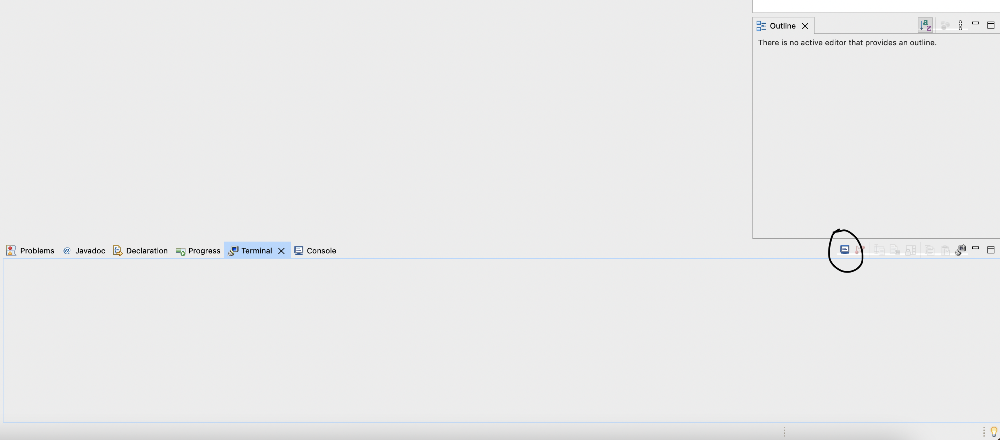

# Documentation

Note: it is preferable to use the latest version of either macOS or Windows.

Make sure to [download](#downloads) all of the programs for your operating system first. Go with the defaults for installing the software, unless otherwise stated. Afterwards, check out [terminal-commands](terminal-commands) to see detailed explanations of the most commonly-used terminal commands. Experiment with them in your terminal.

Then, read the instructions on how to [generate a SSH key](ssh#generating-a-ssh-key). After that is done, run [these](git#first-time-usage) first-time steps, then clone (download) this repository to your computer:

- Click the blue 'Clone' button on this page
- Copy the URL for "Clone with SSH"
- In your terminal, run
    ```
    cd ~/eclipse-workspace
    git clone <url>
    ```
    where `<url>` is the URL you just copied

### Setting up Eclipse

You will then need to import this project into Eclipse. Open Eclipse and follow the steps below:

1. Go to File -> Import...
1. Expand the Git folder and select "Projects from Git"
1. Click Next >
1. Select "Existing local repository"
1. Click Next >
1. Click "Add..." and check off the box corresponding to this project (should end with `/blogging-project/.git`)
1. Click Add
1. Click Next >
1. Make sure "Import using the New Project wizard" is selected
1. Click Finish
1. Make sure "Java Project" is selected (if not, expand the Java folder and select "Java Project")
1. Click Next >
1. Name the project `blogging-project`
1. Click Next >
1. Click on the Libraries tab
1. Click on Classpath
1. Click the "Add Library..." button and select JUnit
1. Click Next >
1. Make sure JUnit 5 is selected and click Finish
1. Click Finish again

If you would like to access the terminal from within Eclipse:

- Go to Window -> Show View -> Terminal
- Click on the small blue computer monitor icon (hard to see):
    
- Click OK
- The Eclipse terminal for macOS is very limited in functionality so it is still recommended to use Terminal

For Windows:

- Set Unix LF line endings as your default by going to Window -> Preferences -> General -> Workspace and set "New text file line delimiter" to Other -> Unix
- You should also be able to go to File -> Convert Line Delimiters To and select Unix

See the [Java](java) folder for information pertaining to Java development and unit testing. Other folders are geared towards more in-depth terminal commands.

Check out the [getting started](docker#getting-started) section of the Docker folder to set up an Ubuntu container. There is also a folder on [VirtualBox](virtualbox).

# Downloads

- [General (any OS)](#general-any-os)
- [macOS](#macos)
- [Windows](#windows)

## General (any OS)

- Docker Desktop: https://www.docker.com/products/docker-desktop
    - For Windows: go to `Turn Windows features on or off` and make sure Hyper-V is unchecked (restart your computer if necessary)
    - **If you already have Docker Desktop installed:** open it and click on the settings gear, go to Software Updates, click "Check for updates" and install any updates
    - Once installed, make sure to open it, click on the settings gear, uncheck "Show weekly tips," check "Use Docker Compose V2," then click on Apply & Restart
    - Linux instructions are available [here](https://docs.docker.com/desktop/install/ubuntu/) (can be done from a terminal)

- Java SE Development Kit: https://www.oracle.com/java/technologies/downloads/
    - **If you already have an older Java SE Development Kit installed:** you will not need to install the latest SDK, since we are not using any of the latest Java features
    - For Linux: install the `openjdk-17-jdk` package with a [package manager](terminal-commands#package-managers)

- Eclipse IDE: https://www.eclipse.org/downloads/
    - **If you already have Eclipse installed:** go to Help -> Check for Updates and install any updates
    - Otherwise:
        - For macOS:
            - Double-click on `Eclipse Installer.app`
            - Click on the triple-bar menu and click Update
            - Once the installer reopens, click on "Eclipse IDE for Java Developers" and change your installation folder to `/Applications`
        - For Windows:
            - Click on the triple-bar menu and click Update
            - Accept the licenses and continue
            - Once the installer reopens, click on "Eclipse IDE for Java Developers"
        - When you first open Eclipse, accept the default workspace and check "Use this as the default and do not ask again" then click Launch
        - Close the Welcome window

- VirtualBox platform package (host means your operating system): https://www.virtualbox.org/wiki/Downloads
    - **If you already have VirtualBox installed:** open it and:
        - For macOS: go to VirtualBox -> Check for Updates...
        - For Windows: go to File -> Check for Updates...
        - Install any updates, including the updated VirtualBox Extension Pack
        - You _might_ need to do the following for macOS:
            - Open System Preferences -> Security & Privacy -> General, click on the padlock to make changes, and allow the software from "Oracle America, Inc." to load (requires a restart)
    - Otherwise:
        - Download the VirtualBox Extension Pack from the website
        - For macOS:
            - Open System Preferences -> Security & Privacy -> General, click on the padlock to make changes, and allow the software from "Oracle America, Inc." to load (requires a restart)
        - Open VirtualBox, and:
        - For macOS: go to VirtualBox -> Preferences -> Extensions
        - For Windows: go to File -> Preferences -> Extensions
        - click the green '+' button and click on the `.vbox-extpack` file you downloaded
        - You can now delete the `.vbox-extpack` file from wherever you had it downloaded

- Visual Studio Code: https://code.visualstudio.com/download
    - **If you already have Visual Studio Code installed:** open it, click on the gear in the bottom left corner, scroll down to "Check for Updates..." and install any updates
    - Otherwise:
        - For macOS:
            - Move `Visual Studio Code.app` into your Applications folder
        - For Windows:
            - Download the 64-bit User Installer
    - Open Visual Studio Code, and:
    - Click on File -> Auto Save to automatically save your changes
    - To access the terminal from within Visual Studio Code, click on Terminal -> New Terminal
    - Suggested settings for macOS:
        - Go to Code -> Preferences -> Settings
        - Type "blink" in the Settings search bar and check the box for Terminal > Integrated: Cursor Blinking
        - Type "enable persistent sessions" and uncheck the box for that setting
        - Type "terminal default profile osx" and select bash from the drop-down menu
        - Quit Visual Studio Code and restart it to save settings

- Ubuntu: https://ubuntu.com/download/desktop
    - Download the LTS version - this is the `.iso` file used to [create an Ubuntu virtual machine on VirtualBox](virtualbox#installing-ubuntu)

### Just in case

- TeamViewer: https://www.teamviewer.com/en-us/download/
    - **If you already have TeamViewer installed:** open it, go to Help -> Check for update and install any updates
    - Otherwise:
        - For Windows:
            - Download the 64-bit version

- Zoom: I will safely assume you already have Zoom installed on your computer and know how to update it.

## macOS

Open Terminal, and run

```
xcode-select --install
```

- This will install `git`, `ssh`, `vim`, and other command line tools in Terminal
- If you get a message saying `xcode-select: error: command line tools are already installed, use "Software Update" to install updates` then you are good to go

### Optional for macOS

- The Unarchiver: https://apps.apple.com/us/app/the-unarchiver/id425424353
    - This supports even more archive formats than the default `Archive Utility.app`

- iTerm2: https://iterm2.com/
    - This really isn't necessary unless you are _super_-experienced with a terminal **and** you want some added functionality over `Terminal.app`
    - **If you already have iTerm2 installed:** open it and go to iTerm2 -> Check For Updates...
    - Otherwise:
        - If you do download it, unzip the archive and move `iTerm.app` into your Applications folder
        - Open it, go to iTerm2 -> Preferences... -> General -> Closing and uncheck all boxes
    - Suggested settings:
        - Go to iTerm2 -> Preferences... -> Profiles -> Text and check "Blinking cursor"
        - Go to iTerm2 -> Preferences... -> Advanced, type "disable the tip of the day", and select yes from the drop-down menu
        - Quit and restart iTerm2 to save changes

## Windows

Make sure to enable Intel/AMD virtualization from your BIOS. Check online for how to do this based on your motherboard manufacturer.

Make sure to install:

- SSH (**only install OpenSSH Client**):
https://docs.microsoft.com/en-us/windows-server/administration/openssh/openssh_install_firstuse#install-openssh-using-windows-settings

- Git: https://git-scm.com/download/win
    - **If you already have Git installed:** run `git-update-git-for-windows` in Git Bash

Some programs cause problems on Windows when installed without administrator privileges. To fix this, right-click on the installer you want to run and click "Run as administrator".

### Optional for Windows

- 7-Zip: https://www.7-zip.org/download.html
    - **If you already have 7-Zip installed:** uninstall it from Settings -> Apps -> Apps & features
    - Download the 64-bit Windows x64 .exe of the latest 7-Zip version
    - It is a free and open source archive utility that works with pretty much every archive format you'll ever encounter
    - It makes WinRAR useless (for unpacking `.rar` files), and provides enough of WinZip's features for free
        - You will still need WinRAR to _create_ `.rar` files (i.e. you are a Russian malware developer)
