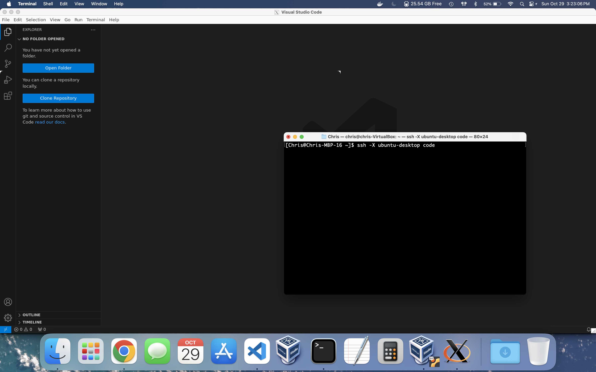

# SSH

SSH stands for "secure shell." It replaces the insecure [`telnet`](https://en.wikipedia.org/wiki/Telnet) / [`rlogin`](https://en.wikipedia.org/wiki/Berkeley_r-commands#rlogin) commands.

It is a program used to access remote servers, although "remote" can mean on the same computer. It works by utilizing SSH keys, which are based on cryptography.

On Windows, use Git Bash to perform any commands on this page except `rsync`. On Linux, you might need to install `openssh-client` with a [package manager](../terminal-commands#package-managers) to use `ssh`, as well as the bundled `scp` and `sftp` file transfer commands.

To access a remote server using any of the commands on this page, `sshd` (the SSH daemon) must be running on the server. You might need to install `openssh-server` on a Linux server, or follow [these](https://learn.microsoft.com/en-us/windows-server/administration/openssh/openssh_install_firstuse?tabs=gui#install-openssh-for-windows) instructions for a Windows server.

## Table of Contents

- [Generating a SSH key](#generating-a-ssh-key)
- [Basic usage](#basic-usage)
- [Tunneling](#tunneling)
- [X11 Forwarding](#x11-forwarding)
- [SSH configurations](#ssh-configurations)
- [`scp` - copies a file or directory to or from a remote server](#scp)
- [`sftp` - interactive version of `scp`](#sftp)

## Generating a SSH key

Run the following code in Terminal (or Git Bash on Windows) to create a SSH key (technically a keypair, a public key and a private key):

```
ssh-keygen -t ed25519 -C "your email address"
```

Press enter/return 3 more times. This saves the key in the default location and leaves the key password blank.

To add your (public) key to your GitLab account, copy the output of

```
cat ~/.ssh/id_ed25519.pub
```

and paste it [here](https://gitlab.com/-/profile/keys) in the Key box. Give your SSH key a title (e.g. MacBook Pro). Don't add an expiration date.

After you add the key, you can test it by running

```
ssh -T git@gitlab.com
```

You might get a message about the authenticity of the GitLab host. Make sure to enter `yes` when prompted to continue connecting.

You should then see a message like this: `Welcome to GitLab, @username!`

## Basic usage

`ssh user@hostname`

- This logs on to a remote server (or virtual machine) specified by `hostname`, with a username specified by `user`
    - `hostname` can be a domain name or an IP address
- It will initially ask for a password, but that can be cached
- `ssh -p <port-number> user@hostname` works the same way but specifies a port to be used
    - By default, SSH uses port 22
- To log out of a remote server, run `exit`
- To shut down a remote server, run `sudo poweroff`
    - For a Windows server, the equivalent PowerShell command is `Stop-Computer -Force`
- To restart a remote server, run `sudo reboot`
    - For a Windows server, the equivalent PowerShell command is `Restart-Computer -Force`

To log in into a Windows server, there are a few more steps involved:

- Go to Settings -> Accounts -> Sign-in options, and make sure that "Require Windows Hello sign-in for Microsoft accounts" is turned off if your account is linked to a Microsoft account (this isn't necessary for local accounts)
- `ssh [-p <port-number>] domain\\user@hostname` is the command to use on Unix terminals
    - `domain\\user` is obtained by running `whoami` in PowerShell on the Windows server, and adding an extra `\`
        - It is the concatentation of the device name and the username
    - If using PowerShell to log in, just use one `\` instead of two
    - The password is your Microsoft account password, or the local account password if logging in to a local account

Run this command in an Administrator PowerShell terminal to use PowerShell as the default shell when logging in via SSH:

```
New-ItemProperty -Path "HKLM:\SOFTWARE\OpenSSH" -Name DefaultShell -Value "C:\Windows\System32\WindowsPowerShell\v1.0\powershell.exe" -PropertyType String -Force
```

### Saving your login to the server

**Note: only do this if you have permission!**

If you are using `ssh` to login to a password-protected server, you may want to cache your login information to the server. Otherwise, you will have to enter your password every single time.

Run the following command in Terminal or Git Bash to cache your login details on a Unix server:

```
ssh-copy-id [-p <port-number>] user@hostname
```

If you want to cache your login details on a Windows server:

Note: run this command in an Administrator PowerShell terminal to allow Administrators to cache their SSH credentials:

```
icacls.exe C:\ProgramData\ssh\administrators_authorized_keys /inheritance:r /grant Administrators:F /grant SYSTEM:F
```

- Run the following command to cache your login for a non-Administrator user:
    ```
    ssh [-p <port-number>] domain\\user@hostname \
        "powershell Add-Content -Force -Path \$HOME\.ssh\authorized_keys -Value '$(cat ~/.ssh/id_ed25519.pub)'"
    ```
- Run the following commands to cache your login for an Administrator:
    ```
    ssh [-p <port-number>] domain\\user@hostname \
        "powershell Add-Content -Force -Path C:\ProgramData\ssh\administrators_authorized_keys -Value '$(cat ~/.ssh/id_ed25519.pub)'"
    ```

If you were told that the server changed their public key(s), you can remove the existing key(s) from your `~/.ssh/known_hosts` file by running

```
ssh-keygen -R hostname[:port]
```

- If the hostname is either `localhost` or `127.0.0.1` (such as a VM), add brackets around it (e.g. `[127.0.0.1]`)

## Tunneling

In SSH there are ways to "tunnel" or redirect network traffic.

- Local (often called "forward") tunneling allows the host computer to use a local port to listen to traffic on the remote server's local port
- Remote (often called "reverse") tunneling allows the remote server to use one of its local ports to listen to traffic on the host computer's local port
    - Remote tunneling is often used in the event where the host computer is behind a firewall and/or a router's [NAT](https://en.wikipedia.org/wiki/Network_address_translation)
- You can additionally specify `-p <port-number>` if the remote server's SSH is listening on a different port than port 22
- [This](https://youtube.com/watch?v=Wp7boqm3Xts) is a helpful video explaining the concepts of local and remote tunneling

Local tunnel command:

```
ssh -TL 127.0.0.1:<your-local-port>:127.0.0.1:<remote-local-port> <user>@<remote-host>
```

- This connects to the remote server via SSH on port 22, and has your local port listen to their local port
- You can replace `<user>@<remote-host>` with an SSH [configuration](#ssh-configurations)

Remote tunnel command:

```
ssh -TR 127.0.0.1:<remote-local-port>:127.0.0.1:<your-local-port> <user>@<remote-host>
```

- This also connects to the remote server via SSH on port 22, but has _their_ local port listen to _your_ local port
- You can replace `<user>@<remote-host>` with an SSH [configuration](#ssh-configurations)

## X11 Forwarding

Every single window you see on your computer is served by a windowing system that runs as a part of your operating system. Without it, you would not have a desktop.

- The default windowing system for many Linux distributions is [X11](https://en.wikipedia.org/wiki/X_Window_System), although [Wayland](https://en.wikipedia.org/wiki/Wayland_(protocol)) is becoming more popular (and used by default on Ubuntu Desktop)
- This is not to be confused with a desktop environment, which runs on top of a windowing system and serves as a "meta-application" that allows you to open other applications graphically
    - This is what you see when you log in to a computer
    - Popular Linux desktop environments include GNOME, KDE Plasma, and Xfce

X11 and Wayland both have the ability to serve windows to a remote user. This is essentially a remote desktop solution comparable to TeamViewer, except it's designed to serve individual applications.

To run a GUI application through SSH, run

```
ssh -X <user>@<remote-host> <path-to-application>
```

- This requires windowing support on both the server and the client (your computer)
    - For Linux, the X.Org Server should already be installed
    - For macOS, you will need to install [XQuartz](https://www.xquartz.org/)
    - For Windows, you can install [Xming](https://sourceforge.net/projects/xming/)
    - You can also run `ssh -X <user>@<remote-host>` and open any GUI applications from the terminal
        - Example X window applications include `xcalc`, `xclock`, and `xterm`
        - Other applications (if using the GNOME desktop environment) are part of the `gnome-*` family
        - Additional commands that may be available include `gedit` and `firefox`

Example: running Visual Studio Code from SSH

```
ssh -X ubuntu-desktop code
```

- `ubuntu-desktop` is a [SSH configuration](#ssh-configurations) for my Ubuntu Desktop VM
- `code` is an [alias](../terminal-commands#aliasing) for Visual Studio Code

Here's what it looks like:



## SSH configurations

Navigate to the `.ssh` directory in your home directory and check if a `config` file exists:

```
cd ~/.ssh
ls -l
```

- If it doesn't, then create one by running `touch config`

Open `config` in your preferred editor and add the following code to it (if it's not already present):

```
Host *
  AddKeysToAgent yes
  UseKeychain yes
  IdentityFile ~/.ssh/id_ed25519
```

These settings apply to any host (hence the `*` wildcard) you connect to via SSH.

You can use this `config` file to "nickname" SSH connections to remote servers or even virtual machines (VMs) on your computer.

- [Here](https://dev.to/developertharun/easy-way-to-ssh-into-virtualbox-machine-any-os-just-x-steps-5d9i) is how to configure a VirtualBox VM for SSH (I just use Adapter 1)

For example, with my seed Ubuntu VM running:
```
[Chris@Chris-MBP-16 .ssh]$ pwd
/Users/Chris/.ssh
[Chris@Chris-MBP-16 .ssh]$ cat config
Host *
  AddKeysToAgent yes
  UseKeychain yes
  IdentityFile ~/.ssh/id_ed25519

Host raspberrypi
  HostName 192.168.1.89
  User pi

Host seed
  HostName 127.0.0.1
  User seed
  Port 3022

Host centos8
  HostName 127.0.0.1
  User clattman
  Port 3023

[Chris@Chris-MBP-16 .ssh]$ ssh seed
Welcome to Ubuntu 20.04.1 LTS (GNU/Linux 5.11.0-41-generic x86_64)

 * Documentation:  https://help.ubuntu.com
 * Management:     https://landscape.canonical.com
 * Support:        https://ubuntu.com/advantage

0 updates can be installed immediately.
0 of these updates are security updates.


The list of available updates is more than a week old.
To check for new updates run: sudo apt update
Your Hardware Enablement Stack (HWE) is supported until April 2025.
Last login: Wed Dec 29 13:34:08 2021 from 10.0.3.2
[01/16/22]seed@VM:~$ exit
logout
Connection to 127.0.0.1 closed.
[Chris@Chris-MBP-16 .ssh]$
```

It is equivalent to running `ssh -p 3022 seed@127.0.0.1`

- Likewise, running `ssh centos8` would be equivalent to running `ssh -p 3023 clattman@127.0.0.1`

Read more about VirtualBox [here](../virtualbox).

You may want to SSH into some server in your home network (LAN).

- Unfortunately, most residential ISPs don't allow their customers to have static IP addresses for their homes (not even for an extra fee)
- These are also known as WAN (wide area network) addresses

Dynamic DNS (DDNS) to the rescue! Some routers support DDNS, which allows you to associate a domain name with your home's IP address _and_ updates the DNS record if your ISP changes your WAN address.

- After you set up a port forwarding rule for that server on your router, you can create a SSH configuration that allows you to connect to that server from anywhere in the world!
    - Make sure that server has a static local IP address

## `scp`

Stands for "secure copy." It is similar to [`cp`](../terminal-commands#cp), but allows you to copy files and directories over the Internet between your computer and a remote server (or directly to a virtual machine on your computer).

- It is installed with `ssh` because it uses the SSH protocol for security
- You can specify a different SSH port to use with the `-P` flag if port 22 is not used by the remote server for SSH connections
- It can compress data before transmission (with the optional `-C` flag)
    - This will take a little longer to initialize, but is worthwhile for large transfers over slow Internet connections

### Usage

`scp [-C] [-P <port-number>] <file> user@hostname:/directory`

- This copies a file from your computer to the remote server, and stores it in `/directory`
- Can optionally specify a port number (in this case, port `port-number` of user@hostname)
- With the `seed` SSH configuration: `scp <file> seed:/directory`

`scp [-C] [-P <port-number>] -r <directory> user@hostname:/directory`

- This copies a directory from your computer to the remote server, and stores it in `/directory`
- With the `seed` SSH configuration: `scp -r <directory> seed:/directory`

`scp [-C] [-P <port-number>] user@hostname:/directory/file.txt .`

- This copies `file.txt` from the remote server in `/directory` to the your computer's current directory
- With the `seed` SSH configuration: `scp seed:/directory/file.txt .`

`scp [-C] [-P <port-number>] -r user@hostname:/directory .`

- This copies over `/directory` from the remote server to your computer's current directory
- With the `seed` SSH configuration: `scp -r seed:/directory .`

### `rsync`

A more efficient alternative to `scp` is `rsync`.

- You might need to install `rsync` with a [package manager](../terminal-commands#package-managers)
- It also uses SSH by default, but is more complex than `scp`
- It is ideal for consistently updating files and directories between two servers
    - It only transmits the differences between the source file or directory and destination file or directory
    - `scp` on the other hand transmits the whole file or directory, regardless of any similarities (inefficient)
    - Like `scp`, you can specify a different SSH port to use (with `-e`) and compress data before sending it (with `-z`)

`rsync -P [-z] [-e 'ssh -p <port-number>'] <file> user@hostname:/directory`

- This copies a file from your computer to the remote server, and stores it in `/directory`
- With the `seed` SSH configuration: `rsync -P [-z] <file> seed:/directory`

`rsync -P [-z] [-e 'ssh -p <port-number>'] -r <directory> user@hostname:/directory`

- This copies a directory from your computer to the remote server, and stores it in `/directory`
- With the `seed` SSH configuration: `rsync -Pr [-z] <directory> seed:/directory`

`rsync -P [-z] [-e 'ssh -p <port-number>'] user@hostname:/directory/file.txt .`

- This copies `file.txt` from the remote server in `/directory` to the your computer's current directory
- With the `seed` SSH configuration: `rsync -P [-z] seed:/directory/file.txt .`

`rsync -P [-z] [-e 'ssh -p <port-number>'] -r user@hostname:/directory .`

- This copies over `/directory` from the remote server to your computer's current directory
- With the `seed` SSH configuration: `rsync -Pr [-z] seed:/directory .`

## `sftp`

Stands for "secure file transfer protocol." It replaces the insecure [`ftp`](https://en.wikipedia.org/wiki/File_Transfer_Protocol) command.

It is an interactive version of [`scp`](#scp) that lets you look into the remote server while copying files and directories. Like `scp`, it is installed with `ssh` because it uses the SSH protocol for security.

You can run `sftp` in one of two ways:

- `sftp [-P <port-number>] user@hostname`
- `sftp seed` (using the `seed` SSH configuration as an example)

It will provide you with a separate `sftp` shell from which you can run commands:

```
[Chris@Chris-MBP-16 Downloads]$ sftp seed
Connected to seed.
sftp>
```

### Usage

`get <file>`

- This copies over a file from the remote server to your computer's current directory
- `get -R <directory>` does the same thing for directories

`put <file>`

- This copies over a file from your computer to the remote server
- `put -R <directory>` does the same thing for directories

`reget <file>`

- If file receiving failed, this will continue where `sftp` left off
- `reget -R <directory>` does the same thing for directories

`reput <file>`

- If file sending failed, this will continue where `sftp` left off
- `reput -R <directory>` does the same thing for directories

While `sftp` is more complex, the advantage of using `sftp` over `scp` is the ability to continue a failed `get` or `put`, as well as the features below.

### Extras

You can run several commands within the `sftp` shell that operate _within the remote server_:

- [`ls`](../terminal-commands#ls)
- [`mkdir`](../terminal-commands#mkdir)
- [`pwd`](../terminal-commands#pwd)
- [`cd`](../terminal-commands#cd)
- [`cp`](../terminal-commands#cp)
- [`rm`](../terminal-commands#rm)
- [`rmdir`](../terminal-commands#rm)
- [`rename` (sftp version of `mv`)](../terminal-commands#mv)
- [`chmod`](../terminal-commands#chmod)

Example:

```
sftp> ls -l
drwxr-xr-x    3 seed     seed         4096 Oct 10 19:04 Desktop
drwxr-xr-x    8 seed     seed         4096 Dec 12  2021 Documents
drwxr-xr-x    4 seed     seed         4096 Dec 28 22:11 Downloads
drwxr-xr-x    2 seed     seed         4096 Nov 24  2020 Music
drwxr-xr-x    2 seed     seed         4096 Oct 24  2021 Pictures
drwxr-xr-x    2 seed     seed         4096 Nov 24  2020 Public
drwxr-xr-x    2 seed     seed         4096 Nov 24  2020 Templates
drwxr-xr-x    2 seed     seed         4096 Nov 24  2020 Videos
-rw-rw-r--    1 seed     seed            0 Oct 10 20:53 bomb.s
sftp> pwd
Remote working directory: /home/seed
sftp>
```

You can also run commands that operate _within your local computer_:

- `lls`
- `lmkdir`
- `lpwd`
- `lcd`

These correspond to the commands after the first `l`, e.g. `lls` does _local_ `ls` on your local current directory

Example:

```
sftp> lls -l
total 86296
-rw-r--r--@ 1 Chris  staff   5755218 Jan 18 01:04 Hard Real-Time Computing Systems.pdf
-rw-r--r--@ 1 Chris  staff    107279 Jan 30 15:43 Homework1.pdf
-rw-r--r--@ 1 Chris  staff  27517484 Jan 18 01:09 Introduction to Embedded Systems.pdf
-rw-r--r--@ 1 Chris  staff  10661354 Jan 18 01:06 Logical Foundations of Cyber-Physical Systems.pdf
-rw-r--r--@ 1 Chris  staff    119196 Jan 30 15:44 Project1.pdf
-rw-r--r--@ 1 Chris  staff      3258 Jul  9  2022 crypto_test.py
-rw-r--r--@ 1 Chris  staff       565 Sep 20 09:51 firsts.txt
drwxr-xr-x  7 Chris  staff       224 Jan 21 00:11 flask
drwxr-xr-x  6 Chris  staff       192 Sep 24  2021 taken from phone
sftp> lpwd
Local working directory: /Users/Chris/Downloads
sftp>
```

You can use the `!` symbol to run any command within your local computer

- `!clear` clears your terminal screen from within `sftp`

To exit `sftp`, run `exit`
