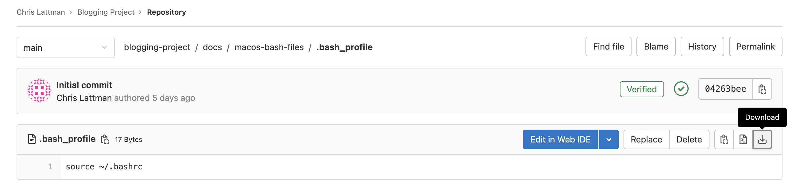

# Terminal Commands

## Table of Contents

- [Introduction](#introduction)
- [Before you start (macOS only)](#before-you-start-macos-only)
- [The 45 most important terminal commands (plus symbols and compression)](#the-45-most-important-terminal-commands-plus-symbols-and-compression)
- [Other important terminal info](#other-important-terminal-info)

## Introduction

Examples of [Unix-like](https://en.wikipedia.org/wiki/Unix-like) terminals include `Terminal.app` (Terminal) on macOS and Terminal on Ubuntu or any other Linux distribution.

- Linux uses the terms "folder" and "directory" interchangeably
- Windows is NOT a Unix-like operating system
- If you want to try all of these commands on Windows, create a [Docker container](../docker#getting-started) (recommended) or set up a [virtual machine](../virtualbox)
- Git Bash allows you to run most of these commands (except `man`, `wget`, `speedtest`, `nc`, `host` (use `nslookup` instead), `nmap`, `openvpn`, `htop`, `zip` (use [`powershell Compress-Archive`](https://learn.microsoft.com/en-us/powershell/module/microsoft.powershell.archive/compress-archive?view=powershell-7.3) instead), or any package manager)
- Note: if you are using Windows PowerShell, clicking on a PowerShell window will cause the shell to enter "Select mode"
    - Press the escape key or right-click on the window to exit this mode

Knowing these commands by heart will make you a "power user" on any Unix-like OS.

## Before you start (macOS only)

Before using these commands on macOS, make sure you are using bash (not zsh) in Terminal by running the following command:

```
echo $0
```

- If it says `-bash` then you're good to go
- Otherwise, run
    ```
    chsh -s /bin/bash
    ```

    Then quit Terminal and restart it.

Apple will tell you to use zsh but just ignore it for now.

Download the 4 files inside of [`macos-dot-files`](../macos-dot-files). You can do this by clicking on a file and then downloading it to your computer by clicking the download button. For example:



Copy these files to your home directory. To make this easy, open up Terminal and run
```
open ~
```
This opens up your home directory in a Finder window. After you have copied these files, quit Terminal and restart it. Your Terminal bash settings are now preserved.

Notes:

- These files make the macOS Terminal behave more like a Linux Terminal
- When you start Terminal, it should place you in your home directory
- When you open a new Finder window from the macOS Dock, it should also open your home directory

### Profiles

You can customize Terminal. There are 10 profiles to choose from; I personally use the "Pro" profile.

To change your Terminal profile, open Terminal and go to Terminal -> Preferences... -> Profiles

- Click on which profile you want, then click "Default" to save your choice
- Check "Blink cursor" to keep your Terminal cursor blinking
- I recommend changing the font size from 10 to 12

To save your changes, quit Terminal and restart it.

## The 45 most important terminal commands (plus symbols and compression):

- [`ls` - lists items in a directory](#ls)
- [`du` - shows size of file or directory contents](#du)
- [`df` - shows free space on drive](#df)
- [`file` - shows details about a file](#file)
- [`mkdir` - creates a new directory](#mkdir)
- [`touch` - creates a new file](#touch)
- [`ln` - creates a shortcut to a file or directory](#ln)
- [`echo` - echoes input](#echo)
- [`pwd` - outputs the current directory path](#pwd)
- [`cd` - changes the current directory](#cd)
- [`cp` - copies a file or directory](#cp)
- [`rm` - removes a file or directory](#rm)
- [`mv` - moves or renames a file or directory](#mv)
- [`cat` - outputs the contents of a file](#cat)
- [`tail` - outputs an updated stream of a file](#tail)
- [`diff` - compares two files for differences](#diff)
- [`wc` - outputs number of words, characters, or lines in a file](#wc)
- [`grep` - searches a file (or files) for a given phrase](#grep)
- [`find` - searches the file system for files and directories](#find)
- [`which` - searches for the location of a command](#which)
- [`chmod` - changes the permissions of a file](#chmod)
- [`man` - manual pages for various commands](#man)
- [`history` - outputs your previous terminal commands](#history)
- [`wget` - downloads files from the Internet](#wget)
- [`curl` - powerful networking tool](#curl)
- [`shasum` - outputs the SHA-2 hash of a file](#shasum)
- [`openssl` - encrypts and decrypts files](#openssl)
- [`gpg` - encrypts and signs files for communication](#gpg)
- [`speedtest` - calculates Internet speed](#speedtest)
- [`nc` - troubleshoots connections](#nc)
- [`ping` - pings a URL for connectivity](#ping)
- [`traceroute` - shows IP addresses of all servers encountered during a ping](#traceroute)
- [`host` - resolves the IP address of a website](#host)
- [`nmap` - scans a website for open ports](#nmap)
- [`netstat` - shows active network connections](#netstat)
- [`ifconfig` - outputs network interface information](#ifconfig)
- [`openvpn` - connects to a VPN service](#openvpn)
- [`date` - outputs the current date and time](#date)
- [`clear` - clears the terminal screen](#clear)
- [`less` - displays a terminal window-sized chunk of scrollable output](#less)
- [`tee` - writes output to both the terminal and a file](#tee)
- [`passwd` - changes the password of a user](#passwd)
- [`ps` - outputs a list of running processes](#ps)
- [`kill` - terminates one or more running processes](#kill)
- [`htop` - displays system usage](#htop)
- [Symbols](#symbols)
- [Compression (`zip` and `tar`)](#compression-zip-and-tar)

There is also a presentation [here](https://courses.cs.vt.edu/cs2505/spring2019/notes/T02_BasicLinuxCommands.pdf), created by Virginia Tech CS department faculty, that discusses some of these commands.

### `ls`

Stands for "list." Use it to list files and directories.

- By default, `ls` lists the files/directories in your current directory
    - Add the name of a directory after `ls` to list the files/directories in that specific directory
    - e.g. `ls ~/Downloads` outputs the contents of your Downloads directory regardless of your current directory
- Use the `-l` flag to list details of the files/directories
    - A 'd' in front of a result means it is a directory
    - An 'l' in front of a result means it is a link/shortcut
- Use the `-a` flag to list all files/directories in your current directory (including hidden files/directories)
- Flags can be combined, e.g. `-al` or `-la` (order does not matter)
- For macOS:
    - `ls -lT` is like `ls -l` but shows the detailed timestamp for each file/directory
- For Linux and Git Bash:
    - `ls --full-time` is like `ls -l` but shows the detailed timestamp for each file/directory
- `ls -lt` sorts results by last modified
- `ls -lS` sorts file results by size (doesn't sort directories)
- `ls -lX` sorts results by type (not available on macOS)
- Use the `-r` flag to reverse the results
- `tree` is a similar command that displays directory and subdirectory contents in a tree
    - You might need to install `tree` with a [package manager](#package-managers)
    - `tree -L <depth>` outputs the first `depth` levels of the directory tree
    - To setup `tree` in Git Bash, run `echo 'alias tree="tree.com //f //a"' >> ~/.bashrc; source ~/.bashrc`
        - The `tree` in Git Bash does not support any flags

Examples:

```
[Chris@Chris-MBP-16 test-make]$ ls
FracTester.c FracTester.o Fraction.h   Makefile     driver.c
FracTester.h Fraction.c   Fraction.o   driver       driver.dSYM
[Chris@Chris-MBP-16 test-make]$ ls -l
total 208
-rw-r--r--  1 Chris  staff   5385 Dec 19  2021 FracTester.c
-rw-r--r--  1 Chris  staff    412 Dec 19  2021 FracTester.h
-rw-r--r--  1 Chris  staff  13040 Aug 29 16:49 FracTester.o
-rw-r--r--@ 1 Chris  staff   3036 Dec 18  2021 Fraction.c
-rw-r--r--  1 Chris  staff   2512 Dec 19  2021 Fraction.h
-rw-r--r--  1 Chris  staff   5280 Aug 29 16:49 Fraction.o
-rw-r--r--@ 1 Chris  staff    758 Aug 29 16:51 Makefile
-rwxr-xr-x  1 Chris  staff  52816 Aug 29 16:49 driver
-rw-r--r--  1 Chris  staff    985 Dec 18  2021 driver.c
drwxr-xr-x  3 Chris  staff     96 Aug 29 16:49 driver.dSYM
[Chris@Chris-MBP-16 test-make]$ ls -al
total 232
drwxr-xr-x  15 Chris  staff    480 Aug 29 16:49 .
drwx------@ 18 Chris  staff    576 Sep 18 23:06 ..
-rw-r--r--@  1 Chris  staff   6148 Sep  1 20:24 .DS_Store
drwxr-xr-x  16 Chris  staff    512 Aug 29 16:51 .git
-rw-r--r--   1 Chris  staff     23 Dec 19  2021 .gitignore
-rw-r--r--   1 Chris  staff   5385 Dec 19  2021 FracTester.c
-rw-r--r--   1 Chris  staff    412 Dec 19  2021 FracTester.h
-rw-r--r--   1 Chris  staff  13040 Aug 29 16:49 FracTester.o
-rw-r--r--@  1 Chris  staff   3036 Dec 18  2021 Fraction.c
-rw-r--r--   1 Chris  staff   2512 Dec 19  2021 Fraction.h
-rw-r--r--   1 Chris  staff   5280 Aug 29 16:49 Fraction.o
-rw-r--r--@  1 Chris  staff    758 Aug 29 16:51 Makefile
-rwxr-xr-x   1 Chris  staff  52816 Aug 29 16:49 driver
-rw-r--r--   1 Chris  staff    985 Dec 18  2021 driver.c
drwxr-xr-x   3 Chris  staff     96 Aug 29 16:49 driver.dSYM
[Chris@Chris-MBP-16 test-make]$ ls -l driver.dSYM
total 0
drwxr-xr-x  4 Chris  staff  128 Aug 29 16:49 Contents
[Chris@Chris-MBP-16 test-make]$ ls -lT
total 208
-rw-r--r--  1 Chris  staff   5385 Dec 19 00:19:07 2021 FracTester.c
-rw-r--r--  1 Chris  staff    412 Dec 19 00:18:15 2021 FracTester.h
-rw-r--r--  1 Chris  staff  13040 Aug 29 16:49:39 2022 FracTester.o
-rw-r--r--@ 1 Chris  staff   3036 Dec 18 22:49:42 2021 Fraction.c
-rw-r--r--  1 Chris  staff   2512 Dec 19 00:18:10 2021 Fraction.h
-rw-r--r--  1 Chris  staff   5280 Aug 29 16:49:39 2022 Fraction.o
-rw-r--r--@ 1 Chris  staff    758 Aug 29 16:51:23 2022 Makefile
-rwxr-xr-x  1 Chris  staff  52816 Aug 29 16:49:39 2022 driver
-rw-r--r--  1 Chris  staff    985 Dec 18 23:05:09 2021 driver.c
drwxr-xr-x  3 Chris  staff     96 Aug 29 16:49:40 2022 driver.dSYM
[Chris@Chris-MBP-16 test-make]$
```

```
[Chris@Chris-MBP-16 flask]$ tree
.
├── birthdays
│   ├── app.py
│   ├── birthdays.db
│   ├── static
│   │   └── styles.css
│   └── templates
│       ├── error.html
│       ├── index.html
│       ├── invalid-birthday.html
│       ├── invalid-name.html
│       └── layout.html
├── finance
│   ├── app.py
│   ├── finance.db
│   ├── helpers.py
│   ├── requirements.txt
│   ├── static
│   │   ├── favicon.ico
│   │   └── styles.css
│   └── templates
│       ├── add-money.html
│       ├── apology.html
│       ├── buy.html
│       ├── change-password.html
│       ├── delete-account.html
│       ├── history.html
│       ├── index.html
│       ├── layout.html
│       ├── login.html
│       ├── quote.html
│       ├── quoted.html
│       ├── register.html
│       └── sell.html
├── flask-http-echo-server
│   └── app.py
└── trivia
    ├── index.html
    └── styles.css

8 directories, 30 files
[Chris@Chris-MBP-16 flask]$ tree -L 1
.
├── birthdays
├── finance
├── flask-http-echo-server
└── trivia

4 directories, 0 files
[Chris@Chris-MBP-16 flask]$
```

### `du`

Stands for "disk usage." Use it to see the true size of a file or directory's contents.

- `du -s --si <file-or-directory>` shows the file or directory size on disk
- For macOS:
    - `du -sA --si <file-or-directory>` shows the "apparent" directory size
- For Linux and Git Bash:
    - `du -s --si --apparent-size <file-or-directory>` shows the "apparent" directory size

Example:

```
[Chris@Chris-MBP-16 Downloads]$ du -s --si test-make
315k	test-make
[Chris@Chris-MBP-16 Downloads]$ du -sA --si test-make
177k	test-make
[Chris@Chris-MBP-16 Downloads]$
```

### `df`

Stands for "disk free." Use it to see the original size of your drive and the amount of free space available.

- `df -H` shows the free space in human-readable format
    - In my case, the file system representing my files and apps is `/dev/disk1s2`
    - On macOS, this can also be checked by going to System Information -> Hardware -> Storage
    - On Linux, the file system representing files is usually mounted at `/`, the root directory

Example:

```
[Chris@Chris-MBP-16 ~]$ df -H
Filesystem       Size   Used  Avail Capacity iused      ifree %iused  Mounted on
/dev/disk1s1s1   1.0T   8.9G   430G     3%  348574 4195501840    0%   /
devfs            195k   195k     0B   100%     658          0  100%   /dev
/dev/disk1s3     1.0T   2.2G   430G     1%    2887 4195501840    0%   /System/Volumes/Preboot
/dev/disk1s5     1.0T    20k   430G     1%       0 4195501840    0%   /System/Volumes/VM
/dev/disk1s6     1.0T    10M   430G     1%      18 4195501840    0%   /System/Volumes/Update
/dev/disk1s2     1.0T   558G   430G    57% 3718885 4195501840    0%   /System/Volumes/Data
map auto_home      0B     0B     0B   100%       0          0  100%   /System/Volumes/Data/home
/dev/disk2s1     1.6G   1.2G   455M    72%    1086 4294966193    0%   /Volumes/UTM
[Chris@Chris-MBP-16 ~]$
```

### `file`

Shows details about a file's type.

- To see a file's size, use [`du`](#du)
- `file --mime-type` outputs the [MIME type](https://en.wikipedia.org/wiki/Media_type#Common_examples) of a file

Example:

```
[Chris@Chris-MBP-16 test-make]$ ls -l
total 208
-rw-r--r--  1 Chris  staff   5385 Dec 19  2021 FracTester.c
-rw-r--r--  1 Chris  staff    412 Dec 19  2021 FracTester.h
-rw-r--r--  1 Chris  staff  13040 Aug 29 16:49 FracTester.o
-rw-r--r--@ 1 Chris  staff   3036 Dec 18  2021 Fraction.c
-rw-r--r--  1 Chris  staff   2512 Dec 19  2021 Fraction.h
-rw-r--r--  1 Chris  staff   5280 Aug 29 16:49 Fraction.o
-rw-r--r--@ 1 Chris  staff    758 Aug 29 16:51 Makefile
-rwxr-xr-x  1 Chris  staff  52816 Aug 29 16:49 driver
-rw-r--r--  1 Chris  staff    985 Dec 18  2021 driver.c
drwxr-xr-x  3 Chris  staff     96 Aug 29 16:49 driver.dSYM
[Chris@Chris-MBP-16 test-make]$ file FracTester.c
FracTester.c: c program text, ASCII text
[Chris@Chris-MBP-16 test-make]$ file FracTester.h
FracTester.h: c program text, ASCII text
[Chris@Chris-MBP-16 test-make]$ file FracTester.o
FracTester.o: Mach-O 64-bit object x86_64
[Chris@Chris-MBP-16 test-make]$ file driver
driver: Mach-O 64-bit executable x86_64
[Chris@Chris-MBP-16 test-make]$ file --mime-type driver.c
driver.c: text/x-c
[Chris@Chris-MBP-16 test-make]$
```

### `mkdir`

Stands for "make directory." Use it to create a new directory.

- You can create multiple directories at once
- `mkdir -p <name>` creates any necessary directories in the middle, e.g. `mkdir -p path/to/folder`

Examples:

```
[Chris@Chris-MBP-16 test-make]$ ls -l
total 160
-rw-r--r--  1 Chris  staff   5385 Dec 19 00:19 FracTester.c
-rw-r--r--  1 Chris  staff    412 Dec 19 00:18 FracTester.h
-rw-r--r--@ 1 Chris  staff   3036 Dec 18 22:49 Fraction.c
-rw-r--r--  1 Chris  staff   2512 Dec 19 00:18 Fraction.h
-rw-r--r--  1 Chris  staff    647 Dec 19 22:22 Makefile
-rwxr-xr-x  1 Chris  staff  52816 Dec 19 00:30 driver
-rw-r--r--  1 Chris  staff    985 Dec 18 23:05 driver.c
drwxr-xr-x  3 Chris  staff     96 Dec 19 00:30 driver.dSYM
[Chris@Chris-MBP-16 test-make]$ mkdir test-directory
[Chris@Chris-MBP-16 test-make]$ ls -l
total 160
-rw-r--r--  1 Chris  staff   5385 Dec 19 00:19 FracTester.c
-rw-r--r--  1 Chris  staff    412 Dec 19 00:18 FracTester.h
-rw-r--r--@ 1 Chris  staff   3036 Dec 18 22:49 Fraction.c
-rw-r--r--  1 Chris  staff   2512 Dec 19 00:18 Fraction.h
-rw-r--r--  1 Chris  staff    647 Dec 19 22:22 Makefile
-rwxr-xr-x  1 Chris  staff  52816 Dec 19 00:30 driver
-rw-r--r--  1 Chris  staff    985 Dec 18 23:05 driver.c
drwxr-xr-x  3 Chris  staff     96 Dec 19 00:30 driver.dSYM
drwxr-xr-x  2 Chris  staff     64 Jan 16 00:48 test-directory
[Chris@Chris-MBP-16 test-make]$ mkdir test-directory1 directory2 dir3
[Chris@Chris-MBP-16 test-make]$ ls -l
total 160
-rw-r--r--  1 Chris  staff   5385 Dec 19 00:19 FracTester.c
-rw-r--r--  1 Chris  staff    412 Dec 19 00:18 FracTester.h
-rw-r--r--@ 1 Chris  staff   3036 Dec 18 22:49 Fraction.c
-rw-r--r--  1 Chris  staff   2512 Dec 19 00:18 Fraction.h
-rw-r--r--  1 Chris  staff    647 Dec 19 22:22 Makefile
drwxr-xr-x  2 Chris  staff     64 Jan 16 00:48 dir3
drwxr-xr-x  2 Chris  staff     64 Jan 16 00:48 directory2
-rwxr-xr-x  1 Chris  staff  52816 Dec 19 00:30 driver
-rw-r--r--  1 Chris  staff    985 Dec 18 23:05 driver.c
drwxr-xr-x  3 Chris  staff     96 Dec 19 00:30 driver.dSYM
drwxr-xr-x  2 Chris  staff     64 Jan 16 00:48 test-directory
drwxr-xr-x  2 Chris  staff     64 Jan 16 00:48 test-directory1
[Chris@Chris-MBP-16 test-make]$
```

```
[Chris@Chris-MBP-16 Downloads]$ mkdir -p path/to/folder
[Chris@Chris-MBP-16 Downloads]$ pwd
/Users/Chris/Downloads
[Chris@Chris-MBP-16 Downloads]$ cd path/
[Chris@Chris-MBP-16 path]$ pwd
/Users/Chris/Downloads/path
[Chris@Chris-MBP-16 path]$ cd to/
[Chris@Chris-MBP-16 to]$ pwd
/Users/Chris/Downloads/path/to
[Chris@Chris-MBP-16 to]$ cd folder/
[Chris@Chris-MBP-16 folder]$ pwd
/Users/Chris/Downloads/path/to/folder
[Chris@Chris-MBP-16 folder]$
```

### `touch`

Creates a new file.

- You can create multiple files at once

Example:

```
[Chris@Chris-MBP-16 test-make]$ ls -l
total 160
-rw-r--r--  1 Chris  staff   5385 Dec 19 00:19 FracTester.c
-rw-r--r--  1 Chris  staff    412 Dec 19 00:18 FracTester.h
-rw-r--r--@ 1 Chris  staff   3036 Dec 18 22:49 Fraction.c
-rw-r--r--  1 Chris  staff   2512 Dec 19 00:18 Fraction.h
-rw-r--r--  1 Chris  staff    647 Dec 19 22:22 Makefile
-rwxr-xr-x  1 Chris  staff  52816 Dec 19 00:30 driver
-rw-r--r--  1 Chris  staff    985 Dec 18 23:05 driver.c
drwxr-xr-x  3 Chris  staff     96 Dec 19 00:30 driver.dSYM
[Chris@Chris-MBP-16 test-make]$ touch file.txt
[Chris@Chris-MBP-16 test-make]$ ls -l
total 160
-rw-r--r--  1 Chris  staff   5385 Dec 19 00:19 FracTester.c
-rw-r--r--  1 Chris  staff    412 Dec 19 00:18 FracTester.h
-rw-r--r--@ 1 Chris  staff   3036 Dec 18 22:49 Fraction.c
-rw-r--r--  1 Chris  staff   2512 Dec 19 00:18 Fraction.h
-rw-r--r--  1 Chris  staff    647 Dec 19 22:22 Makefile
-rwxr-xr-x  1 Chris  staff  52816 Dec 19 00:30 driver
-rw-r--r--  1 Chris  staff    985 Dec 18 23:05 driver.c
drwxr-xr-x  3 Chris  staff     96 Dec 19 00:30 driver.dSYM
-rw-r--r--  1 Chris  staff      0 Jan 16 00:45 file.txt
[Chris@Chris-MBP-16 test-make]$ touch file1.txt file2.py file3.java
[Chris@Chris-MBP-16 test-make]$ ls -l
total 160
-rw-r--r--  1 Chris  staff   5385 Dec 19 00:19 FracTester.c
-rw-r--r--  1 Chris  staff    412 Dec 19 00:18 FracTester.h
-rw-r--r--@ 1 Chris  staff   3036 Dec 18 22:49 Fraction.c
-rw-r--r--  1 Chris  staff   2512 Dec 19 00:18 Fraction.h
-rw-r--r--  1 Chris  staff    647 Dec 19 22:22 Makefile
-rwxr-xr-x  1 Chris  staff  52816 Dec 19 00:30 driver
-rw-r--r--  1 Chris  staff    985 Dec 18 23:05 driver.c
drwxr-xr-x  3 Chris  staff     96 Dec 19 00:30 driver.dSYM
-rw-r--r--  1 Chris  staff      0 Jan 16 00:45 file.txt
-rw-r--r--  1 Chris  staff      0 Jan 16 00:46 file1.txt
-rw-r--r--  1 Chris  staff      0 Jan 16 00:46 file2.py
-rw-r--r--  1 Chris  staff      0 Jan 16 00:46 file3.java
[Chris@Chris-MBP-16 test-make]$
```

### `ln`

Stands for "link." Use it to create symbolic links, also known as shortcuts, to files and directories.

- `ln -s $(realpath <source-file-or-directory>) <shortcut-name>`
    - This is what you want most of the time
    - The created shortcut can be moved around and it will still work
    - Of course, if the source file or directory is moved, the link will be broken and no longer work
- `ln -s <source-file-or-directory> <shortcut-name>`
    - In some cases, you want the shortcut to link to a file in the same directory tree, where both can be exported, e.g. to a USB drive
    - However, moving the shortcut into any other directory will break the shortcut

Example:

```
[Chris@Chris-MBP-16 Downloads]$ ls -l
total 24
drwxr-xr-x  8 Chris  staff   256 Oct 27 18:59 VM images
-rw-r--r--@ 1 Chris  staff  3258 Jul  9 00:37 crypto_test.py
-rw-r--r--  1 Chris  staff    46 Dec 27 22:13 file.txt
-rw-r--r--@ 1 Chris  staff   565 Sep 20 09:51 firsts.txt
drwxr-xr-x  8 Chris  staff   256 Dec 27 22:14 flask
drwxr-xr-x  6 Chris  staff   192 Sep 24  2021 taken from phone
[Chris@Chris-MBP-16 Downloads]$
[Chris@Chris-MBP-16 Downloads]$ cat file.txt
This is a file that will have a shortcut soon
[Chris@Chris-MBP-16 Downloads]$ ln -s $(realpath file.txt) shortcut1
[Chris@Chris-MBP-16 Downloads]$ ls -l
total 24
drwxr-xr-x  8 Chris  staff   256 Oct 27 18:59 VM images
-rw-r--r--@ 1 Chris  staff  3258 Jul  9 00:37 crypto_test.py
-rw-r--r--  1 Chris  staff    46 Dec 27 22:13 file.txt
-rw-r--r--@ 1 Chris  staff   565 Sep 20 09:51 firsts.txt
drwxr-xr-x  7 Chris  staff   224 Dec 26 22:06 flask
lrwxr-xr-x  1 Chris  staff    31 Dec 27 22:13 shortcut1 -> /Users/Chris/Downloads/file.txt
drwxr-xr-x  6 Chris  staff   192 Sep 24  2021 taken from phone
[Chris@Chris-MBP-16 Downloads]$ file shortcut1
shortcut1: ASCII text
[Chris@Chris-MBP-16 Downloads]$ cat shortcut1
This is a file that will have a shortcut soon
[Chris@Chris-MBP-16 Downloads]$ mv shortcut1 flask
[Chris@Chris-MBP-16 Downloads]$ cd flask
[Chris@Chris-MBP-16 flask]$ ls -l
total 0
drwxr-xr-x  7 Chris  staff  224 May  1  2022 birthdays
drwxr-xr-x  9 Chris  staff  288 May  2  2022 finance
drwxr-xr-x  4 Chris  staff  128 Apr 29  2022 flask-http-echo-server
lrwxr-xr-x  1 Chris  staff   31 Dec 27 22:13 shortcut1 -> /Users/Chris/Downloads/file.txt
drwxr-xr-x@ 4 Chris  staff  128 Apr 27  2022 trivia
[Chris@Chris-MBP-16 flask]$ file shortcut1
shortcut1: ASCII text
[Chris@Chris-MBP-16 flask]$ cat shortcut1
This is a file that will have a shortcut soon
[Chris@Chris-MBP-16 flask]$
```

### `echo`

Useful utility that echoes any input back out.

- It can be used to check which shell you are using: `echo $0`
- It is also used to quickly add text to a file: `echo [-e] "text" > <file>`
    - The `-e` flag allows you to write characters such as the newline character, `\n`
        - Special characters such as `$` need to be prefixed with a `\`
    - You can append to the end of a file (instead of overwriting its contents) by running `echo [-e] "text" >> <file>`
        - Appending to a file automatically adds a newline character before any text
- You can use `echo` to see the exit code of the last command executed: `echo $?`
    - 0 indicates success, while a non-zero value indicates failure

Example:

```
[Chris@Chris-MBP-16 test-make]$ echo $0
-bash
[Chris@Chris-MBP-16 test-make]$ echo -e "sample text\nmore text" > file.txt
[Chris@Chris-MBP-16 test-make]$ cat file.txt
sample text
more text
[Chris@Chris-MBP-16 test-make]$ echo "even more text" >> file.txt
[Chris@Chris-MBP-16 test-make]$ cat file.txt
sample text
more text
even more text
[Chris@Chris-MBP-16 test-make]$ echo $?
0
[Chris@Chris-MBP-16 test-make]$ cat ~/Downloads
cat: /Users/Chris/Downloads/: Is a directory
[Chris@Chris-MBP-16 test-make]$ echo $?
1
[Chris@Chris-MBP-16 test-make]$
```

### `pwd`

Stands for "present working directory." Use it to output your current directory.

Example:

```
[Chris@Chris-MBP-16 test-make]$ pwd
/Users/Chris/Downloads/test-make
[Chris@Chris-MBP-16 test-make]$
```

### `cd`

Stands for "change directory." Use it to change your current directory.

- Running `cd` by itself takes you to your home directory

Example:

```
[Chris@Chris-MBP-16 test-make]$ pwd
/Users/Chris/Downloads/test-make
[Chris@Chris-MBP-16 test-make]$ mkdir test-directory
[Chris@Chris-MBP-16 test-make]$ cd test-directory
[Chris@Chris-MBP-16 test-directory]$ pwd
/Users/Chris/Downloads/test-make/test-directory
[Chris@Chris-MBP-16 test-make]$
```

### `cp`

Stands for "copy." Use it to copy files or subdirectories from one directory to another directory.

- `cp <source1> [source2] ... [sourceN] <destination>`
- Use the `-r` flag to copy over a directory (the r stands for recursive)
    - `cp -r <source-directory> <destination-directory>`
    - `cp -r <source-directory>/* <destination-directory>` copies everything _within_ `<source-directory>` and places the contents in `<destination-directory>`
- You can copy one or more files and/or directories to a destination directory
- Remember, this does not work like copy and paste on a GUI - there is no inherent "clipboard"
    - Therefore, you must specify a destination
- You can use `cp` to make a copy of a file in the same directory, e.g. `cp file.txt file-copy.txt`
- You can copy a file to another directory and rename the file in its new directory with one command
    - For example, `cp file.txt /tmp/results.txt` copies `file.txt` from the current directory and pastes it into the `/tmp` directory, but with the new name of `results.txt`

Examples:

```
[Chris@Chris-MBP-16 test-make]$ ls -l
total 160
-rw-r--r--  1 Chris  staff   5385 Dec 19 00:19 FracTester.c
-rw-r--r--  1 Chris  staff    412 Dec 19 00:18 FracTester.h
-rw-r--r--@ 1 Chris  staff   3036 Dec 18 22:49 Fraction.c
-rw-r--r--  1 Chris  staff   2512 Dec 19 00:18 Fraction.h
-rw-r--r--  1 Chris  staff    647 Dec 19 22:22 Makefile
-rwxr-xr-x  1 Chris  staff  52816 Dec 19 00:30 driver
-rw-r--r--  1 Chris  staff    985 Dec 18 23:05 driver.c
drwxr-xr-x  3 Chris  staff     96 Dec 19 00:30 driver.dSYM
[Chris@Chris-MBP-16 test-make]$ mkdir test-directory
[Chris@Chris-MBP-16 test-make]$ cp driver.c test-directory
[Chris@Chris-MBP-16 test-make]$ cd test-directory
[Chris@Chris-MBP-16 test-directory]$ ls -l
total 8
-rw-r--r--  1 Chris  staff  985 Jan 16 01:00 driver.c
[Chris@Chris-MBP-16 test-make]$
```

```
[Chris@Chris-MBP-16 test-make]$ ls -l
total 160
-rw-r--r--  1 Chris  staff   5385 Dec 19 00:19 FracTester.c
-rw-r--r--  1 Chris  staff    412 Dec 19 00:18 FracTester.h
-rw-r--r--@ 1 Chris  staff   3036 Dec 18 22:49 Fraction.c
-rw-r--r--  1 Chris  staff   2512 Dec 19 00:18 Fraction.h
-rw-r--r--  1 Chris  staff    647 Dec 19 22:22 Makefile
-rwxr-xr-x  1 Chris  staff  52816 Dec 19 00:30 driver
-rw-r--r--  1 Chris  staff    985 Dec 18 23:05 driver.c
drwxr-xr-x  3 Chris  staff     96 Dec 19 00:30 driver.dSYM
[Chris@Chris-MBP-16 test-make]$ mkdir test-directory
[Chris@Chris-MBP-16 test-make]$ cp driver.c test-directory
[Chris@Chris-MBP-16 test-make]$ mkdir other-directory
[Chris@Chris-MBP-16 test-make]$ cp -r test-directory other-directory
[Chris@Chris-MBP-16 test-make]$ cd other-directory
[Chris@Chris-MBP-16 other-directory]$ ls -l
total 0
drwxr-xr-x  3 Chris  staff  96 Jan 16 01:03 test-directory
[Chris@Chris-MBP-16 other-directory]$ cd test-directory
[Chris@Chris-MBP-16 test-directory]$ ls -l
total 8
-rw-r--r--  1 Chris  staff  985 Jan 16 01:03 driver.c
[Chris@Chris-MBP-16 test-make]$
```

### `rm`

Stands for "remove." Use it to remove files and/or directories.

- Use `-rf` to remove one or more directories (r stands for recursive, f stands for force)
- `rmdir` is another remove command you might see, but it can only be used to remove empty directories

Example:

```
[Chris@Chris-MBP-16 test-make]$ ls -l
total 160
-rw-r--r--  1 Chris  staff   5385 Dec 19 00:19 FracTester.c
-rw-r--r--  1 Chris  staff    412 Dec 19 00:18 FracTester.h
-rw-r--r--@ 1 Chris  staff   3036 Dec 18 22:49 Fraction.c
-rw-r--r--  1 Chris  staff   2512 Dec 19 00:18 Fraction.h
-rw-r--r--  1 Chris  staff    647 Dec 19 22:22 Makefile
-rwxr-xr-x  1 Chris  staff  52816 Dec 19 00:30 driver
-rw-r--r--  1 Chris  staff    985 Dec 18 23:05 driver.c
drwxr-xr-x  3 Chris  staff     96 Dec 19 00:30 driver.dSYM
[Chris@Chris-MBP-16 test-make]$ touch file.txt
[Chris@Chris-MBP-16 test-make]$ ls -l
total 160
-rw-r--r--  1 Chris  staff   5385 Dec 19 00:19 FracTester.c
-rw-r--r--  1 Chris  staff    412 Dec 19 00:18 FracTester.h
-rw-r--r--@ 1 Chris  staff   3036 Dec 18 22:49 Fraction.c
-rw-r--r--  1 Chris  staff   2512 Dec 19 00:18 Fraction.h
-rw-r--r--  1 Chris  staff    647 Dec 19 22:22 Makefile
-rwxr-xr-x  1 Chris  staff  52816 Dec 19 00:30 driver
-rw-r--r--  1 Chris  staff    985 Dec 18 23:05 driver.c
drwxr-xr-x  3 Chris  staff     96 Dec 19 00:30 driver.dSYM
-rw-r--r--  1 Chris  staff      0 Jan 24 23:51 file.txt
[Chris@Chris-MBP-16 test-make]$ rm file.txt
[Chris@Chris-MBP-16 test-make]$ ls -l
total 160
-rw-r--r--  1 Chris  staff   5385 Dec 19 00:19 FracTester.c
-rw-r--r--  1 Chris  staff    412 Dec 19 00:18 FracTester.h
-rw-r--r--@ 1 Chris  staff   3036 Dec 18 22:49 Fraction.c
-rw-r--r--  1 Chris  staff   2512 Dec 19 00:18 Fraction.h
-rw-r--r--  1 Chris  staff    647 Dec 19 22:22 Makefile
-rwxr-xr-x  1 Chris  staff  52816 Dec 19 00:30 driver
-rw-r--r--  1 Chris  staff    985 Dec 18 23:05 driver.c
drwxr-xr-x  3 Chris  staff     96 Dec 19 00:30 driver.dSYM
[Chris@Chris-MBP-16 test-make]$ touch file.txt
[Chris@Chris-MBP-16 test-make]$ mkdir file-directory
[Chris@Chris-MBP-16 test-make]$ cp file.txt file-directory
[Chris@Chris-MBP-16 test-make]$ ls -l
total 160
-rw-r--r--  1 Chris  staff   5385 Dec 19 00:19 FracTester.c
-rw-r--r--  1 Chris  staff    412 Dec 19 00:18 FracTester.h
-rw-r--r--@ 1 Chris  staff   3036 Dec 18 22:49 Fraction.c
-rw-r--r--  1 Chris  staff   2512 Dec 19 00:18 Fraction.h
-rw-r--r--  1 Chris  staff    647 Dec 19 22:22 Makefile
-rwxr-xr-x  1 Chris  staff  52816 Dec 19 00:30 driver
-rw-r--r--  1 Chris  staff    985 Dec 18 23:05 driver.c
drwxr-xr-x  3 Chris  staff     96 Dec 19 00:30 driver.dSYM
drwxr-xr-x  3 Chris  staff     96 Jan 24 23:52 file-directory
-rw-r--r--  1 Chris  staff      0 Jan 24 23:52 file.txt
[Chris@Chris-MBP-16 test-make]$ ls -l file-directory
total 0
-rw-r--r--  1 Chris  staff  0 Jan 24 23:52 file.txt
[Chris@Chris-MBP-16 test-make]$ rm -rf file.txt file-directory
[Chris@Chris-MBP-16 test-make]$ ls -l
total 160
-rw-r--r--  1 Chris  staff   5385 Dec 19 00:19 FracTester.c
-rw-r--r--  1 Chris  staff    412 Dec 19 00:18 FracTester.h
-rw-r--r--@ 1 Chris  staff   3036 Dec 18 22:49 Fraction.c
-rw-r--r--  1 Chris  staff   2512 Dec 19 00:18 Fraction.h
-rw-r--r--  1 Chris  staff    647 Dec 19 22:22 Makefile
-rwxr-xr-x  1 Chris  staff  52816 Dec 19 00:30 driver
-rw-r--r--  1 Chris  staff    985 Dec 18 23:05 driver.c
drwxr-xr-x  3 Chris  staff     96 Dec 19 00:30 driver.dSYM
[Chris@Chris-MBP-16 test-make]$ touch file1.txt file2.txt
[Chris@Chris-MBP-16 test-make]$ ls -l
total 160
-rw-r--r--  1 Chris  staff   5385 Dec 19 00:19 FracTester.c
-rw-r--r--  1 Chris  staff    412 Dec 19 00:18 FracTester.h
-rw-r--r--@ 1 Chris  staff   3036 Dec 18 22:49 Fraction.c
-rw-r--r--  1 Chris  staff   2512 Dec 19 00:18 Fraction.h
-rw-r--r--  1 Chris  staff    647 Dec 19 22:22 Makefile
-rwxr-xr-x  1 Chris  staff  52816 Dec 19 00:30 driver
-rw-r--r--  1 Chris  staff    985 Dec 18 23:05 driver.c
drwxr-xr-x  3 Chris  staff     96 Dec 19 00:30 driver.dSYM
-rw-r--r--  1 Chris  staff      0 Jan 24 23:52 file1.txt
-rw-r--r--  1 Chris  staff      0 Jan 24 23:52 file2.txt
[Chris@Chris-MBP-16 test-make]$ rm file1.txt file2.txt
[Chris@Chris-MBP-16 test-make]$ ls -l
total 160
-rw-r--r--  1 Chris  staff   5385 Dec 19 00:19 FracTester.c
-rw-r--r--  1 Chris  staff    412 Dec 19 00:18 FracTester.h
-rw-r--r--@ 1 Chris  staff   3036 Dec 18 22:49 Fraction.c
-rw-r--r--  1 Chris  staff   2512 Dec 19 00:18 Fraction.h
-rw-r--r--  1 Chris  staff    647 Dec 19 22:22 Makefile
-rwxr-xr-x  1 Chris  staff  52816 Dec 19 00:30 driver
-rw-r--r--  1 Chris  staff    985 Dec 18 23:05 driver.c
drwxr-xr-x  3 Chris  staff     96 Dec 19 00:30 driver.dSYM
[Chris@Chris-MBP-16 test-make]$ mkdir empty-directory
[Chris@Chris-MBP-16 test-make]$ ls -l
total 160
-rw-r--r--  1 Chris  staff   5385 Dec 19 00:19 FracTester.c
-rw-r--r--  1 Chris  staff    412 Dec 19 00:18 FracTester.h
-rw-r--r--@ 1 Chris  staff   3036 Dec 18 22:49 Fraction.c
-rw-r--r--  1 Chris  staff   2512 Dec 19 00:18 Fraction.h
-rw-r--r--  1 Chris  staff    647 Dec 19 22:22 Makefile
-rwxr-xr-x  1 Chris  staff  52816 Dec 19 00:30 driver
-rw-r--r--  1 Chris  staff    985 Dec 18 23:05 driver.c
drwxr-xr-x  3 Chris  staff     96 Dec 19 00:30 driver.dSYM
drwxr-xr-x  2 Chris  staff     64 Jan 24 23:53 empty-directory
[Chris@Chris-MBP-16 test-make]$ rmdir empty-directory
[Chris@Chris-MBP-16 test-make]$ ls -l
total 160
-rw-r--r--  1 Chris  staff   5385 Dec 19 00:19 FracTester.c
-rw-r--r--  1 Chris  staff    412 Dec 19 00:18 FracTester.h
-rw-r--r--@ 1 Chris  staff   3036 Dec 18 22:49 Fraction.c
-rw-r--r--  1 Chris  staff   2512 Dec 19 00:18 Fraction.h
-rw-r--r--  1 Chris  staff    647 Dec 19 22:22 Makefile
-rwxr-xr-x  1 Chris  staff  52816 Dec 19 00:30 driver
-rw-r--r--  1 Chris  staff    985 Dec 18 23:05 driver.c
drwxr-xr-x  3 Chris  staff     96 Dec 19 00:30 driver.dSYM
[Chris@Chris-MBP-16 test-make]$
```

### `mv`

Stands for "move." It can be used to move _or rename_ a file or directory.

- `mv <old-name> <new-name>` for renaming
- `mv <file-or-directory> <new-location>` for moving
- `mv <source-directory>/* <destination-directory>` moves all contents _within_ `<source-directory>` to `<destination-directory>`

Example:

```
[Chris@Chris-MBP-16 test-make]$ ls -l
total 160
-rw-r--r--  1 Chris  staff   5385 Dec 19 00:19 FracTester.c
-rw-r--r--  1 Chris  staff    412 Dec 19 00:18 FracTester.h
-rw-r--r--@ 1 Chris  staff   3036 Dec 18 22:49 Fraction.c
-rw-r--r--  1 Chris  staff   2512 Dec 19 00:18 Fraction.h
-rw-r--r--  1 Chris  staff    647 Dec 19 22:22 Makefile
-rwxr-xr-x  1 Chris  staff  52816 Dec 19 00:30 driver
-rw-r--r--  1 Chris  staff    985 Dec 18 23:05 driver.c
drwxr-xr-x  3 Chris  staff     96 Dec 19 00:30 driver.dSYM
[Chris@Chris-MBP-16 test-make]$ touch file.txt
[Chris@Chris-MBP-16 test-make]$ ls -l
total 160
-rw-r--r--  1 Chris  staff   5385 Dec 19 00:19 FracTester.c
-rw-r--r--  1 Chris  staff    412 Dec 19 00:18 FracTester.h
-rw-r--r--@ 1 Chris  staff   3036 Dec 18 22:49 Fraction.c
-rw-r--r--  1 Chris  staff   2512 Dec 19 00:18 Fraction.h
-rw-r--r--  1 Chris  staff    647 Dec 19 22:22 Makefile
-rwxr-xr-x  1 Chris  staff  52816 Dec 19 00:30 driver
-rw-r--r--  1 Chris  staff    985 Dec 18 23:05 driver.c
drwxr-xr-x  3 Chris  staff     96 Dec 19 00:30 driver.dSYM
-rw-r--r--  1 Chris  staff      0 Jan 18 16:21 file.txt
[Chris@Chris-MBP-16 test-make]$ mv file.txt new-name.txt
[Chris@Chris-MBP-16 test-make]$ ls -l
total 160
-rw-r--r--  1 Chris  staff   5385 Dec 19 00:19 FracTester.c
-rw-r--r--  1 Chris  staff    412 Dec 19 00:18 FracTester.h
-rw-r--r--@ 1 Chris  staff   3036 Dec 18 22:49 Fraction.c
-rw-r--r--  1 Chris  staff   2512 Dec 19 00:18 Fraction.h
-rw-r--r--  1 Chris  staff    647 Dec 19 22:22 Makefile
-rwxr-xr-x  1 Chris  staff  52816 Dec 19 00:30 driver
-rw-r--r--  1 Chris  staff    985 Dec 18 23:05 driver.c
drwxr-xr-x  3 Chris  staff     96 Dec 19 00:30 driver.dSYM
-rw-r--r--  1 Chris  staff      0 Jan 18 16:21 new-name.txt
[Chris@Chris-MBP-16 test-make]$ mkdir test-directory
[Chris@Chris-MBP-16 test-make]$ mv new-name.txt test-directory
[Chris@Chris-MBP-16 test-make]$ ls -l
total 160
-rw-r--r--  1 Chris  staff   5385 Dec 19 00:19 FracTester.c
-rw-r--r--  1 Chris  staff    412 Dec 19 00:18 FracTester.h
-rw-r--r--@ 1 Chris  staff   3036 Dec 18 22:49 Fraction.c
-rw-r--r--  1 Chris  staff   2512 Dec 19 00:18 Fraction.h
-rw-r--r--  1 Chris  staff    647 Dec 19 22:22 Makefile
-rwxr-xr-x  1 Chris  staff  52816 Dec 19 00:30 driver
-rw-r--r--  1 Chris  staff    985 Dec 18 23:05 driver.c
drwxr-xr-x  3 Chris  staff     96 Dec 19 00:30 driver.dSYM
drwxr-xr-x  3 Chris  staff     96 Jan 18 16:22 test-directory
[Chris@Chris-MBP-16 test-make]$ cd test-directory
[Chris@Chris-MBP-16 test-directory]$ ls -l
total 0
-rw-r--r--  1 Chris  staff  0 Jan 18 16:21 new-name.txt
[Chris@Chris-MBP-16 test-directory]$
```

### `cat`

Stands for "concatenate," but for most purposes, it is used to output the contents of a file.

- `cat -n <file>` outputs line numbers for a given file
- `cat <file1> [file2] ... [fileN]` concatenates the output of two or more files

Examples:

```
[Chris@Chris-MBP-16 test-make]$ ls -l
total 160
-rw-r--r--  1 Chris  staff   5385 Dec 19 00:19 FracTester.c
-rw-r--r--  1 Chris  staff    412 Dec 19 00:18 FracTester.h
-rw-r--r--@ 1 Chris  staff   3036 Dec 18 22:49 Fraction.c
-rw-r--r--  1 Chris  staff   2512 Dec 19 00:18 Fraction.h
-rw-r--r--  1 Chris  staff    647 Dec 19 22:22 Makefile
-rwxr-xr-x  1 Chris  staff  52816 Dec 19 00:30 driver
-rw-r--r--  1 Chris  staff    985 Dec 18 23:05 driver.c
drwxr-xr-x  3 Chris  staff     96 Dec 19 00:30 driver.dSYM
[Chris@Chris-MBP-16 test-make]$ cat driver.c
#include "Fraction.h"
#include "FracTester.h"

int main(void)
{
    /*
     * Quick test of Fraction implementation
     */
    Fraction* frac1 = fraction_init(14, 27);
    Fraction* frac2 = fraction_init(12, 13);
    int f1_num = frac1->numerator;
    int f1_denom = frac1->denominator;
    int f2_num = frac2->numerator;
    int f2_denom = frac2->denominator;
    fraction_multiply(frac1, frac2);
    int prod_num = frac1->numerator;
    int prod_denom = frac1->denominator;
    printf("%d/%d * %d/%d = %d/%d\n", f1_num, f1_denom, f2_num, f2_denom,
        prod_num, prod_denom);
    fraction_free(frac1);
    fraction_free(frac2);

    /**
     * Run the full test suite
     */
    test_fraction_init();
    test_fraction_free();
    test_fraction_add();
    test_fraction_subtract();
    test_fraction_multiply();
    test_fraction_divide();
    test_fraction_invert();
    test_fraction_negate();
    test_fraction_reduce();
    test_fraction_check_negatives();

    return 0;
}
[Chris@Chris-MBP-16 test-make]$ cat -n driver.c
     1	#include "Fraction.h"
     2	#include "FracTester.h"
     3
     4	int main(void)
     5	{
     6	    /*
     7	     * Quick test of Fraction implementation
     8	     */
     9	    Fraction* frac1 = fraction_init(14, 27);
    10	    Fraction* frac2 = fraction_init(12, 13);
    11	    int f1_num = frac1->numerator;
    12	    int f1_denom = frac1->denominator;
    13	    int f2_num = frac2->numerator;
    14	    int f2_denom = frac2->denominator;
    15	    fraction_multiply(frac1, frac2);
    16	    int prod_num = frac1->numerator;
    17	    int prod_denom = frac1->denominator;
    18	    printf("%d/%d * %d/%d = %d/%d\n", f1_num, f1_denom, f2_num, f2_denom,
    19	        prod_num, prod_denom);
    20	    fraction_free(frac1);
    21	    fraction_free(frac2);
    22
    23	    /**
    24	     * Run the full test suite
    25	     */
    26	    test_fraction_init();
    27	    test_fraction_free();
    28	    test_fraction_add();
    29	    test_fraction_subtract();
    30	    test_fraction_multiply();
    31	    test_fraction_divide();
    32	    test_fraction_invert();
    33	    test_fraction_negate();
    34	    test_fraction_reduce();
    35	    test_fraction_check_negatives();
    36
    37	    return 0;
    38	}
[Chris@Chris-MBP-16 test-make]$
```

```
[Chris@Chris-MBP-16 Downloads]$ cat file1.txt
This is file1.txt
[Chris@Chris-MBP-16 Downloads]$ cat file2.txt
This is file2.txt
[Chris@Chris-MBP-16 Downloads]$ cat file1.txt file2.txt
This is file1.txt
This is file2.txt
[Chris@Chris-MBP-16 Downloads]$
```

### `tail`

While it can be used to output the last n lines of a file, it is often useful to output a file stream.

- `tail -f <file>` outputs the contents of the file, and constantly waits for new updates to the file and prints them out
- `tail -n <num> <file>` outputs the last `<num>` lines of the file
    - If `-n <num>` is not specified, it defaults to 10 lines

Example:

```
[Chris@Chris-MBP-16 test-make]$ tail Makefile
libfraction: fraction.c fraction.h
	$(CC) $(CFLAGS) $(CFLAGS_LIB) -o $(LIBNAME) fraction.c

clean:
	rm -rf *.o *.so driver driverdl driver.dSYM *.exe *.dll

help:
	@echo "For debug build, run: make DEBUG=1"

.PHONY: normal lib dl clean help
[Chris@Chris-MBP-16 test-make]$ tail -n 15 Makefile
	$(CC) $(CFLAGS) -c frac_tester.c

fraction.o: fraction.c fraction.h
	$(CC) $(CFLAGS) -c fraction.c

libfraction: fraction.c fraction.h
	$(CC) $(CFLAGS) $(CFLAGS_LIB) -o $(LIBNAME) fraction.c

clean:
	rm -rf *.o *.so driver driverdl driver.dSYM *.exe *.dll

help:
	@echo "For debug build, run: make DEBUG=1"

.PHONY: normal lib dl clean help
[Chris@Chris-MBP-16 test-make]$ cat Makefile
# Specify shell to execute recipes
SHELL=/bin/bash

# To compile

# Set compilation options:
#
# -O0 no optimizations, for debugging purposes
# -ggdb3 adds extra debug info
# -m64 targets 64-bit architecture
# -std=c99 uses C99 Standard features
# -Wall shows "all" warnings
# -Wextra show all other warnings
# -Werror treats all warnings as errors
# -pedantic checks for conformity to ANSI C

OS=$(shell echo `uname`)

# macOS gcc is symlinked to clang
ifeq ($(OS),Darwin)
CC=gcc-12
else
CC=gcc
endif

# Windows (Cygwin) calls shared libraries DLLs
# macOS normally uses .dylib for shared libraries, but
# we are not using clang, so .so will be used for macOS (and Linux)
ifneq ($(findstring CYGWIN,$(OS)),)
LIBNAME=libfraction.dll
else
LIBNAME=libfraction.so
endif

# Compilation flags for executables and shared libraries
CFLAGS=-m64 -std=c99 -Wall -Wextra -Werror -pedantic
CFLAGS_LIB=-shared -fpic

# Debug flags
ifeq ($(DEBUG),1)
CFLAGS+=-O0 -ggdb3
endif

normal: fraction.o frac_tester.o
	$(CC) $(CFLAGS) -o driver driver.c fraction.o frac_tester.o

lib: libfraction frac_tester_lib.o
	$(CC) $(CFLAGS) -o driver driver.c ./$(LIBNAME) frac_tester.o

dl: libfraction
	$(CC) $(CFLAGS) -o driverdl driverdl.c

frac_tester.o: fraction.o frac_tester.c frac_tester.h
	$(CC) $(CFLAGS) -c frac_tester.c

frac_tester_lib.o: libfraction frac_tester.c frac_tester.h
	$(CC) $(CFLAGS) -c frac_tester.c

fraction.o: fraction.c fraction.h
	$(CC) $(CFLAGS) -c fraction.c

libfraction: fraction.c fraction.h
	$(CC) $(CFLAGS) $(CFLAGS_LIB) -o $(LIBNAME) fraction.c

clean:
	rm -rf *.o *.so driver driverdl driver.dSYM *.exe *.dll

help:
	@echo "For debug build, run: make DEBUG=1"

.PHONY: normal lib dl clean help
[Chris@Chris-MBP-16 test-make]$
```

### `diff`

Stands for "difference." It compares two files for differences line by line.

Example:

```
[Chris@Chris-MBP-16 Downloads]$ cat file1.txt
Line of text
1ine of text
some more text
[Chris@Chris-MBP-16 Downloads]$ cat file2.txt
Line of text
line of text
some more text
[Chris@Chris-MBP-16 Downloads]$ diff file1.txt file2.txt
2c2
< 1ine of text
---
> line of text
[Chris@Chris-MBP-16 Downloads]$
```

### `wc`

Stands for "word count." Despite its name, it can also output the character count or line count of a file.

- `wc -w <file>` outputs the number of words in a file
- `wc -m <file>` outputs the number of characters in a file
- `wc -l <file>` outputs the numbers of lines of text in a file
- To count the number of characters in some chunk of data without using an intermediate file, run `echo -n "data" | wc -m`

Example:

```
[Chris@Chris-MBP-16 Downloads]$ cat file1.txt
Line of text
1ine of text
some more text
[Chris@Chris-MBP-16 Downloads]$ wc -w file1.txt
       9 file1.txt
[Chris@Chris-MBP-16 Downloads]$ wc -m file1.txt
      41 file1.txt
[Chris@Chris-MBP-16 Downloads]$ wc -l file1.txt
       3 file1.txt
[Chris@Chris-MBP-16 Downloads]$ echo -n "hello" | wc -m
       5
[Chris@Chris-MBP-16 Downloads]$
```

### `grep`

It searches a file (or files) for a given phrase.

- `grep -In "phrase" <file>` outputs every line that has a match as well as the line number
    - You can specify more than one file: `grep -In "phrase" <file1> <file2> ... <fileN>`
    - `grep -In "phrase" test*` searches all files that start with "test" for phrase
    - `grep -In "\.world" <file>` searches a file for the phrase ".world" (including the period)
        - You may need to prefix other special characters with `\`
- `grep -In -e "phrase1" -e "phrase2" <file>` searches for either `phrase1` or `phrase2` in the file
    - `grep -In -v -e "phrase1" -e "phrase2" <file>` excludes results that contain `phrase1` or `phrase2`
- `grep -Inr "phrase" <directory>` recursively searches within a directory for lines containing the provided phrase
    - You can specify more than one directory: `grep -Inr "phrase" <directory1> <directory2> ... <directoryN>`
    - `grep -Inr "phrase" test*` recursively searches all files and directories that start with "test" for files that contain phrase
- You can also include and/or exclude certain file extensions and directories from your search
    - `grep -Inr --include=*.txt "phrase" <directory>` restricts the search to text files
    - `grep -Inr --include=*.{c,h} "phrase" <directory>` restricts the search to C source and header files
    - `grep -Inr --exclude=*.txt "phrase" <directory>` restricts the search to everything except text files
    - `grep -Inr --exclude=*{c,h} "phrase" <directory>` restricts the search to everything except C source and header files
    - `grep -Inr --exclude-dir=*lorem* "phrase" <directory>` restricts the search to everything except files in any subdirectory with "lorem" anywhere in its name
    - `grep -Inr --exclude-dir={*lorem*,ipsum} "phrase" <directory>` restricts the search to everything except files in any subdirectory with "lorem" anywhere in its name and any subdirectory precisely named "ipsum"
    - If using curly braces, make sure to include comma, even for 1 pattern: `{phrase,}`
    - These include/exclude options can be combined in a single command
- `grep -Inw "phrase" <directory>` matches whole words, e.g. `onephrase` or `phrases` will not be matched
- By default, `grep` is case-sensitive. To perform a case-insensitive search, add the lowercase `-i` flag.
- `grep -Irl "old-phrase" <directory> | xargs sed -i "s/old-phrase/new-phrase/g"` finds and replaces all instances of `old-phrase` with `new-phrase` for all files within a directory (and its subdirectories)
    - For a single file, run `sed -i "s/old-phrase/new-phrase/g" <file>`
    - Prefix any `/` in `old-phrase` or `new-phrase` of `sed -i "s/old-phrase/new-phrase/g"` with a `\`
    - `grep -Iirl "old-phrase" <directory> | xargs sed -i "s/old-phrase/new-phrase/gI"` performs a case-insensitive find and replace
        - macOS requires `gsed` to do this, which can be installed by running `brew install gnu-sed`
- Once you've found matching results, you can filter out results containing an undesired phrase
    - `grep -Inr "phrase-wanted" <directory> | grep -v "phrase-unwanted"` filters out the results that include `phrase-unwanted` from all results containing `phrase-wanted`

Examples:

```
[Chris@Chris-MBP-16 Downloads]$ cat file.txt
This is a random file.
Lorem ipsum dolor
Some more text
Even more text
Done
[Chris@Chris-MBP-16 Downloads]$ grep -In "text" file.txt
3:Some more text
4:Even more text
[Chris@Chris-MBP-16 Downloads]$
```

```
[Chris@Chris-MBP-16 flask]$ grep -Inr "True" .
./birthdays/app.py:10:app.config["TEMPLATES_AUTO_RELOAD"] = True
./finance/app.py:16:app.config["TEMPLATES_AUTO_RELOAD"] = True
./finance/app.py:269:                lower = True
./finance/app.py:271:                upper = True
./finance/app.py:273:                digit = True
./finance/app.py:494:                lower = True
./finance/app.py:496:                upper = True
./finance/app.py:498:                digit = True
[Chris@Chris-MBP-16 flask]$
```

### `find`

It searches the file system for files and directories that match the input phrase. You specify which directory to search within.

- `find <directory> -iname "phrase"`
- `find / -iname "file.txt"` searches anywhere in the entire drive for files with the name "file.txt"
- `find . -iname "test*"` only searches within the current directory (and any subdirectories) for files and directories whose names start with "test"
    - `find . -iname "test*" -maxdepth 1` does the same thing but does not search within subdirectories
- Use `-name` instead of `-iname` if you want to perform a case-sensitive search
- By default, `find` outputs matching files
    - This is formally represented by the `-print` flag
    - `find . -iname "file*.txt` does the same thing as `find . -iname "file*.txt" -print`
    - To discard output from folders giving "permission denied" errors, run `find . -iname "file*.txt" -print 2>/dev/null`
- `find` can also be used to copy, move, or rename files and directories (and more) with the `-exec` flag
    - `find . -iname "file*.txt" -exec cp {} {}_1 \;` makes a copy of each matching file with `_1` appended to the filename
    - `find . -iname "file*.txt" -exec mv {} {}_1 \;` appends `_1` to the filename of each matching file
    - `find . -name "*.txt" -exec sh -c 'f="{}"; mv -- "$f" "${f%.txt}.pdf"' \;` changes the file extension of all text files found to .pdf
- `find . -iname "file*.txt" | xargs rm` removes all matching files
    - To ignore spaces in file names, run:
        - `find . -iname "file*.txt" | xargs -d '\n' rm` (on Linux and Git Bash)
        - `find . -iname "file*.txt" | tr \\n \\0 | xargs -0 rm` (on macOS)

Example:

```
[Chris@Chris-MBP-16 Downloads]$ touch file1.txt file2.txt file3.txt
[Chris@Chris-MBP-16 Downloads]$ find . -iname "file*.txt"
./file2.txt
./file3.txt
./file1.txt
[Chris@Chris-MBP-16 Downloads]$
```

### `which`

Outputs the file location of a command in the terminal's [path](#add-to-path).

- It can be used to determine if a command is available without having to run the command itself
- Commands like [`cd`](#cd), [`alias`](#aliasing), and [`history`](#history) might not have file locations because they are built-in bash commands

Example:

```
[Chris@Chris-MBP-16 Downloads]$ which mkdir
/bin/mkdir
[Chris@Chris-MBP-16 Downloads]$
```

### `chmod`

Stands for "change mode." It changes the permissions of a file.

- This is commonly used to allow shell scripts (`.sh` files) or executables to run in a terminal
- A common usage is `chmod 744 <file>`, which allows `<file>` to be executed by the user and read by members of the user's group and others
    - 1 allows execution, 2 allows write access, and 4 allows read access
    - You can use any combination of these privileges by adding the numbers of the desired privileges
- You may also see something like `chmod +x <file>`, which allows `<file>` to be executed by anyone
    - `chmod u+x <file>` specifically grants the user execute permissions for `<file>`

Example:

```
[Chris@Chris-MBP-16 test-directory]$ ls -l
total 8
-rw-r--r--  1 Chris  staff  21 Jan 16 01:30 script.sh
[Chris@Chris-MBP-16 test-directory]$ cat script.sh
echo "Hello, world!"
[Chris@Chris-MBP-16 test-directory]$ ./script.sh
-bash: ./script.sh: Permission denied
[Chris@Chris-MBP-16 test-directory]$ chmod 744 script.sh
[Chris@Chris-MBP-16 test-directory]$ ./script.sh
Hello, world!
[Chris@Chris-MBP-16 test-directory]$
```

### `man`

Stands for "manual." It can be helpful if you want to find out more about a common command.

- `man <command>`
- Press `q` to exit any manual page
- Many commands output a condensed help guide with the `--help` flag, e.g. `grep --help`

### `history`

Outputs your terminal history. Just run `history` to view.

- You can use `history` with [`grep`](#grep) to quickly find a command you previously ran (see example below)

Example (finds previous `wget` commands):

```
[Chris@Chris-MBP-16 Downloads]$ history | grep "wget"
  1547  wget https://releases.ubuntu.com/20.04.3/ubuntu-20.04.3-desktop-amd64.iso
  1548  history | grep "wget"
[Chris@Chris-MBP-16 Downloads]$
```

### `wget`

Stands for "[world wide] web get." It downloads files from the Internet.

- You might need to install `wget` with a [package manager](#package-managers)
- `wget -c <url>` will continue a dropped download where it left off

Example:

```
[Chris@Chris-MBP-16 Downloads]$ mkdir downloaded-files
[Chris@Chris-MBP-16 Downloads]$ cd downloaded-files
[Chris@Chris-MBP-16 downloaded-files]$ wget https://releases.ubuntu.com/20.04.3/ubuntu-20.04.3-desktop-amd64.iso
--2022-01-18 14:55:48--  https://releases.ubuntu.com/20.04.3/ubuntu-20.04.3-desktop-amd64.iso
Resolving releases.ubuntu.com (releases.ubuntu.com)... 2001:67c:1562::28, 2001:67c:1360:8001::33, 2001:67c:1562::25, ...
Connecting to releases.ubuntu.com (releases.ubuntu.com)|2001:67c:1562::28|:443... connected.
HTTP request sent, awaiting response... 200 OK
Length: 3071934464 (2.9G) [application/x-iso9660-image]
Saving to: ‘ubuntu-20.04.3-desktop-amd64.iso’

ubuntu-20.04.3-desktop-amd64.iso                                100%[======================================================================================================================================================>]   2.86G  56.2MB/s    in 50s

2022-01-18 14:56:39 (58.3 MB/s) - ‘ubuntu-20.04.3-desktop-amd64.iso’ saved [3071934464/3071934464]

[Chris@Chris-MBP-16 downloaded-files]$ ls -l
total 6030984
-rw-r--r--  1 Chris  staff  3071934464 Aug 19 07:06 ubuntu-20.04.3-desktop-amd64.iso
[Chris@Chris-MBP-16 downloaded-files]$
```

### `curl`

Stands for "client URL" and is often written as cURL. It allows you to both download and upload files to the Internet.

- You could also run `curl -LO https://releases.ubuntu.com/20.04.3/ubuntu-20.04.3-desktop-amd64.iso` to do the same thing as the above `wget` command
- `curl` only works for individual files (`wget` is more [robust](https://daniel.haxx.se/docs/curl-vs-wget.html))
- You might also need to install `curl` with a package manager (it's better to use `wget` anyways for downloads)

Example use cases:

- `curl https://ipv4.ipleak.net/json/` outputs your IP address and rough geographic location
- `curl wttr.in` outputs a 3-day weather forecast for your current IP address location
    - `curl wttr.in/<city>` outputs a 3-day weather forecast for the given city
    - You can also specify a state to narrow down the right city, e.g. `curl wttr.in/manhattan,ks`

`curl` is a very powerful tool for testing web applications. Here are some more `curl` options:

- `-L` follows HTTP 3xx redirects
- `-O` names the downloaded file as it appears in the URL
- `-d arg=value` is used to submit a POST request with `Content-Type: application/x-www-form-urlencoded`
    - This flag can be specified multiple times for multiple arguments
    - This flag cannot be used with `-F`
- `--data-raw <data>` is like `-d` above, but allows you to send raw text (e.g. JSON data) without treating `@` as a special character
- `-F arg=value` is used to submit a POST request with `ContentType: multipart/form-data` (supports file uploads)
    - This flag can be specified multiple times for multiple arguments
    - To submit a file, use `-F arg=@filename`
    - This flag cannot be used with `-d`
- `-H "<header>"` is used to specify an extra HTTP request header when submitting any HTTP request
    - This flag can be specified multiple times for multiple headers
    - A file of HTTP request headers (one for each line) can be specified with `-H @<headerfilename>.txt`
    - `--proxy-header "<header>"` does the same thing, but passes the header to an HTTP proxy only
- `--dns-servers <address>` specifies a custom DNS server to use
    - This flag is not available on all versions of `curl`, but you can use [`host`](#host) to get a website's IP address according to a particular DNS server
- `-D <file>` writes the HTTP response line and headers from a GET request to a file
- `-o <file>` writes the HTTP response body from a GET request to a file
- `-I` is used to submit a HEAD request, so only the HTTP response line and headers are outputted
- `-i` outputs the HTTP response line and headers along with the HTTP response body
- `-v` outputs any TLS handshake data and the HTTP request line and headers, as well as the output from `-i`
- `-U <username:password>` specifies the username and password for a proxy
- `-u <username:password>` specifies the username and password for a server
- `-x https://proxy-address` specifies an HTTPS proxy to use to connect to a website
- `--ssl-reqd` forces TLS to be used for any protocol
    - Alternatively, you can specify a specific (secure) protocol to use with `--proto =<protocol>`
    - Example: `--proto =https` only lets `curl` use HTTPS for the request
    - A list of supported protocols is available [here](https://man7.org/linux/man-pages/man1/curl.1.html#PROTOCOLS)
        - You can also run `curl -V | grep Protocols` to locally see what protocols your version of `curl` supports
- `-c <file>.txt` outputs cookies from a website to a text file
- `-b <file>.txt` uses cookies from a text file when uploading data
- `-T <file>` uploads a file with the request
- `-X <request>` specifies a custom request
    - This is generally unnecessary for HTTP, but other protocols may necessitate it (see below)

Aside from HTTP requests, `curl` can be used with other protocols, such as FTP(S).

- FTPS is different from [SFTP](../ssh#sftp)
    - FTPS is simply [FTP](https://en.wikipedia.org/wiki/File_Transfer_Protocol) over TLS, much like HTTPS is HTTP over TLS
    - SFTP is FTP over SSH, which is its own cryptographic protocol

FTP is largely being phased out, and most web browsers no longer support `ftp://` or `ftps://` URLs. If you do need to use it though, it can be invoked in the following ways with `curl`:

- `curl --ssl-reqd ftp://<ftp-server>` allows you to view files in a FTPS server
- `curl --ssl-reqd ftp://<ftp-server>/<file> -o <file>` downloads a file from a FTPS server
- `curl --ssl-reqd ftp://<ftp-server> -T <file>` uploads a file to a FTPS server
- For all of these commands, you may need to specify a username and password with `-u <username>:<password>`
- The reason why `ftps://` isn't used is explained [here](https://everything.curl.dev/ftp/ftps#common-ftps-problems)
    - It uses port 21 to establish a connection and port 20 for data transfer
    - Yes this is weird
- You can also use the file manager on your OS to access FTP(S) servers, as well as FTP clients such as [FileZilla](https://filezilla-project.org/download.php?type=client)

You can even send and receive email from the command line using `curl`!

To send email, use SMTPS, the secure version of [SMTP](https://en.wikipedia.org/wiki/Simple_Mail_Transfer_Protocol):

```
curl --ssl-reqd \
    smtps://smtp.gmail.com \
    -u "sender@gmail.com:<app-password>" \
    --mail-from sender@gmail.com \
    --mail-rcpt recipient@outlook.com \
    -T email.txt
```

where `email.txt` is a file that looks like this:

```
From: Sender Name <sender@gmail.com>
To: Recipient Name <recipient@outlook.com>
Subject: This is a test

Hi Recipient,

I’m sending this email with cURL through my Gmail account.

Bye!
```

- Add more `--mail-rcpt` flags to specify more recipients, then add those recipients to the "To: " field separated by a comma followed by a space

To send an email with an attachment, there are more flags involved:

```
curl --ssl-reqd \
    smtps://smtp.gmail.com \
    -u "sender@gmail.com:<app-password>" \
    --mail-from sender@gmail.com \
    --mail-rcpt recipient@outlook.com \
    -H @headers.txt \
    -F "=(;type=multipart/mixed" \
    -F "=$(cat body.txt);type=text/plain" \
    -F "file=@attachment.pdf;type=application/pdf;encoder=base64" \
    -F "=)"
```

where `headers.txt` is a file that looks like this:

```
From: Sender Name <sender@gmail.com>
To: Recipient Name <recipient@outlook.com>
Subject: This is a test
```

and `body.txt` is a file that looks like this:

```
Hi Recipient,

I’m sending this email with cURL through my Gmail account.

Bye!
```

- You can use HTML (with CSS if desired) instead of plain text for the email body
- `type` refers to the [MIME type](https://en.wikipedia.org/wiki/Media_type#Common_examples) of the file
- You can programatically get the MIME type of an attachment with the [`file`](#file) command:
    ```
    file --mime-type <attachment> | sed "s/.*: //"
    ```

To download emails, there are a few steps involved. They use IMAPS, the secure version of [IMAP](https://en.wikipedia.org/wiki/Internet_Message_Access_Protocol).

First, to see the names of your folders:

```
curl --ssl-reqd \
    imaps://imap.gmail.com \
    -u "username@gmail.com:<app-password>"
```

For a Gmail account, this should print something like this:

```
* LIST (\HasNoChildren) "/" "INBOX"
* LIST (\HasNoChildren) "/" "Notes"
* LIST (\HasChildren \Noselect) "/" "[Gmail]"
* LIST (\All \HasNoChildren) "/" "[Gmail]/All Mail"
* LIST (\HasNoChildren) "/" "[Gmail]/Chats"
* LIST (\Drafts \HasNoChildren) "/" "[Gmail]/Drafts"
* LIST (\HasNoChildren \Important) "/" "[Gmail]/Important"
* LIST (\HasNoChildren \Sent) "/" "[Gmail]/Sent Mail"
* LIST (\HasNoChildren \Junk) "/" "[Gmail]/Spam"
* LIST (\Flagged \HasNoChildren) "/" "[Gmail]/Starred"
* LIST (\HasNoChildren \Trash) "/" "[Gmail]/Trash"
```

To find out which emails are in your inbox, run

```
curl --ssl-reqd \
    imaps://imap.gmail.com/INBOX \
    -u "username@gmail.com:<app-password>" \
    -X "UID SEARCH ALL"
```

This uses the IMAP SEARCH command and prints out `* SEARCH` followed by a potentially gigantic list of numbers.

- These numbers are UIDs, or unique IDs, associated with each of your emails
- They should be sorted (mostly) chronologically
- However, you can refine your search by replacing `UID SEARCH ALL` with one of the following IMAP commands:
    - `UID SEARCH UNSEEN` prints out UIDs for unread emails
    - `UID SEARCH BEFORE 13-Apr-2021` prints out UIDs for emails before April 13, 2021
    - `UID SEARCH ON 13-Apr-2021` prints out UIDs for emails on April 13, 2021
    - `UID SEARCH SINCE 13-Apr-2021` prints out UIDs for emails on or after April 13, 2021
    - `UID SEARCH BODY jackrabbit` prints out UIDs for emails that contain the phrase "jackrabbit" in the email body
    - `UID SEARCH SUBJECT jackrabbit` prints out UIDs for emails that contain the phrase "jackrabbit" in the email subject line
    - `UID SEARCH TEST jackrabbit` prints out UIDs for emails that contain the phrase "jackrabbit" in either the email subject line or email body
    - `UID SEARCH FROM user@gmail.com` prints out UIDs for emails that were sent from `user@gmail.com`
    - `UID SEARCH TO user@gmail.com` prints out UIDs for emails that were sent to `user@gmail.com`

When you find the UID for an email you want to download, run

```
curl --ssl-reqd \
    "imaps://imap.gmail.com/INBOX;UID=<desired-UID>" \
    -u "username@gmail.com:<app-password>" \
    -o email.txt
```

- You can also download it as `email.eml` since email clients recognize that file extension
- Downloading an email causes it to be marked as read (at least for Gmail)
- Emails are really just long text files, with file attachments encoded as [Base64](https://en.wikipedia.org/wiki/Base64)
    - To decode Base64 from a text file:
        ```
        cat base64_encoded.txt | base64 -d > decoded_file
        ```

To replicate this with an email in the "Sent Mail" folder, run

```
curl --ssl-reqd \
    "imaps://imap.gmail.com/%5BGmail%5D/Sent%20Mail;UID=<desired-UID>" \
    -u "username@gmail.com:<app-password>" \
    -o email.txt
```

- This applies URL [percent-encoding](https://en.wikipedia.org/wiki/Percent-encoding#Reserved_characters) that you have probably seen before in other URLs

Some notes about web browsers:

- Web browsers like Google Chrome, Safari, Microsoft Edge, and Mozilla Firefox use an underlying browser engine to render webpages
    - Google Chrome and Microsoft Edge use [Blink](https://en.wikipedia.org/wiki/Blink_(browser_engine))
    - Safari uses [WebKit](https://en.wikipedia.org/wiki/WebKit)
    - Mozilla Firefox uses [Gecko](https://en.wikipedia.org/wiki/Gecko_(software))
- Email clients such as the Gmail and Outlook apps on iOS and Android, Apple Mail, Windows Mail/Outlook for Windows, and Mozilla Thunderbird also use browser engines to render emails (since they can be in HTML format)
- Browser engines include an underlying JavaScript engine, used to execute JavaScript code in webpages
    - Blink uses [V8](https://en.wikipedia.org/wiki/V8_(JavaScript_engine))
        - The popular JavaScript runtime environment [Node.js](https://en.m.wikipedia.org/wiki/Node.js) also uses V8
    - WebKit uses [JavaScriptCore](https://en.wikipedia.org/wiki/WebKit#JavaScriptCore)
    - Gecko uses [SpiderMonkey](https://en.wikipedia.org/wiki/SpiderMonkey)
- Email clients, however, do not support JavaScript in emails, so they do not use the JavaScript engine

### `shasum`

Used to show the [SHA-2](https://en.wikipedia.org/wiki/SHA-2) cryptographic hash of a file.

- A cryptographic hash is a unique value associated with a file (or any series of bytes)
- In general, it is easy to get the cryptographic hash of a file, but hard/impossible to get the file from a cryptographic hash
- Cryptographic hashes are often used to verify that a file has not been tampered with, e.g. Internet downloads
- `shasum -a 256 <file>` outputs the [SHA-256](https://en.wikipedia.org/wiki/SHA-2) hash of a file
- If you have the SHA-256 hash available from a website, and you want to compare it with the file, run
    ```
    echo "<sha256-hash> *<file>" | shasum -a 256 --check
    ```
    - You should get an "OK" message if the provided hash matches the calculated hash
- On Linux, you may also see the `sha256sum` command, which does the exact same thing as `shasum -a 256`
- [`openssl`](#openssl) also has an identical SHA-256 command

Example (go to this website to verify: https://releases.ubuntu.com/22.04.1/SHA256SUMS):

```
[Chris@Chris-MBP-16 VM images]$ shasum -a 256 ubuntu-22.04.1-live-server-amd64.iso
10f19c5b2b8d6db711582e0e27f5116296c34fe4b313ba45f9b201a5007056cb  ubuntu-22.04.1-live-server-amd64.iso
[Chris@Chris-MBP-16 VM images]$ echo "10f19c5b2b8d6db711582e0e27f5116296c34fe4b313ba45f9b201a5007056cb *ubuntu-22.04.1-live-server-amd64.iso" | shasum -a 256 --check
ubuntu-22.04.1-live-server-amd64.iso: OK
[Chris@Chris-MBP-16 VM images]$
```

## `openssl`

OpenSSL is a cryptography toolkit used, among other things, to encrypt and decrypt files.

- You might need to install `openssl` with a [package manager](#package-managers)
- `openssl` is organized into subcommands:
    - `openssl rand <num-bytes>` is used to generate random bytes of data
    - `openssl enc -aes-256-cbc -pass file:<file> -pbkdf2 -P` is used to securely generate a secret key for the [AES-256](https://en.wikipedia.org/wiki/Advanced_Encryption_Standard) cipher in [CBC](https://en.wikipedia.org/wiki/Block_cipher_mode_of_operation#Cipher_block_chaining_(CBC)) mode, where `<file>` is a file containing random bytes
        - This will output a salt, key, and iv (initialization vector) used for encryption
    - `openssl enc -aes-256-cbc -in <plaintext-file> -out <ciphertext-file> -S <salt> -K <key> -iv <iv>` is used to encrypt a file `<plaintext-file>`, and stores the encrypted file in `<ciphertext-file>`
    - `openssl enc -aes-256-cbc -in <ciphertext-file> -out <decrypted-file> -d -S <salt> -K <key> -iv <iv>` decrypts a file, and stores the decrypted file in `<decrypted-file>`
        - Don't forget the `-d` (decrypt) flag
    - Despite the names "plaintext" and "ciphertext" any type of file (not just text files) can be encrypted using `openssl`
    - `openssl dgst -sha256 <file>` can be used to output the SHA-256 hash of a file

The following example creates a text file and shows how to properly encrypt a file, decrypt it, and prove that the decryption process was correct.

```
[Chris@Chris-MBP-16 crypto]$ touch plain.txt
[Chris@Chris-MBP-16 crypto]$ echo "Hello world!" >> plain.txt
[Chris@Chris-MBP-16 crypto]$ cat plain.txt
Hello world!
[Chris@Chris-MBP-16 crypto]$ openssl rand 32 > rand.bin
[Chris@Chris-MBP-16 crypto]$ openssl enc -aes-256-cbc -pass file:rand.bin -pbkdf2 -P
salt=E6B1C7C1A26E13DB
key=86FEAFDFA6035F06AEAC2CF946F8C1E28F64134BBF60B41957D380926055A3A7
iv =DE64D1654EF1C92E92B3BA9FFEE0123A
[Chris@Chris-MBP-16 crypto]$ openssl enc -aes-256-cbc -in plain.txt -out encrypted.bin -S E6B1C7C1A26E13DB -K 86FEAFDFA6035F06AEAC2CF946F8C1E28F64134BBF60B41957D380926055A3A7 -iv DE64D1654EF1C92E92B3BA9FFEE0123A
[Chris@Chris-MBP-16 crypto]$ ls -l
total 24
-rw-r--r--  1 Chris  staff  16 Jan 22 13:00 encrypted.bin
-rw-r--r--  1 Chris  staff  13 Jan 22 12:59 plain.txt
-rw-r--r--  1 Chris  staff  32 Jan 22 12:59 rand.bin
[Chris@Chris-MBP-16 crypto]$ openssl enc -aes-256-cbc -in encrypted.bin -out decrypted.txt -d -S E6B1C7C1A26E13DB -K 86FEAFDFA6035F06AEAC2CF946F8C1E28F64134BBF60B41957D380926055A3A7 -iv DE64D1654EF1C92E92B3BA9FFEE0123A
[Chris@Chris-MBP-16 crypto]$ ls -l
total 32
-rw-r--r--  1 Chris  staff  13 Jan 22 13:06 decrypted.txt
-rw-r--r--  1 Chris  staff  16 Jan 22 13:00 encrypted.bin
-rw-r--r--  1 Chris  staff  13 Jan 22 12:59 plain.txt
-rw-r--r--  1 Chris  staff  32 Jan 22 12:59 rand.bin
[Chris@Chris-MBP-16 crypto]$ cat decrypted.txt
Hello world!
[Chris@Chris-MBP-16 crypto]$ openssl dgst -sha256 decrypted.txt
SHA256(decrypted.txt)= 0ba904eae8773b70c75333db4de2f3ac45a8ad4ddba1b242f0b3cfc199391dd8
[Chris@Chris-MBP-16 crypto]$ openssl dgst -sha256 plain.txt
SHA256(plain.txt)= 0ba904eae8773b70c75333db4de2f3ac45a8ad4ddba1b242f0b3cfc199391dd8
[Chris@Chris-MBP-16 crypto]$
```

- The `.bin` extension is meant to imply that the file consists of raw bytes
- The "password" in this example is the three values (salt, key, iv)
- The identical SHA-256 hashes for `plain.txt` and `decrypted.txt` prove that the two files are identical

### `gpg`

Stands for "GNU Privacy Guard" and also referred to as "GnuPG." It is a free and open source implementation of the OpenPGP standard, which is used by proprietary software such as [PGP](https://en.wikipedia.org/wiki/Pretty_Good_Privacy).

Some background (feel free to skip to [Usage](#usage)):

Why would someone need to use GPG when there is already software like OpenSSL? OpenSSL, as demonstrated above, is great for encrypting local files, but a major problem arises when trying to share encrypted files with other people on the Internet:

- For someone else to decrypt the encrypted file, they would need to know the password (salt, key, iv)
- But how can that password be shared with them over the Internet without anyone else being able to use it?
    - One would have to encrypt the password itself, but then how does one share the password for the password?
    - This becomes a never-ending loop when only using private-key algorithms, such as AES-256 in the above example

The solution is public-key encryption. Each person has two keys:

- A public key, which can be shared with the whole world
- A private key, which must be kept secret

A sender encrypts their file with the recipient's public key, which the recipient decrypts with their private key. A cryptosystem like [RSA](https://en.wikipedia.org/wiki/RSA_(cryptosystem)) (which GPG uses by default) is used for this purpose.

- This may seem impossible (or magical) using intuition
- It's worth noting that it took over 2000 years to get from the [Caesar cipher](https://en.wikipedia.org/wiki/Caesar_cipher) (Julius Caesar died in 44 BC), one of the earliest forms of private-key encryption, to RSA, which was published in 1977

In practice, protocols like [HTTPS](https://en.wikipedia.org/wiki/HTTPS), which are used to encrypt Internet traffic, employ a cryptographic protocol like [TLS](https://en.wikipedia.org/wiki/Transport_Layer_Security), which utilizes both public-key and private-key encryption.

- TLS starts by using the [Diffie-Hellman key exchange](https://en.wikipedia.org/wiki/Diffie%E2%80%93Hellman_key_exchange) to securely generate a shared secret key between the client (you) and the server (the website you are visiting)
- After that, TLS encrypts all subsequent communications between the client and the server with AES-256 using the shared secret key as the password
- The reason why TLS doesn't use something like RSA for all communications is because public-key encryption is generally slower than private-key encryption

Cryptosystems like RSA also allow you to [digitally sign](https://en.wikipedia.org/wiki/Digital_signature) a message. The signer signs their message with their private key, and the recipient (who can be anyone if the message isn't encrypted) can verify that signature with the signer's public key.

- In practice, a message is first hashed using SHA-256, and then that hash is signed
- This is perfectly safe, since SHA-256 is a one-to-one function for inputs up to 2^64 - 1 bits long, or roughly 2.3 million terabytes!

#### Usage:

To create a GPG key, follow the instructions [here](../git#optional-sign-your-commits-with-a-gpg-key), but ignore all the Git/GitLab stuff.

- Technically, you are generating a keypair (a GPG public key and a GPG private key)

#### Key management:

- `gpg -k` outputs all public keys saved in your GPG keyring
    - The GPG keyring is where your GPG public and private keys are stored (kind of like the key ring for your keys)
    - This is where you can see the email address associated with a public key
- `gpg -a --export <key-id>` exports your own GPG public key in text format
    - Find your key ID by running `gpg -K --keyid-format=long`
- `gpg --import <public-key>` imports someone else's public key into your keyring
    - `<public-key>` should be a text file (sometimes ends with `.key` or `.asc`) whose contents begin with
        ```
        -----BEGIN PGP PUBLIC KEY BLOCK-----
        ```
        and end with
        ```
        -----END PGP PUBLIC KEY BLOCK-----
        ```
    - [Here](https://github.com/chrislattman/chrislattman/blob/master/public.asc) is an example of a GPG public key
- Optional: `gpg --sign-key <email-address>` signs a public key corresponding to a specified email address with your private key
    - It will get rid of any warning messages about this public key not being trusted by anyone
- `gpg --delete-key <email-address>` deletes a public key from your keyring

#### Sign without encrypting:

- Do this if you want anyone to see your message/file, but be able to verify it was you who signed that message/file
    - E.g. [signed Git commits](../git#optional-sign-your-commits-with-a-gpg-key)
- To verify someone else's signature, you need to import their public key; see [Key management](#key-management)
- Option 1: sign a text file
    - `gpg --clearsign <text-file>`
        - This stores both the contents of the text file and your signature in a file of the form `<text-file>.asc`, whose contents will begin with
            ```
            -----BEGIN PGP SIGNED MESSAGE-----
            ```
            and will end with
            ```
            -----END PGP SIGNATURE-----
            ```
    - `gpg --verify <text-file>.asc`
        - Verifies the signature using the signer's public key
        - Note: this will not work if `<text-file>.asc` is [encrypted](#sign-and-encrypt)
- Option 2: sign any type of file
    - `gpg -b <file>`
        - This stores only your signature in a file of the form `<file>.sig`
    - `gpg --verify <file>.sig <file>`
        - Verifies the signature using the signer's public key
- For either option, when verifying a signature, look for output of the form
    ```
    gpg: Good signature from "name <email-address>" [...]
    ```

#### Sign and encrypt:

- Do this if you want to send an encrypted message/file to someone, who can verify that you signed it
- As a sender, you need to import the recipient's public key; see [Key management](#key-management)
- As a recipient, you need to import the sender's public key to verify their signature
- Option 1: sign and encrypt a text file
    - `gpg -esa -r <email-address> <text-file>`
        - The email address is the recipient's email address associated with their public key
        - This stores both the contents of the text file and your signature in an encrypted file of the form `<text-file>.asc`, whose contents will begin with
            ```
            -----BEGIN PGP MESSAGE-----
            ```
            and will end with
            ```
            -----END PGP MESSAGE-----
            ```
    - `gpg <text-file>.asc`
        - Produces the decrypted file `<text-file>` and verifies the signature using the sender's public key
- Option 2: sign and encrypt any type of file
    - `gpg -es -r <email-address> <file>`
        - The email address is the recipient's email address associated with their public key
        - This stores the file and your signature in an encrypted file of the form `<file>.gpg`
    - `gpg <file>.gpg`
        - Produces the decrypted file `<file>` and verifies the signature using the sender's public key
- For either option:
    - When you encrypt anything with the recipient's public key, you won't be able to recover the original contents from the `.asc` or `.gpg` file alone
        - Don't delete the original message/file until the recipient confirms that they've received your `.asc` or `.gpg` file
    - When verifying a signature (during decryption), look for output of the form
        ```
        gpg: Good signature from "name <email-address>" [...]
        ```

#### Encrypt without signing:

- Do this if you want to send an encrypted message/file to someone without them needing to verify that you signed it
- The only difference between signing and not signing an encrypted message/file is the presence of the `-s` flag in the encryption step
    - As a sender, you still need to import the recipient's public key; see [Key management](#key-management)
    - As a recipient, however, since the message is not signed (and thus no signature is verified), you don't need to import the sender's public key

### `speedtest`

A command line interface offered by [speedtest.net](https://www.speedtest.net/) to calculate Internet upload speed, download speed, and ping.

- You might need to install `speedtest-cli` with a [package manager](#package-managers)
- `speedtest` runs a speed test with default settings and provides verbose output
- `speedtest --simple` removes verbose output and just outputs ping, download speed, and upload speed (with default settings)
- `speedtest --list` outputs a list of nearby servers available
    - The first column of output is the server ID
- `speedtest --server <server-id>` runs a speed test with your chosen server from the list
- By default, multiple connections are used
    - Use `--single` to force a single connection (as in a file transfer)

Example:

```
[Chris@Chris-MBP-16 Downloads]$ speedtest
Retrieving speedtest.net configuration...
Testing from Cox Communications (*.*.*.*)...
Retrieving speedtest.net server list...
Selecting best server based on ping...
Hosted by Cox - Nova (Fairfax, VA) [13.91 km]: 16.457 ms
Testing download speed................................................................................
Download: 363.33 Mbit/s
Testing upload speed......................................................................................................
Upload: 8.47 Mbit/s
[Chris@Chris-MBP-16 Downloads]$ speedtest --simple
Ping: 15.469 ms
Download: 421.14 Mbit/s
Upload: 8.39 Mbit/s
[Chris@Chris-MBP-16 Downloads]$
```

## `nc`

Stands for "netcat." It's a handy utility that is used to test connections between devices on a network.

- Telnet is a similar tool (which should also only be used for diagnostic purposes)
- `nc` can also be used for file transfers and port scanning
    - For file transfers, it's more secure to use [`scp`](../ssh#scp) or [`sftp`](../ssh#sftp)
    - For port scanning, a more sophisticated alternative is [`nmap`](#nmap)
- `nc -zv <host> <port>` is used to ping a specific port at a host, whereas [`ping`](#ping) is not port-specific
    - `-v` means verbose output and `-z` means do not persist connection
- For testing connections between devices:
    - Run `nc -lv <port>` on the listening device
        - `-l` means listen on specified port
    - Run `nc -v <host> <port>` on the sending device
        - If these are both running on one computer, `<host>` would be `127.0.0.1` (localhost)
    - Once a connection is established, you can type and enter text into one terminal, which will appear in the other terminal
    - You can also add `-z` to the sending device command to drop the connection once it has been established

Examples:

In one terminal:

```
[Chris@Chris-MBP-16 ~]$ nc -lv 1234

```

In another terminal:

```
[Chris@Chris-MBP-16 ~]$ nc -v 127.0.0.1 1234
Connection to 127.0.0.1 port 1234 [tcp/search-agent] succeeded!

```

```
[Chris@Chris-MBP-16 ~]$ nc -zv google.com 443
Connection to google.com port 443 [tcp/https] succeeded!
[Chris@Chris-MBP-16 ~]$
```

### `ping`

Sends packets to a URL and listens for any responses.

- You might need to install `ping` with a [package manager](#package-managers)
- On Linux and macOS, `ping -s 32 -c 4 <url>` sends 4 packets, each of size 32 bytes, to the provided URL (this is the default Windows/Git Bash ping)

Example:

```
[Chris@Chris-MBP-16 ~]$ ping -s 32 -c 4 google.com
PING google.com (142.251.163.113): 32 data bytes
40 bytes from 142.251.163.113: icmp_seq=0 ttl=106 time=19.226 ms
40 bytes from 142.251.163.113: icmp_seq=1 ttl=106 time=19.166 ms
40 bytes from 142.251.163.113: icmp_seq=2 ttl=106 time=19.814 ms
40 bytes from 142.251.163.113: icmp_seq=3 ttl=106 time=19.647 ms

--- google.com ping statistics ---
4 packets transmitted, 4 packets received, 0.0% packet loss
round-trip min/avg/max/stddev = 19.166/19.463/19.814/0.275 ms
[Chris@Chris-MBP-16 ~]$ ping -s 32 -c 4 www.google.com
PING www.google.com (142.251.163.99): 32 data bytes
40 bytes from 142.251.163.99: icmp_seq=0 ttl=59 time=14.221 ms
40 bytes from 142.251.163.99: icmp_seq=1 ttl=59 time=20.811 ms
40 bytes from 142.251.163.99: icmp_seq=2 ttl=59 time=20.555 ms
40 bytes from 142.251.163.99: icmp_seq=3 ttl=59 time=20.516 ms

--- www.google.com ping statistics ---
4 packets transmitted, 4 packets received, 0.0% packet loss
round-trip min/avg/max/stddev = 14.221/19.026/20.811/2.776 ms
[Chris@Chris-MBP-16 ~]$
```

### `traceroute`

Works like `ping`, except it shows the IP addresses of all servers encountered en route to the destination URL.

- You might need to install `traceroute` with a [package manager](#package-managers)
- `traceroute -m 30 <url> 60` does the default Linux traceroute on macOS
- `tracert` is the Windows/Git Bash equivalent of `traceroute`

### `host`

Performs a [DNS](https://en.wikipedia.org/wiki/Domain_Name_System) query.

- It outputs the IP address(es) associated with a website
- Add `-v` to see verbose output
- You can also specify which DNS server to query, for example `host google.com 1.1.1.1` (this uses [Cloudflare's DNS server](https://www.cloudflare.com/learning/dns/what-is-1.1.1.1/))
- Related commands include `nslookup` and `dig`
- On Unix OSes:
    - `/etc/resolv.conf` specifies DNS servers to use, which override any DNS servers inherited from the network
        - Windows has a PowerShell command called [`Set-DnsClientServerAddress`](https://www.thewindowsclub.com/change-dns-server-using-command-prompt-and-powershell) to override the inherited DNS server
    - `/etc/hosts` specifies domain name to IP address mappings, which bypass DNS resolution
        - Windows has an equivalent file at `C:\Windows\System32\drivers\etc\hosts`

Examples:

```
[Chris@Chris-MBP-16 ~]$ host google.com
google.com has address 172.217.2.110
google.com has IPv6 address 2607:f8b0:4004:c1b::8b
google.com has IPv6 address 2607:f8b0:4004:c1b::65
google.com has IPv6 address 2607:f8b0:4004:c1b::64
google.com has IPv6 address 2607:f8b0:4004:c1b::71
google.com mail is handled by 10 smtp.google.com.
[Chris@Chris-MBP-16 ~]$ host www.google.com
www.google.com has address 142.251.163.103
www.google.com has address 142.251.163.104
www.google.com has address 142.251.163.106
www.google.com has address 142.251.163.105
www.google.com has address 142.251.163.99
www.google.com has address 142.251.163.147
www.google.com has IPv6 address 2607:f8b0:4004:c08::63
www.google.com has IPv6 address 2607:f8b0:4004:c08::6a
www.google.com has IPv6 address 2607:f8b0:4004:c08::69
www.google.com has IPv6 address 2607:f8b0:4004:c08::68
[Chris@Chris-MBP-16 ~]$
```

```
[Chris@Chris-MBP-16 ~]$ host -v google.com 1.1.1.1
Trying "google.com"
Using domain server:
Name: 1.1.1.1
Address: 1.1.1.1#53
Aliases:

;; ->>HEADER<<- opcode: QUERY, status: NOERROR, id: 54000
;; flags: qr rd ra; QUERY: 1, ANSWER: 6, AUTHORITY: 0, ADDITIONAL: 0

;; QUESTION SECTION:
;google.com.                    IN      A

;; ANSWER SECTION:
google.com.             123     IN      A       142.251.163.101
google.com.             123     IN      A       142.251.163.100
google.com.             123     IN      A       142.251.163.113
google.com.             123     IN      A       142.251.163.102
google.com.             123     IN      A       142.251.163.138
google.com.             123     IN      A       142.251.163.139

Received 124 bytes from 1.1.1.1#53 in 20 ms
Trying "google.com"
;; ->>HEADER<<- opcode: QUERY, status: NOERROR, id: 36648
;; flags: qr rd ra; QUERY: 1, ANSWER: 4, AUTHORITY: 0, ADDITIONAL: 0

;; QUESTION SECTION:
;google.com.                    IN      AAAA

;; ANSWER SECTION:
google.com.             61      IN      AAAA    2607:f8b0:4004:c08::8b
google.com.             61      IN      AAAA    2607:f8b0:4004:c08::71
google.com.             61      IN      AAAA    2607:f8b0:4004:c08::8a
google.com.             61      IN      AAAA    2607:f8b0:4004:c08::66

Received 140 bytes from 1.1.1.1#53 in 10 ms
Trying "google.com"
;; ->>HEADER<<- opcode: QUERY, status: NOERROR, id: 61832
;; flags: qr rd ra; QUERY: 1, ANSWER: 1, AUTHORITY: 0, ADDITIONAL: 0

;; QUESTION SECTION:
;google.com.                    IN      MX

;; ANSWER SECTION:
google.com.             300     IN      MX      10 smtp.google.com.

Received 49 bytes from 1.1.1.1#53 in 10 ms
[Chris@Chris-MBP-16 ~]$
```

### `nmap`

Stands for "network mapper." It is used to scan a website for open ports.

- You might need to install `nmap` with a [package manager](#package-managers)
- `nmap -T4 <url>` shows the open ports and services running on those ports
    - Remove `-T4` if your Internet connection is slow
    - There are many more flags you can use with `nmap`
        - Run `man nmap` or read [here](https://linux.die.net/man/1/nmap) for more information

Example:

```
[Chris@Chris-MBP-16 ~]$ nmap -T4 google.com
Starting Nmap 7.92 ( https://nmap.org ) at 2023-02-05 14:07 EST
Nmap scan report for google.com (172.253.62.100)
Host is up (0.013s latency).
Other addresses for google.com (not scanned): 2607:f8b0:4004:c1b::71 2607:f8b0:4004:c1b::64 2607:f8b0:4004:c1b::8b 2607:f8b0:4004:c1b::65 172.253.62.138 172.253.62.101 172.253.62.139 172.253.62.102 172.253.62.113
rDNS record for 172.253.62.100: bc-in-f100.1e100.net
Not shown: 997 filtered tcp ports (no-response)
PORT    STATE SERVICE
53/tcp  open  domain
80/tcp  open  http
443/tcp open  https

Nmap done: 1 IP address (1 host up) scanned in 42.41 seconds
[Chris@Chris-MBP-16 ~]$
```

### `netstat`

Stands for "network statistics." It is used to show all active network connections from your computer.

- You might need to install `net-tools` with a [package manager](#package-managers)

Example (I am excluding most results):

```
[Chris@Chris-MBP-16 ~]$ netstat
Active Internet connections
Proto Recv-Q Send-Q  Local Address          Foreign Address        (state)
tcp6       0      0  2605:ad80:20:1cd.51110 ack.nmap.org.https     CLOSE_WAIT
tcp6      31      0  2605:ad80:20:1cd.51109 ack.nmap.org.https     CLOSE_WAIT
tcp6      31      0  2605:ad80:20:1cd.51108 ack.nmap.org.https     CLOSE_WAIT
tcp6      31      0  2605:ad80:20:1cd.51107 ack.nmap.org.https     CLOSE_WAIT
tcp6      31      0  2605:ad80:20:1cd.51106 ack.nmap.org.https     CLOSE_WAIT
tcp6      31      0  2605:ad80:20:1cd.51105 ack.nmap.org.https     CLOSE_WAIT
.
.
.
```

### `ifconfig`

Outputs information about your network interfaces, e.g. Wi-Fi and Ethernet.

- You might need to install `net-tools` with a [package manager](#package-managers)
- `ifconfig` shows your local IP address and MAC address
    - You will see multiple network devices when you run `ifconfig`
    - The one corresponding to your active device (either a Wi-Fi antenna or an Ethernet port) will have an inet address that is not 127.0.0.1 and multiple inet6 address that are not ::1
    - The MAC address of a device is denoted by "ether" (even for a Wi-Fi antenna)
- `ipconfig` is the Windows/Git Bash equivalent of `ifconfig`

Example:

```
[Chris@Chris-MBP-16 ~]$ ifconfig
lo0: flags=8049<UP,LOOPBACK,RUNNING,MULTICAST> mtu 16384
	options=1203<RXCSUM,TXCSUM,TXSTATUS,SW_TIMESTAMP>
	inet 127.0.0.1 netmask 0xff000000
	inet6 ::1 prefixlen 128
	inet6 fe80::1%lo0 prefixlen 64 scopeid 0x1
	nd6 options=201<PERFORMNUD,DAD>
en0: flags=8863<UP,BROADCAST,SMART,RUNNING,SIMPLEX,MULTICAST> mtu 1500
	options=6463<RXCSUM,TXCSUM,TSO4,TSO6,CHANNEL_IO,PARTIAL_CSUM,ZEROINVERT_CSUM>
	ether 01:23:45:67:89:0a
	inet6 fe80::451:fde8:31fc:cb02%en0 prefixlen 64 secured scopeid 0x6
	inet6 2600:8806:2907:8a00:14c8:a203:4bc2:9d99 prefixlen 64 autoconf secured
	inet6 2600:8806:2907:8a00:f86a:2677:f8bd:58a2 prefixlen 64 autoconf temporary
	inet6 2600:8806:2907:8a00::16c prefixlen 64 dynamic
	inet 192.168.1.56 netmask 0xffffff00 broadcast 192.168.1.255
	nd6 options=201<PERFORMNUD,DAD>
	media: autoselect
	status: active
bridge0: flags=8863<UP,BROADCAST,SMART,RUNNING,SIMPLEX,MULTICAST> mtu 1500
	options=63<RXCSUM,TXCSUM,TSO4,TSO6>
	ether 82:30:ea:68:4c:01
	Configuration:
		id 0:0:0:0:0:0 priority 0 hellotime 0 fwddelay 0
		maxage 0 holdcnt 0 proto stp maxaddr 100 timeout 1200
		root id 0:0:0:0:0:0 priority 0 ifcost 0 port 0
		ipfilter disabled flags 0x0
	member: en1 flags=3<LEARNING,DISCOVER>
	        ifmaxaddr 0 port 10 priority 0 path cost 0
	member: en2 flags=3<LEARNING,DISCOVER>
	        ifmaxaddr 0 port 11 priority 0 path cost 0
	member: en3 flags=3<LEARNING,DISCOVER>
	        ifmaxaddr 0 port 12 priority 0 path cost 0
	member: en4 flags=3<LEARNING,DISCOVER>
	        ifmaxaddr 0 port 13 priority 0 path cost 0
	nd6 options=201<PERFORMNUD,DAD>
	media: <unknown type>
	status: inactive
```

- In this example, `en0` is the Wi-Fi device for my Mac, its MAC address is 01:23:45:67:89:0a (I made this up for demonstration purposes), and my local IP address is 192.168.1.56

### `openvpn`

Endpoint that connects to a VPN service. This command only works for Linux.

- You might need to install `openvpn` with a [package manager](#package-managers)
- OpenVPN is NOT a VPN service, it is a _protocol_ used to connect to VPN services like NordVPN, ExpressVPN, ProtonVPN, etc.
- You need to already have an account with a VPN service (and you will probably need to pay for it)
- Refer to your VPN service for specific instructions on using OpenVPN
    - There may be some steps that have to be done prior to running `openvpn`
    - You will need a `.ovpn` configuration file from your VPN service that indicates which server to route your Internet traffic through
        - Make sure to specify Linux (if applicable) and use UDP (it is faster than TCP)
        - However, use TCP if there are connection issues with UDP (unlikely)
    - You may also be prompted for an OpenVPN username/password pair that is provided by your VPN service
- WireGuard is an alternative VPN protocol that promises faster speeds
    - WireGuard client instructions are available [here](https://engineerworkshop.com/blog/how-to-set-up-a-wireguard-client-on-linux-with-conf-file/)

Usage: `sudo openvpn some-file.ovpn`

- Keep the terminal window open to stay connected
- To disconnect, enter `Ctrl + C`

### `date`

Outputs the current date and time.

- On some terminals, GMT/UTC is used instead of your local time zone
- On some terminals, AM/PM time is used instead of 24-hour time

Example:

```
[Chris@Chris-MBP-16 Downloads]$ date
Sat Dec  3 19:24:55 EST 2022
[Chris@Chris-MBP-16 Downloads]$
```

### `clear`

This one is pretty straightforward. It just clears your terminal screen.

- Just type `clear` into your terminal and press enter/return

A note on `clear`: it should work as expected in a VirtualBox virtual machine. However,

- For macOS:
    - `clear` merely hides the previous Terminal output, but still allows you to see it again by scrolling up
    - To actually clear (i.e. remove) all previous Terminal output, you will need to enter `Cmd + K`
        - This applies to Terminal and the Visual Studio Code terminal, but not the Eclipse terminal
- For Windows:
    - `clear` behaves as expected in Git Bash (and Windows PowerShell and the Eclipse terminal)
    - If you are using Visual Studio Code:
        - Go to File -> Preferences -> Keyboard Shortcuts and search for `workbench.action.terminal.clear`
        - Hover over the Terminal: Clear command and click on the pencil icon
        - Type `Ctrl + K` and press enter
        - Now Ctrl + K will actually clear your Visual Studio Code terminal (instead of just hiding previous output)

### `less`

Used to display a scrollable windows of output.

- You might need to install `less` with a [package manager](#package-managers)
- `ls -l ~ | less` outputs the contents of your home directory into a pane, in which the up and down arrow keys are used to navigate
- Type `q` and press enter/return to exit `less`

### `tee`

Duplicates output of a command to the terminal and a file.

- It is named after the [T-splitter pipe fitting](https://en.wikipedia.org/wiki/Tee_(command))
- It is used with the [`|`](#pipes-and-redirection) (pipe) symbol
- Replace `|` with `2>&1 |` to include additional error output in both the terminal output and the output file
- `tee -a <file>` appends to the end of the file instead of overwriting its contents

Example:

```
[Chris@Chris-MBP-16 Downloads]$ ls -l | tee output.txt
total 16
drwxr-xr-x  8 Chris  staff   256 Oct 27 18:59 VM images
-rw-r--r--@ 1 Chris  staff  3258 Jul  9 00:37 crypto_test.py
-rw-r--r--@ 1 Chris  staff   565 Sep 20 09:51 firsts.txt
drwxr-xr-x  7 Chris  staff   224 May  2  2022 flask
drwxr-xr-x  4 Chris  staff   128 Dec  3 18:02 fromusb
drwxr-xr-x  6 Chris  staff   192 Sep 24  2021 taken from phone
[Chris@Chris-MBP-16 Downloads]$ cat output.txt
total 16
drwxr-xr-x  8 Chris  staff   256 Oct 27 18:59 VM images
-rw-r--r--@ 1 Chris  staff  3258 Jul  9 00:37 crypto_test.py
-rw-r--r--@ 1 Chris  staff   565 Sep 20 09:51 firsts.txt
drwxr-xr-x  7 Chris  staff   224 May  2  2022 flask
drwxr-xr-x  4 Chris  staff   128 Dec  3 18:02 fromusb
drwxr-xr-x  6 Chris  staff   192 Sep 24  2021 taken from phone
[Chris@Chris-MBP-16 Downloads]$
```

### `passwd`

Stands for "password." Changes the login password of a user.

- `passwd` changes your password
- `passwd <username>` changes the password of a specified user
    - `whoami` outputs your username
- You may need to restart your computer to reflect the password change

### `ps`

Stands for "process status." It displays a list of processes.

- All processes have a unique PID (process ID)
- `ps aux` outputs all processes

Example:

```
[Chris@Chris-MBP-16 Downloads]$ ps
  PID TTY           TIME CMD
 7550 ttys000    0:00.11 -bash
[Chris@Chris-MBP-16 Downloads]$
```

### `kill`

Ends one or more processes.

- `kill -9 <pid>` ends a process immediately
- `kill -2 <pid>` tries to end a process gracefully
- These are associated with `Ctrl +` signals, read more [below](#contents)
- You can end multiple processes at once, e.g. `kill -9 <pid1> [pid2] ... [pidN]`

Example (I am downloading a 3 GB file in the [background](#run-in-background)):

```
[Chris@Chris-MBP-16 Downloads]$ wget https://releases.ubuntu.com/20.04.3/ubuntu-20.04.3-desktop-amd64.iso &
[1] 8155
[Chris@Chris-MBP-16 Downloads]$
Redirecting output to ‘wget-log’.

[Chris@Chris-MBP-16 Downloads]$ ps
  PID TTY           TIME CMD
 8119 ttys000    0:00.03 -bash
 8155 ttys000    0:01.32 wget https://releases.ubuntu.com/20.04.3/ubuntu-20.04.
[Chris@Chris-MBP-16 Downloads]$ kill -9 8155
[Chris@Chris-MBP-16 Downloads]$ ps
  PID TTY           TIME CMD
 8119 ttys000    0:00.03 -bash
[1]+  Killed: 9               wget https://releases.ubuntu.com/20.04.3/ubuntu-20.04.3-desktop-amd64.iso
[Chris@Chris-MBP-16 Downloads]$ ls -l
total 623232
drwxr-xr-x  8 Chris  staff        256 Oct 27 18:59 VM images
-rw-r--r--@ 1 Chris  staff       3258 Jul  9 00:37 crypto_test.py
-rw-r--r--@ 1 Chris  staff        565 Sep 20 09:51 firsts.txt
drwxr-xr-x  7 Chris  staff        224 May  2  2022 flask
drwxr-xr-x  6 Chris  staff        192 Sep 24  2021 taken from phone
-rw-r--r--  1 Chris  staff  303480832 Dec 11 03:09 ubuntu-20.04.3-desktop-amd64.iso
-rw-r--r--  1 Chris  staff       5599 Dec 11 03:09 wget-log
[Chris@Chris-MBP-16 Downloads]$
```

- Even though the `wget` process got killed, the two leftover files from the download are still there (they can be removed with [rm](#rm))

### `htop`

Improved version of `top` (table of processes). It lists process activity including CPU usage and memory usage.

- You might need to install `htop` with a [package manager](#package-managers)
- It is similar to Task Manager on Windows or Activity Monitor on macOS
- Type `q` and press enter/return to exit `htop`
- `uptime` outputs the amount of time the computer has been on for the current session, but `htop` includes this and much more

## Symbols

There are 3 symbols used to abbreviate certain directories:

- `.` refers to the current directory
    - This is often used to run an executable (`<some-file>.exe` on Windows) in your current directory, e.g. `./<some-file>`
    - Unlike Windows, Unix-like operating systems do not have a designated file extension for executables
- `..` refers to the parent directory of the current directory
- `~` refers to your home directory (this doesn't change)

Example:

```
[Chris@Chris-MBP-16 Downloads]$ cd ~
[Chris@Chris-MBP-16 ~]$ pwd
/Users/Chris
[Chris@Chris-MBP-16 ~]$ cd ..
[Chris@Chris-MBP-16 Users]$ pwd
/Users
[Chris@Chris-MBP-16 Users]$ cd .
[Chris@Chris-MBP-16 Users]$ pwd
/Users
[Chris@Chris-MBP-16 Users]$
```

## Compression (`zip` and `tar`)

On macOS and Windows, you are most likely familiar with the [ZIP](https://en.wikipedia.org/wiki/ZIP_(file_format)) compression format. It is the default utility used by both major OSes to create a compressed archive.

Linux distributions also support ZIP with the `zip` and `unzip` commands, but you'll see a lot more `.tar.gz` files. Why? It is because the [`tar`](https://en.wikipedia.org/wiki/Tar_(computing)) and [`gzip`](https://en.wikipedia.org/wiki/Gzip) commands used to create such files are native to Linux (whereas `zip` and `unzip` are _not_).

- You might need to install `zip` (and possibly `unzip`) with a [package manager](#package-managers) if using Linux
- Note: `.tar` stands for "tape archive" and `.gz` means that it is _compressed_ with Gzip
    - Trivia: `.tar` files are often referred to as "tarballs"
- However, you can archive and compress files at once (like `zip`) using just the `tar` command
- `tar` can also be used to decompress and unarchive (a.k.a. extract) files at once (whereas `unzip` is needed for `.zip` files)

You might see other compression algorithms used besides `.gz`, such as `.bz2`, the newer `.xz`, or even the old `.Z` format.

- Due to its novelty, you might need to install `bzip2` and/or `xz` with a [package manager](#package-managers) to compress or extract `.tar.bz2` and/or `.tar.xz` files

Usage:

```bash
# To view the contents of a .zip file:
zip -sf archive.zip

# To compress files into a .zip:
zip archive.zip [files] [directory/*]

# To extract a .zip file:
unzip archive.zip

# To view the contents of a .tar[.gz|.bz2|.xz] file:
tar -tf archive.tar[.gz|.bz2|.xz]

# To archive (but not compress) files into a .tar file:
tar -cf archive.tar [files] [directory/*]

# To unarchive a .tar file:
tar -xf archive.tar

# To compress files into a .tar.gz file:
tar -czf archive.tar.gz [files] [directory/*]

# To extract a .tar.gz file:
tar -xzf archive.tar.gz

# To compress files into a .tar.bz2 file:
tar -cjf archive.tar.bz2 [files] [directory/*]

# To extract a .tar.bz2 file:
tar -xjf archive.tar.bz2

# To compress files into a .tar.xz file:
tar -cJf archive.tar.xz [files] [directory/*]

# To extract a .tar.xz file:
tar -xJf archive.tar.xz

# To extract a .tar.Z file:
uncompress archive.tar.Z
tar -xf archive.tar

# When extracting any archive, you can output its contents to a separate directory:
mkdir output-directory
tar -x[z|j|J]f archive.tar[.gz|.bz2|.xz] -C output-directory
```

- `[files]` refers to the files that you want to compress
- `[directory/*]` refers to a directory that you want to compress
    - You can compress multiple directories
    - It is important to include the `/*` to include all of the files within a given directory
- **Make sure to specify file extensions** when compressing files to ensure [portability](https://en.wikipedia.org/wiki/Software_portability)

## Other important terminal info

- Use the up/down arrow keys to navigate through commands you previously ran
- Pressing enter/return without any command moves the prompt down the terminal window
- Pressing the tab key completes your terminal input with a known command, file, or directory

You do not have to run every single terminal command one at a time. You can aggregate your commands with [bash scripting](https://courses.cs.vt.edu/cs2505/spring2019/notes/T27_ShellScripting.pdf) (generally called "shell scripting").

### Contents:

- [`Ctrl + D` - end of file](#ctrl-d)
- [`Ctrl + C` - kills a command](#ctrl-c)
- [`Ctrl + Z` - stops a command](#ctrl-z)
- [Run a command in the background](#run-in-background)
- [Package managers](#package-managers)
- [More commands](#more-commands)
- [`vim` - file editor](#vim)
- [Aliasing](#aliasing)
- [Pipes and redirection](#pipes-and-redirection)
- [Run sequential commands](#run-sequential-commmands)
- [Split command over several lines](#split-command-over-several-lines)
- [Add to path](#add-to-path)
- [Mounting devices](#mounting-devices)
- [`xclip` - clipboard](#xclip)
- [`iwlist` - scans for nearby Wi-Fi networks](#iwlist)
- [Converting between hexadecimal and base64](#converting-between-hexadecimal-and-base64)
- [Adding a certificate to the trust store](#adding-a-certificate-to-the-trust-store)
- [Tracing library and system calls on Linux](#tracing-library-and-system-calls-on-a-linux-application)
- [`objdump` - displays info from object files](#objdump)
- [Managing services](#managing-services)
- [Job scheduling](#job-scheduling)
- [Network traffic filtering](#network-traffic-filtering)

### `Ctrl D`

`Ctrl + D` is a special key combination that indicates an end of file (EOF) to an interactive command.

For example, here is the `nslookup` command, which is an interactive version of [host](#host):

```
[Chris@Chris-MBP-16 ~]$ nslookup
> google.com
Server:		10.2.0.1
Address:	10.2.0.1#53

Non-authoritative answer:
Name:	google.com
Address: 142.250.81.238
> ^D
[Chris@Chris-MBP-16 ~]$
```

- The `^D` signifies to `nslookup` that there is no more input to parse, therefore it exits

### `Ctrl C`

`Ctrl + C` (for both macOS and Windows keyboards) tries to gracefully kill a running command in a terminal.

Example (here I am using the [`wget`](#wget) command to attempt to download a 3 GB file):

```
[Chris@Chris-MBP-16 test-directory]$ wget https://releases.ubuntu.com/20.04.3/ubuntu-20.04.3-desktop-amd64.iso
--2022-01-16 01:40:08--  https://releases.ubuntu.com/20.04.3/ubuntu-20.04.3-desktop-amd64.iso
Resolving releases.ubuntu.com (releases.ubuntu.com)... 2001:67c:1360:8001::33, 2001:67c:1562::28, 2001:67c:1562::25, ...
Connecting to releases.ubuntu.com (releases.ubuntu.com)|2001:67c:1360:8001::33|:443... connected.
HTTP request sent, awaiting response... 200 OK
Length: 3071934464 (2.9G) [application/x-iso9660-image]
Saving to: ‘ubuntu-20.04.3-desktop-amd64.iso’

ubuntu-20.04.3-desk   1%[                    ]  33.01M  14.2MB/s               ^C
[Chris@Chris-MBP-16 test-directory]$
```

- The `^C` signifies that I entered Ctrl + C to the terminal, terminating the remainder of the download

### `Ctrl Z`

`Ctrl + Z` (for both macOS and Windows keyboards) stops, without killing, a running command in a terminal. Think of this as "pausing" the command.

- This outputs a job ID (different from a process ID) that can be referenced later
- To resume a stopped command, run `fg` (stands for "foreground")
- To resume a stopped command in the [background](#run-in-background), run `bg`
- To kill a stopped command immediately without resuming it, run `kill -9 %<job-ID>`
- To try to kill a stopped command graceully without resuming it, run `kill -2 %<job-ID>`
- To see a list of jobs, run `jobs`

Example:

```
[Chris@Chris-MBP-16 Downloads]$ tail -f tester.py
from time import sleep

while True:
    print("Hello world")
    sleep(5)
^Z
[2]+  Stopped                 tail -f tester.py
[Chris@Chris-MBP-16 Downloads]$ fg
tail -f tester.py
^Z
[2]+  Stopped                 tail -f tester.py
[Chris@Chris-MBP-16 Downloads]$ jobs
[2]+  Stopped                 tail -f tester.py
[Chris@Chris-MBP-16 Downloads]$ bg
[2]+ tail -f tester.py &
[Chris@Chris-MBP-16 Downloads]$ kill %2
[2]-  Terminated: 15          tail -f tester.py
[Chris@Chris-MBP-16 Downloads]$
```

- The `^Z` signifies that I entered Ctrl + Z to the terminal, stopping the command without killing it
- Here, the job ID associated with the command `tail -f tester.py` is 2

### Run in background

If some command takes a very long time to complete, and you want to use the same terminal for another command, you can use the `&` operator.

Example:

```
[Chris@Chris-MBP-16 Downloads]$ cat script.py
counter = 0
for i in range(100000000):
	counter += 1
print(counter)
[Chris@Chris-MBP-16 Downloads]$ python3 script.py > logfile.txt &
[1] 96345
[Chris@Chris-MBP-16 Downloads]$ jobs
[1]+  Running                 python3 script.py > logfile.txt &
[Chris@Chris-MBP-16 Downloads]$ cat logfile.txt
100000000
[Chris@Chris-MBP-16 Downloads]$
```

The Python script increments a counter 100 million times, and then prints out its value (should be 100000000, of course). `python3 script.py > logfile.txt` runs the script and [redirects](#pipes-and-redirection) the output to a file named logfile.txt. The `&` runs the script as a background job, and prints out its job ID (in square brackets) and its process ID. Now you are able to use your terminal without waiting for the script to finish. As you can see, the script did eventually finish, since the correct output was saved in logfile.txt.

- To see a command running in the background (bring it to the "foreground"), run `fg`
- To stop a command running in the background without killing it, run
    - `kill -17 %<job-ID>` on macOS
    - `kill -19 %<job-ID>` on Linux
- To kill a command running in the background immediately, run `kill -9 %<job-ID>`
- To try to kill a command running in the background gracefully, run `kill -2 %<job-ID>`
- To see a list of jobs, run `jobs`

A more advanced tool is `tmux` (stands for terminal multiplexer), which has built-in support in [iTerm2](../../docs#optional-for-macos).

### Package managers

Package managers are meant to make software installation easier, by providing a single source of up-to-date software. Every Linux distribution comes with its own built-in package manager.

- There are [two major families](https://en.wikipedia.org/wiki/List_of_Linux_distributions) of Linux distributions: `deb` and `rpm`
- Ubuntu, part of the Debian (`.deb`) family of distributions, uses the `apt` package manager
- Distributions in the Red Hat (`.rpm`) family, such as CentOS, use the `dnf` package manager

However, both of the major package managers use the same syntax:

- `sudo apt update` fetches updates for packages on a Debian-based OS
- `sudo apt upgrade` installs updates for packages on a Debian-based OS
- `sudo apt install <package>` installs a package on a Debian-based OS
    - Example: `sudo apt install wget`
    - Works with `.deb` files too, e.g. `sudo apt install package.deb`
- `sudo apt remove <package>` uninstalls a package on a Debian-based OS
- `sudo apt clean` clears the cache
    - This wipes metadata that speeds up fetching updates
- `sudo apt autoremove` removes all unneeded packages
- `apt list --installed` shows all installed packages
- `sudo dnf update` fetches updates for packages on a Red Hat-based OS
- `sudo dnf upgrade` installs updates for packages on a Red Hat-based OS
- `sudo dnf install <package>` installs a package on a Red Hat-based OS
    - Example: `sudo dnf install wget`
    - Works with `.rpm` files too, e.g. `sudo dnf install package.rpm`
- `sudo dnf remove <package>` uninstalls a package on a Red Hat-based OS
- `sudo dnf clean all` clears the cache
    - This wipes metadata that speeds up fetching updates
- `sudo dnf autoremove` removes all unneeded packages
- `dnf list installed` shows all installed packages
- **If you are running these commands in a Docker container (Ubuntu preferably):**
    - Remove `sudo` since you are already the [root](https://en.wikipedia.org/wiki/Superuser) user
    - Run either `apt update` (Ubuntu uses this) or `dnf update` before installing first package

The are package managers available for other operating systems too:

- [Homebrew](https://brew.sh/) is a package manager available for macOS, and uses roughly the same syntax as `apt` and `dnf`, but without the `sudo` keyword:
    - `brew update`
    - `brew upgrade`
    - `brew install <package>`
        - Example: `brew install wget`
    - `brew remove <package>`
    - `brew cleanup`
    - `brew autoremove`
    - `brew list`
- [MacPorts](https://www.macports.org/) is an older but less popular package manager for macOS

### More commands!

I lied. There are actually a few more useful terminal commands, but they are more complex. They have their own pages linked below:

- [`ssh`](../ssh)
- [`git`](../git)
- [`docker`](../docker)
- [`transmission`](../transmission)
- [`tshark`](../wireshark)
- [`qemu`](../qemu)

### `vim`

It is one of the oldest (and most despised) editors in existence. However, it is useful when you need to make a quick change to a file from within a terminal.

- You might need to install `vim` with a [package manager](#package-managers)
- Make sure to place [this file](../macos-dot-files/.exrc) in your home directory
- `vim <file>` opens an existing file or creates a new file, then opens up the editor
- Vim opens up in Command Mode, which accepts values such as `:w` to save a file, `:q` to exit a blank file, and more
- From Command Mode, press the `i` key to enter Insert Mode and start editing
    - Use the arrow keys to move the cursor around
    - Hold the shift key while pressing the left or right arrow keys to move the cursor faster
- When you're done, press the escape key to go back to Command Mode, then type `:wq` and press enter/return to save your changes and exit
    - If you did not mean to make any changes, press the escape key then type `:q!` and press enter/return to exit Vim
- From Command Mode, press the `v` key to enter Visual Mode, which allows you to cut/copy and paste text
- Steps to cut/copy and paste text (from Command Mode):
    1. Move your cursor to where you want to start the cut/copy
    1. Press `v`
    1. Move your cursor to select the text, and end the blinking cursor at the last character you want to cut/copy
    1. Press `d` to cut the selected text or press `y` to copy the selected text
    1. Press the escape key
    1. Press `i`
    1. Insert enough spaces to where you want to paste, plus 1 space
    1. Press the escape key
    1. Press `v`
    1. Press `p`

### Aliasing

Command aliasing is a common practice used to provide a shortcut alias to a longer command that is typed often.

There are two ways to create an alias:

- Use [`vim`](#vim) to edit `~/.bashrc` and manually type in an alias (see [here](../macos-dot-files/.bashrc) for examples)
- Append an alias to `~/.bashrc` in a command
    - Example: `echo "alias shortcut='ls -l /home/user/me'" >> ~/.bashrc`
    - This appends the alias `shortcut` to the end of the `.bashrc` file in your home directory

In either case, run `source ~/.bashrc` to save your changes.

### Pipes and redirection

Pipes can be used to send the output of one command to the input of another command.

Example:

```
[Chris@Chris-MBP-16 Downloads]$ cat firsts.txt | wc -l
      12
```

This sends the output of firsts.txt to the [`wc`](#wc) command, which uses it as input to determine how many lines of text are in the file (in this case, 12 lines).

Redirectors can be used to redirect terminal output to a file.
- `ls -l > file.txt` copies the output of `ls -l` to file.txt
- `ls -l >> file.txt` copies the output of `ls -l` and appends it to the end of file.txt (rather than overwrite file.txt's contents)
- `ls -l &> file.txt` copies the output and any additional error output from running `ls -l` to file.txt
- `ls -l &> file.txt &` runs the previous command in the [background](#run-in-background)

### Run sequential commmands

You can run commands one after the other with one terminal line using the `&&` symbol.

- `sudo apt update && sudo apt upgrade -y` updates and upgrades packages on a Debian-based OS in a single expression
- `sudo dnf update && sudo dnf upgrade -y` does the same thing on a Red Hat-based OS
- `brew update && brew upgrade` does the same thing on macOS
- `<command1> && <command2>` executes `<command2>` only if `<command1>` is successful
- `<command1> || <command2>` is similar, except `<command2>` will execute only if `<command1>` is _unsuccessful_
- `<command1>; <command2>` is similar, except `<command2>` will execute regardless of `<command1>`'s success

### Split command over several lines

You can use `\` to split a single command over several lines.

Example:

```
[Chris@Chris-MBP-16 Downloads]$ cat \
> file1.txt \
> file2.txt
This is a text file.
This is another text file.
[Chris@Chris-MBP-16 Downloads]$
```

### Add to path

The `$PATH` environment variable contains the directories that bash searches through for commands.

- To see its value, run `echo $PATH`

You can add directories to this `$PATH` variable by modifying your `~/.bashrc` file:

- Example: `echo "export PATH=/path/to/directory:$PATH" >> ~/.bashrc`
- Run `source ~/.bashrc` to save your changes.
- Now, any executable in `/path/to/directory` will be visible in the terminal without having to specify its location

To view and modify the path for Windows PowerShell, go to `Edit the system environment variables`, click on "Environment Variables...", select the Path User variable, and click "Edit...". Add a directory by clicking "New".

- There is also the Path System variable, which is shared by all users

### Mounting devices

Most modern operating systems abstract away the process of mounting a removable storage device, such as a USB flash drive or SD card, to a computer. For Linux on some platforms, you may have to manually mount a device from the terminal.

Here's how to do so (e.g. for a USB flash drive):

1. Plug the flash drive into a USB port on your computer
1. Run the `lsblk` command
    - It is named something like `sda1`, `sdb1`, etc. Use this name for step 5
    - Take note of the type. Look for the device of type `part` (partition), not `disk`!
    - If there is confusion, run `sudo fdisk -l | grep -Iin -B 1 "company"` and replace `company` with the manufacturer of your flash drive
        - This tells you if the name's prefix is `sda` or `sdb` or something else
1. Run `sudo ls -l /mnt`
    - If no such directory exists, or if the `/mnt` directory is empty, go on to the next step
    - If `/mnt` contains a directory, such as `/usb`, you should make sure that no other USB device is plugged in
        - If there is no other USB device plugged in, run `sudo umount /mnt/usb` to unmount the `/mnt/usb` directory
        - If you're plugging in a 2nd USB device, REPLACE `/mnt/usb` WITH `/mnt/usb2` FOR THE REST OF THESE INSTRUCTIONS
1. Run `sudo mkdir -p /mnt/usb`
1. Replace `sdXX` in `sudo mount /dev/sdXX /mnt/usb` with the name from step 2, then run the command

Now you can copy files between your computer and your flash drive by using the following (read more on `cp` [here](#cp)):
- `sudo cp ~/your/directory/<files> /mnt/usb`
- `sudo cp /mnt/usb/<files> ~/your/directory`

Trivia: on macOS, devices are automatically mounted in the `/Volumes` directory

You may want to format a removable storage device from a Linux terminal. To do so:

1. Follow steps 1-2 from above
1. Optional: have only one partition
    - Run `sudo fdisk /dev/sdX` (e.g. `sda` not `sda1`)
    - In the prompt, enter `d` repeatedly until there are no more partitions left
    - Enter `n`, then accept the defaults by pressing enter until a new partition has been created
    - Enter `w` to save your changes and exit
1. Run `sudo umount /dev/sdX1`, using the name from step 2 above
    - This removes OS access to the files and folders on the device, but still allows your computer hardware to communicate with the device itself
1. Run `sudo dd if=/dev/zero of=/dev/sdXX bs=4M status=progress && sync`
    - This overwrites the entire partition with zeros
    - This can take a really long time to complete
    - It's okay if you see `No space left on device`
1. Run `sudo mkfs.exfat /dev/sdXX`
    - This sometimes takes a while to complete
    - You might need to install `exfatprogs` with a [package manager](#package-managers)
    - What follows `mkfs.` depends on which type of [file system](https://en.wikipedia.org/wiki/File_system) you want on your device
    - Each OS has a native file system:
        - Windows uses [NTFS](https://en.wikipedia.org/wiki/NTFS) which corresponds to `mkfs.ntfs`
        - macOS uses [APFS](https://en.wikipedia.org/wiki/Apple_File_System) which is currently unsupported for `mkfs`
        - Linux uses [ext4](https://en.wikipedia.org/wiki/Ext4) which corresponds to `mkfs.ext4`
        - [exFAT](https://en.wikipedia.org/wiki/ExFAT) is often used by USB flash drives and SD cards (and corresponds to `mkfs.exfat` as shown above)
    - However, modern operating systems support accessing devices with differing file systems by means of an abstraction layer, called a [virtual file system](https://en.wikipedia.org/wiki/Virtual_file_system)
1. Run `sudo fsck /dev/sdXX` to verify that the device has been formatted
    - It should say that there are 0 files on the device (1 directory is ok)

Alternatively, you may want to create a startup disk. To do so:

1. Plug the flash drive into a USB port on your computer
1. Run the `lsblk` command
    - It is named something like `sda1`, `sdb1`, etc. Use this name for step 5
    - Take note of the type. Look for the device of type `part` (partition), not `disk`!
    - If there is confusion, run `sudo fdisk -l | grep -Iin -B 1 "company"` and replace `company` with the manufacturer of your flash drive
        - This tells you if the name's prefix is `sda` or `sdb` or something else
1. Optional: have only one partition
    - Run `sudo fdisk /dev/sdX` (e.g. `sda` not `sda1`)
    - In the prompt, enter `d` repeatedly until there are no more partitions left
    - Enter `n`, then accept the defaults by pressing enter until a new partition has been created
    - Enter `w` to save your changes and exit
1. Run `sudo umount /dev/sdX1`, using the name from step 2
1. Run `sudo dd if=/path/to/startup-disk.iso of=/dev/sdX bs=4M status=progress && sync`
    - `/path/to/startup-disk.iso` is the location of the startup disk you want to install on the flash drive
    - `sdX` is the name from step 2 but without the number (i.e. the whole disk, not just a partition)
    - This can take a really long time to complete
    - It's okay if you see `No space left on device`

To unmount the device:

1. Run `sudo eject /dev/sdX` (the whole disk, not just partition `sdXX`)
1. Run `sudo rm -rf /mnt/usb` if you ran `sudo mount` earlier
1. Unplug the device from your computer

### `xclip`

Linux command that copies output from a command and stores it in the clipboard.

- You might need to install `xclip` with a [package manager](#package-managers)
- This command isn't really necessary, since it's only useful on Linux desktop environments, where you presumably have a mouse/touchpad available to right-click and copy or paste text

Usage: `command | xclip -sel clip`

To paste what's in the clipboard to the terminal: `xclip -sel clip -o`

- You might need to use `$(xclip -sel clip -o)` to evaluate the clipboard's contents for the command
- Example: `git clone $(xclip -sel clip -o)` to [clone](../git#initializing-a-git-repository) a repository whose link you copied

For macOS, `command | pbcopy` stores output in the clipboard and `pbpaste` pastes the clipboard

- Evaluate `pbpaste` the same way as for Linux, i.e. `git clone $(pbpaste)`

For Git Bash, run these commands:

```
echo "alias pbcopy='cat > /dev/clipboard'" >> ~/.bashrc
echo "alias pbpaste='cat /dev/clipboard'" >> ~/.bashrc
source ~/.bashrc
```

Now you can use `pbcopy` and `pbpaste` in Git Bash like you would on macOS.

### `iwlist`

Used to scan for Wi-Fi access points. This command only works on Linux.

To output a list of distinct access points, run

```
sudo iwlist <interface> scan | grep "ESSID" | sort -u
```

where `<interface>` is the name of the Wi-Fi interface from [ifconfig](#ifconfig)

- It is usually either `wlan0` or `wlp4so`, but run `ifconfig` to be sure
- This is another good command to [alias](#aliasing)

### Converting between hexadecimal and base64

[Hexadecimal](https://en.wikipedia.org/wiki/Hexadecimal) is a base-16 numeral system. Whereas decimal (base-10) digits range from `0`-`9`, hexadecimal digits range from `0`-`f` (`9` is followed by `a`).

- Sometimes the hexadecimal digits `a`-`f` are capitalized
    - This makes no difference in the underlying value
- Sometimes hexadecimal numbers are prefixed with `0x`
    - This also makes no difference in the underlying value
- Example: the hexadecimal value `0x1f` is equal to the decimal value `31` ([this website](https://www.rapidtables.com/convert/number/hex-to-decimal.html) may help)
- Hexadecimal is used frequently in computing

[Base64](https://en.wikipedia.org/wiki/Base64) is (obviously) a base-64 numeral system. Base64 digits range from `A`-`/`.
- `Z` is followed by `a`, then `z`, is followed by `0`, and finally `9` is followed by `+` and then `/`
- This results in the combined range of digits `A`-`Z`, `a`-`z`, `0`-`9`, `+`, `/` (26 + 26 + 10 + 1 + 1 = 64 possible digits)
- Sometimes there are 1-2 `=` signs after a base64 value
    - These are padding digits and do not change the underlying value, but are needed for converting to another numeral system
- Base64 is commonly used in networking applications

Other well-known numeral systems include binary (base-2, digits range from `0`-`1`) and octal (base-8, digits range from `0`-`7`).

Example: convert a hexadecimal value to base64:

```
echo -n "6c696768742077" | xxd -r -p | base64
```

Example: convert a base64 value to hexadecimal:

```
echo -n "bGlnaHQgdw==" | base64 -d | xxd -p
```

### Adding a certificate to the trust store

Sometimes, you need to add a [TLS certificate](https://aws.amazon.com/what-is/ssl-certificate/) to your operating system in order for TLS verification to go smoothly.

To download a certificate from a website, you can use your web browser (it likely has a way for you to click to download), or you can use [openssl](#openssl):

```
openssl s_client -showcerts -connect <domain-name>:443 < /dev/null | \
    sed -ne '/-BEGIN CERTIFICATE-/,/-END CERTIFICATE-/p' > certificate.crt
```

- You may see other extensions such as `.cer` or `.pem` for certificates (they refer to the same file type)

Adding the certificate to the operating system's trust/certificate store depends on which OS you are using:

- On Windows, double-click the certificate file, click on the "Install Certificate..." button, and follow the instructions in the pop-up window
    - If you need to install a root certificate, choose "Place all certificates in the following store" on the 2nd window, and select "Trusted Root Certification Authorities"
    - The Administrator PowerShell command to do this is `Import-Certificate -FilePath certificate.crt -CertStoreLocation Cert:\LocalMachine\Root`
- On macOS, double-click the certificate; it should automatically add it to Keychain Access
    - The command to do this is `sudo security add-trusted-cert -d -r trustRoot -k /Library/Keychains/System.keychain certificate.crt`
- On Linux, it depends on which Linux distribution you are using:
    - For Ubuntu, run:
        ```
        sudo apt install ca-certificates
        sudo cp certificate.crt /usr/local/share/ca-certificates
        sudo update-ca-certificates
        ```
    - You may need to reboot afterwards

### Tracing library and system calls on a Linux application

On Linux, you can see which dynamic library (e.g. libc) functions are invoked from a running application. To do so, use `ltrace`:

```
ltrace <command> [command-flags]
```

You can also include system calls in the output:

```
ltrace -S <command> [command-flags]
```

- A similar command to do this is called `strace`
- You will need to install `ltrace` or `strace` with a [package manager](#package-managers)

### `objdump`

Warning: this section is extremely advanced.

#### Intro

Executables and shared/static libraries on Linux ([ELF](https://en.wikipedia.org/wiki/Executable_and_Linkable_Format)), macOS ([Mach-O](https://en.wikipedia.org/wiki/Mach-O)), and Windows ([PE](https://en.wikipedia.org/wiki/Portable_Executable)) are first compiled from source code in a high-level language like C into a human-readable assembly language, such as [x86-64](https://en.wikipedia.org/wiki/X86-64) (also known as AMD64), used by both Intel and AMD processors, or [AArch64](https://en.wikipedia.org/wiki/AArch64) (also known as ARM64).

- Assembly languages are also known as [instruction sets](https://en.wikipedia.org/wiki/Instruction_set_architecture)

Afterwards, the assembly code is assembled into object code (pure binary, therefore unreadable).

- On Linux and macOS, these are `.o` files
- On Windows, these are `.obj` files

After this stage, the object files are linked with static libraries it depends on, and the end result is either an executable or a library.

- On Linux and macOS, there is no common file extension for executable files
- On Windows, executables are `.exe` files

Libraries can either be static or shared:

- Static libraries are meant to be compiled with other object files to create an executable
    - On Linux and macOS, these are `.a` files
    - On Windows, these are `.lib` files
- Shared libraries can be used by any executable, and are linked at runtime
    - They result in saved memory space, since multiple running executables can link to the same shared library, rather than compiling the same (static) library into every single executable
    - On Linux, these are `.so` files
    - On macOS, these are `.dylib` files
    - On Windows, these are `.dll` files

#### Usage

`objdump` stands for for "object dump." It's used to disassemble a binary's raw bytes into assembly code.

- `objdump -d <binary>` outputs the standard disassembly of a binary
- By default, `objdump` on macOS and Linux will display x86-64 assembly using AT&T syntax
    - Adding `-M intel` will output the assembly using Intel syntax (differences are described [here](https://staffwww.fullcoll.edu/aclifton/courses/cs241/syntax.html))
        - Notably, operands are in reverse order
        - You may see qword/dword/word/byte ptr [r__] (this is a size specifier which is equivalent to the q/l/w/b suffix in an instruction)
- If you are using a computer with an Intel/AMD processor and you want to disassemble a binary compiled with an ARM processor, you will need to use `aarch64-elf-objdump` on macOS or `aarch64-linux-gnu-objdump` on Linux
    - You will need to install either `aarch64-elf-binutils` (macOS) or `binutils-aarch64-linux-gnu` (Linux) with a [package manager](#package-managers)
- If you are using a computer with an ARM processor and you want to disassemble a binary compiled with an Intel/AMD processor, you will need to use `x86_64-linux-gnu-objdump`
    - You will need to install either `x86_64-elf-binutils` (macOS) or `binutils-x86-64-linux-gnu` (Linux) with a [package manager](#package-managers)
- For more involved reverse engineering projects, tools like [Ghidra](https://ghidra-sre.org/) will not only disassemble binaries but also _decompile_ them back into C-like source code

Example:

```
[Chris@Chris-MBP-16 test-make]$ objdump -d fraction.o

fraction.o:	file format mach-o 64-bit x86-64

Disassembly of section __TEXT,__text:

0000000000000000 <_fraction_init>:
       0: 55                           	pushq	%rbp
       1: 48 89 e5                     	movq	%rsp, %rbp
       4: 48 83 ec 20                  	subq	$32, %rsp
       8: 89 7d ec                     	movl	%edi, -20(%rbp)
       b: 89 75 e8                     	movl	%esi, -24(%rbp)
       e: 83 7d e8 00                  	cmpl	$0, -24(%rbp)
      12: 75 07                        	jne	0x1b <_fraction_init+0x1b>
      14: b8 00 00 00 00               	movl	$0, %eax
      19: eb 31                        	jmp	0x4c <_fraction_init+0x4c>
      1b: bf 08 00 00 00               	movl	$8, %edi
      20: e8 00 00 00 00               	callq	0x25 <_fraction_init+0x25>
      25: 48 89 45 f8                  	movq	%rax, -8(%rbp)
      29: 48 8b 45 f8                  	movq	-8(%rbp), %rax
      2d: 8b 55 ec                     	movl	-20(%rbp), %edx
      30: 89 10                        	movl	%edx, (%rax)
      32: 48 8b 45 f8                  	movq	-8(%rbp), %rax
      36: 8b 55 e8                     	movl	-24(%rbp), %edx
      39: 89 50 04                     	movl	%edx, 4(%rax)
      3c: 48 8b 45 f8                  	movq	-8(%rbp), %rax
      40: 48 89 c7                     	movq	%rax, %rdi
      43: e8 00 00 00 00               	callq	0x48 <_fraction_init+0x48>
      48: 48 8b 45 f8                  	movq	-8(%rbp), %rax
      4c: c9                           	leave
      4d: c3                           	retq

000000000000004e <_fraction_free>:
      4e: 55                           	pushq	%rbp
      4f: 48 89 e5                     	movq	%rsp, %rbp
      52: 48 83 ec 10                  	subq	$16, %rsp
      56: 48 89 7d f8                  	movq	%rdi, -8(%rbp)
      5a: 48 83 7d f8 00               	cmpq	$0, -8(%rbp)
      5f: 74 14                        	je	0x75 <_fraction_free+0x27>
      61: 48 8b 45 f8                  	movq	-8(%rbp), %rax
      65: 48 89 c7                     	movq	%rax, %rdi
      68: e8 00 00 00 00               	callq	0x6d <_fraction_free+0x1f>
      6d: 48 c7 45 f8 00 00 00 00      	movq	$0, -8(%rbp)
      75: 90                           	nop
      76: c9                           	leave
      77: c3                           	retq

0000000000000078 <_fraction_add>:
      78: 55                           	pushq	%rbp
      79: 48 89 e5                     	movq	%rsp, %rbp
      7c: 48 83 ec 20                  	subq	$32, %rsp
      80: 48 89 7d e8                  	movq	%rdi, -24(%rbp)
      84: 48 89 75 e0                  	movq	%rsi, -32(%rbp)
      88: 48 83 7d e8 00               	cmpq	$0, -24(%rbp)
      8d: 0f 84 9f 00 00 00            	je	0x132 <_fraction_add+0xba>
      93: 48 83 7d e0 00               	cmpq	$0, -32(%rbp)
      98: 0f 84 94 00 00 00            	je	0x132 <_fraction_add+0xba>
      9e: 48 8b 45 e8                  	movq	-24(%rbp), %rax
      a2: 48 89 c7                     	movq	%rax, %rdi
      a5: e8 00 00 00 00               	callq	0xaa <_fraction_add+0x32>
      aa: 48 8b 45 e0                  	movq	-32(%rbp), %rax
      ae: 48 89 c7                     	movq	%rax, %rdi
      b1: e8 00 00 00 00               	callq	0xb6 <_fraction_add+0x3e>
      b6: c7 45 fc 00 00 00 00         	movl	$0, -4(%rbp)
      bd: c7 45 f8 00 00 00 00         	movl	$0, -8(%rbp)
      c4: 48 8b 45 e8                  	movq	-24(%rbp), %rax
      c8: 8b 40 04                     	movl	4(%rax), %eax
      cb: 89 45 f4                     	movl	%eax, -12(%rbp)
      ce: 48 8b 45 e0                  	movq	-32(%rbp), %rax
      d2: 8b 40 04                     	movl	4(%rax), %eax
      d5: 89 45 f0                     	movl	%eax, -16(%rbp)
      d8: 8b 45 f4                     	movl	-12(%rbp), %eax
      db: 3b 45 f0                     	cmpl	-16(%rbp), %eax
      de: 74 28                        	je	0x108 <_fraction_add+0x90>
      e0: 8b 45 f4                     	movl	-12(%rbp), %eax
      e3: 0f af 45 f0                  	imull	-16(%rbp), %eax
      e7: 89 45 f8                     	movl	%eax, -8(%rbp)
      ea: 48 8b 45 e8                  	movq	-24(%rbp), %rax
      ee: 8b 00                        	movl	(%rax), %eax
      f0: 8b 55 f0                     	movl	-16(%rbp), %edx
      f3: 0f af c2                     	imull	%edx, %eax
      f6: 89 45 fc                     	movl	%eax, -4(%rbp)
      f9: 48 8b 45 e0                  	movq	-32(%rbp), %rax
      fd: 8b 00                        	movl	(%rax), %eax
      ff: 0f af 45 f4                  	imull	-12(%rbp), %eax
     103: 01 45 fc                     	addl	%eax, -4(%rbp)
     106: eb 17                        	jmp	0x11f <_fraction_add+0xa7>
     108: 8b 45 f4                     	movl	-12(%rbp), %eax
     10b: 89 45 f8                     	movl	%eax, -8(%rbp)
     10e: 48 8b 45 e8                  	movq	-24(%rbp), %rax
     112: 8b 10                        	movl	(%rax), %edx
     114: 48 8b 45 e0                  	movq	-32(%rbp), %rax
     118: 8b 00                        	movl	(%rax), %eax
     11a: 01 d0                        	addl	%edx, %eax
     11c: 89 45 fc                     	movl	%eax, -4(%rbp)
     11f: 48 8b 45 e8                  	movq	-24(%rbp), %rax
     123: 8b 55 fc                     	movl	-4(%rbp), %edx
     126: 89 10                        	movl	%edx, (%rax)
     128: 48 8b 45 e8                  	movq	-24(%rbp), %rax
     12c: 8b 55 f8                     	movl	-8(%rbp), %edx
     12f: 89 50 04                     	movl	%edx, 4(%rax)
     132: 90                           	nop
     133: c9                           	leave
     134: c3                           	retq

0000000000000135 <_fraction_subtract>:
     135: 55                           	pushq	%rbp
     136: 48 89 e5                     	movq	%rsp, %rbp
     139: 48 83 ec 10                  	subq	$16, %rsp
     13d: 48 89 7d f8                  	movq	%rdi, -8(%rbp)
     141: 48 89 75 f0                  	movq	%rsi, -16(%rbp)
     145: 48 83 7d f8 00               	cmpq	$0, -8(%rbp)
     14a: 74 2a                        	je	0x176 <_fraction_subtract+0x41>
     14c: 48 83 7d f0 00               	cmpq	$0, -16(%rbp)
     151: 74 23                        	je	0x176 <_fraction_subtract+0x41>
     153: 48 8b 45 f0                  	movq	-16(%rbp), %rax
     157: 8b 00                        	movl	(%rax), %eax
     159: f7 d8                        	negl	%eax
     15b: 89 c2                        	movl	%eax, %edx
     15d: 48 8b 45 f0                  	movq	-16(%rbp), %rax
     161: 89 10                        	movl	%edx, (%rax)
     163: 48 8b 55 f0                  	movq	-16(%rbp), %rdx
     167: 48 8b 45 f8                  	movq	-8(%rbp), %rax
     16b: 48 89 d6                     	movq	%rdx, %rsi
     16e: 48 89 c7                     	movq	%rax, %rdi
     171: e8 00 00 00 00               	callq	0x176 <_fraction_subtract+0x41>
     176: 90                           	nop
     177: c9                           	leave
     178: c3                           	retq

0000000000000179 <_fraction_multiply>:
     179: 55                           	pushq	%rbp
     17a: 48 89 e5                     	movq	%rsp, %rbp
     17d: 48 83 ec 20                  	subq	$32, %rsp
     181: 48 89 7d e8                  	movq	%rdi, -24(%rbp)
     185: 48 89 75 e0                  	movq	%rsi, -32(%rbp)
     189: 48 83 7d e8 00               	cmpq	$0, -24(%rbp)
     18e: 74 58                        	je	0x1e8 <_fraction_multiply+0x6f>
     190: 48 83 7d e0 00               	cmpq	$0, -32(%rbp)
     195: 74 51                        	je	0x1e8 <_fraction_multiply+0x6f>
     197: 48 8b 45 e8                  	movq	-24(%rbp), %rax
     19b: 48 89 c7                     	movq	%rax, %rdi
     19e: e8 00 00 00 00               	callq	0x1a3 <_fraction_multiply+0x2a>
     1a3: 48 8b 45 e0                  	movq	-32(%rbp), %rax
     1a7: 48 89 c7                     	movq	%rax, %rdi
     1aa: e8 00 00 00 00               	callq	0x1af <_fraction_multiply+0x36>
     1af: 48 8b 45 e8                  	movq	-24(%rbp), %rax
     1b3: 8b 10                        	movl	(%rax), %edx
     1b5: 48 8b 45 e0                  	movq	-32(%rbp), %rax
     1b9: 8b 00                        	movl	(%rax), %eax
     1bb: 0f af c2                     	imull	%edx, %eax
     1be: 89 45 fc                     	movl	%eax, -4(%rbp)
     1c1: 48 8b 45 e8                  	movq	-24(%rbp), %rax
     1c5: 8b 50 04                     	movl	4(%rax), %edx
     1c8: 48 8b 45 e0                  	movq	-32(%rbp), %rax
     1cc: 8b 40 04                     	movl	4(%rax), %eax
     1cf: 0f af c2                     	imull	%edx, %eax
     1d2: 89 45 f8                     	movl	%eax, -8(%rbp)
     1d5: 48 8b 45 e8                  	movq	-24(%rbp), %rax
     1d9: 8b 55 fc                     	movl	-4(%rbp), %edx
     1dc: 89 10                        	movl	%edx, (%rax)
     1de: 48 8b 45 e8                  	movq	-24(%rbp), %rax
     1e2: 8b 55 f8                     	movl	-8(%rbp), %edx
     1e5: 89 50 04                     	movl	%edx, 4(%rax)
     1e8: 90                           	nop
     1e9: c9                           	leave
     1ea: c3                           	retq

00000000000001eb <_fraction_divide>:
     1eb: 55                           	pushq	%rbp
     1ec: 48 89 e5                     	movq	%rsp, %rbp
     1ef: 48 83 ec 10                  	subq	$16, %rsp
     1f3: 48 89 7d f8                  	movq	%rdi, -8(%rbp)
     1f7: 48 89 75 f0                  	movq	%rsi, -16(%rbp)
     1fb: 48 83 7d f8 00               	cmpq	$0, -8(%rbp)
     200: 74 26                        	je	0x228 <_fraction_divide+0x3d>
     202: 48 83 7d f0 00               	cmpq	$0, -16(%rbp)
     207: 74 1f                        	je	0x228 <_fraction_divide+0x3d>
     209: 48 8b 45 f0                  	movq	-16(%rbp), %rax
     20d: 48 89 c7                     	movq	%rax, %rdi
     210: e8 00 00 00 00               	callq	0x215 <_fraction_divide+0x2a>
     215: 48 8b 55 f0                  	movq	-16(%rbp), %rdx
     219: 48 8b 45 f8                  	movq	-8(%rbp), %rax
     21d: 48 89 d6                     	movq	%rdx, %rsi
     220: 48 89 c7                     	movq	%rax, %rdi
     223: e8 00 00 00 00               	callq	0x228 <_fraction_divide+0x3d>
     228: 90                           	nop
     229: c9                           	leave
     22a: c3                           	retq

000000000000022b <_fraction_invert>:
     22b: 55                           	pushq	%rbp
     22c: 48 89 e5                     	movq	%rsp, %rbp
     22f: 48 83 ec 20                  	subq	$32, %rsp
     233: 48 89 7d e8                  	movq	%rdi, -24(%rbp)
     237: 48 83 7d e8 00               	cmpq	$0, -24(%rbp)
     23c: 74 2c                        	je	0x26a <_fraction_invert+0x3f>
     23e: 48 8b 45 e8                  	movq	-24(%rbp), %rax
     242: 48 89 c7                     	movq	%rax, %rdi
     245: e8 00 00 00 00               	callq	0x24a <_fraction_invert+0x1f>
     24a: 48 8b 45 e8                  	movq	-24(%rbp), %rax
     24e: 8b 00                        	movl	(%rax), %eax
     250: 89 45 fc                     	movl	%eax, -4(%rbp)
     253: 48 8b 45 e8                  	movq	-24(%rbp), %rax
     257: 8b 50 04                     	movl	4(%rax), %edx
     25a: 48 8b 45 e8                  	movq	-24(%rbp), %rax
     25e: 89 10                        	movl	%edx, (%rax)
     260: 48 8b 45 e8                  	movq	-24(%rbp), %rax
     264: 8b 55 fc                     	movl	-4(%rbp), %edx
     267: 89 50 04                     	movl	%edx, 4(%rax)
     26a: 90                           	nop
     26b: c9                           	leave
     26c: c3                           	retq

000000000000026d <_fraction_negate>:
     26d: 55                           	pushq	%rbp
     26e: 48 89 e5                     	movq	%rsp, %rbp
     271: 48 83 ec 10                  	subq	$16, %rsp
     275: 48 89 7d f8                  	movq	%rdi, -8(%rbp)
     279: 48 83 7d f8 00               	cmpq	$0, -8(%rbp)
     27e: 74 1c                        	je	0x29c <_fraction_negate+0x2f>
     280: 48 8b 45 f8                  	movq	-8(%rbp), %rax
     284: 48 89 c7                     	movq	%rax, %rdi
     287: e8 00 00 00 00               	callq	0x28c <_fraction_negate+0x1f>
     28c: 48 8b 45 f8                  	movq	-8(%rbp), %rax
     290: 8b 00                        	movl	(%rax), %eax
     292: f7 d8                        	negl	%eax
     294: 89 c2                        	movl	%eax, %edx
     296: 48 8b 45 f8                  	movq	-8(%rbp), %rax
     29a: 89 10                        	movl	%edx, (%rax)
     29c: 90                           	nop
     29d: c9                           	leave
     29e: c3                           	retq

000000000000029f <_fraction_reduce>:
     29f: 55                           	pushq	%rbp
     2a0: 48 89 e5                     	movq	%rsp, %rbp
     2a3: 48 83 ec 20                  	subq	$32, %rsp
     2a7: 48 89 7d e8                  	movq	%rdi, -24(%rbp)
     2ab: 48 83 7d e8 00               	cmpq	$0, -24(%rbp)
     2b0: 74 6c                        	je	0x31e <_fraction_reduce+0x7f>
     2b2: 48 8b 45 e8                  	movq	-24(%rbp), %rax
     2b6: 48 89 c7                     	movq	%rax, %rdi
     2b9: e8 00 00 00 00               	callq	0x2be <_fraction_reduce+0x1f>
     2be: 48 8b 45 e8                  	movq	-24(%rbp), %rax
     2c2: 8b 00                        	movl	(%rax), %eax
     2c4: 89 45 fc                     	movl	%eax, -4(%rbp)
     2c7: 48 8b 45 e8                  	movq	-24(%rbp), %rax
     2cb: 8b 40 04                     	movl	4(%rax), %eax
     2ce: 89 45 f8                     	movl	%eax, -8(%rbp)
     2d1: 83 7d fc 00                  	cmpl	$0, -4(%rbp)
     2d5: 79 1b                        	jns	0x2f2 <_fraction_reduce+0x53>
     2d7: f7 5d fc                     	negl	-4(%rbp)
     2da: eb 16                        	jmp	0x2f2 <_fraction_reduce+0x53>
     2dc: 8b 45 fc                     	movl	-4(%rbp), %eax
     2df: 89 45 f4                     	movl	%eax, -12(%rbp)
     2e2: 8b 45 f8                     	movl	-8(%rbp), %eax
     2e5: 89 45 fc                     	movl	%eax, -4(%rbp)
     2e8: 8b 45 f4                     	movl	-12(%rbp), %eax
     2eb: 99                           	cltd
     2ec: f7 7d f8                     	idivl	-8(%rbp)
     2ef: 89 55 f8                     	movl	%edx, -8(%rbp)
     2f2: 83 7d f8 00                  	cmpl	$0, -8(%rbp)
     2f6: 7f e4                        	jg	0x2dc <_fraction_reduce+0x3d>
     2f8: 48 8b 45 e8                  	movq	-24(%rbp), %rax
     2fc: 8b 00                        	movl	(%rax), %eax
     2fe: 99                           	cltd
     2ff: f7 7d fc                     	idivl	-4(%rbp)
     302: 89 c2                        	movl	%eax, %edx
     304: 48 8b 45 e8                  	movq	-24(%rbp), %rax
     308: 89 10                        	movl	%edx, (%rax)
     30a: 48 8b 45 e8                  	movq	-24(%rbp), %rax
     30e: 8b 40 04                     	movl	4(%rax), %eax
     311: 99                           	cltd
     312: f7 7d fc                     	idivl	-4(%rbp)
     315: 89 c2                        	movl	%eax, %edx
     317: 48 8b 45 e8                  	movq	-24(%rbp), %rax
     31b: 89 50 04                     	movl	%edx, 4(%rax)
     31e: 90                           	nop
     31f: c9                           	leave
     320: c3                           	retq

0000000000000321 <_fraction_check_negatives>:
     321: 55                           	pushq	%rbp
     322: 48 89 e5                     	movq	%rsp, %rbp
     325: 48 89 7d f8                  	movq	%rdi, -8(%rbp)
     329: 48 83 7d f8 00               	cmpq	$0, -8(%rbp)
     32e: 74 2d                        	je	0x35d <_fraction_check_negatives+0x3c>
     330: 48 8b 45 f8                  	movq	-8(%rbp), %rax
     334: 8b 40 04                     	movl	4(%rax), %eax
     337: 85 c0                        	testl	%eax, %eax
     339: 79 22                        	jns	0x35d <_fraction_check_negatives+0x3c>
     33b: 48 8b 45 f8                  	movq	-8(%rbp), %rax
     33f: 8b 00                        	movl	(%rax), %eax
     341: f7 d8                        	negl	%eax
     343: 89 c2                        	movl	%eax, %edx
     345: 48 8b 45 f8                  	movq	-8(%rbp), %rax
     349: 89 10                        	movl	%edx, (%rax)
     34b: 48 8b 45 f8                  	movq	-8(%rbp), %rax
     34f: 8b 40 04                     	movl	4(%rax), %eax
     352: f7 d8                        	negl	%eax
     354: 89 c2                        	movl	%eax, %edx
     356: 48 8b 45 f8                  	movq	-8(%rbp), %rax
     35a: 89 50 04                     	movl	%edx, 4(%rax)
     35d: 90                           	nop
     35e: 5d                           	popq	%rbp
     35f: c3                           	retq
[Chris@Chris-MBP-16 test-make]$
```

### Managing services

Services, also known as daemons, are processes that are meant to continuously run in the background. They are present on all major operating systems.

This section describes how to manage them on Linux, macOS, and Windows.

- On Windows, PowerShell is used

#### View all services

- Linux: `systemctl -t service`
- macOS: `launchctl list`
- Windows: `Get-Service`

#### Turn a service on/off or restart a service

- Linux: `sudo systemctl start/stop/restart <service>`
- macOS: `sudo launchctl load/unload/(kickstart -k) -w <service>`
- Windows: `Start-Service/Stop-Service/Restart-Service -Name <service>`

#### Automatically enable/disable a service on startup

- Linux: `sudo systemctl enable/disable <service>`
- macOS: `sudo launchctl enable/disable <service>`
- Windows: `Set-Service -Name <service> -StartupType Automatic/Manual`

### Job scheduling

On all major operating systems, you can schedule a job to be run at intervals. This is useful for servers that need to run routine tasks automatically without human intervention.

#### Unix

On macOS and Linux, the `crontab` command is used to view, create, and delete scheduled jobs, also known as "cron jobs."

To edit the crontab file (which is a text file listing your cron jobs):

```
crontab -e
```

- Initially, it will ask which editor you want to use by default (I use [`vim.basic`](#vim))
- From here, you can add or remove cron jobs

To view your crontab file:

```
crontab -l
```

Here is an example of a crontab file:

```
* */12 * * * rm -rf /tmp/* >/dev/null 2>&1
```

- This includes one cron job, which force deletes all of the contents in the `/tmp` directory at midnight and noon every day
- A handy tool to create crontab entries is [here](https://crontab-generator.org/)

#### Windows

On Windows, cron jobs are known as scheduled tasks.

To view all scheduled tasks:

```
Get-ScheduledTask
```

Example: create a new scheduled task:

```
$trigger = New-ScheduledTaskTrigger -Once -At 12am -RepetitionInterval (New-TimeSpan -Hours 12)
$action = New-ScheduledTaskAction -Execute "Remote-Item -Recurse -Force $env:TEMP"
Register-ScheduledTask -TaskName "RemoveTmpFiles" -Trigger $trigger -Action $action
Start-ScheduledTask -TaskName "RemoveTmpFiles"
```

- This scheduled task deletes all of the contents in the user's temp directory at midnight and noon every day
- You can configure different time intervals for `New-ScheduledTaskTrigger` [here](https://learn.microsoft.com/en-us/powershell/module/scheduledtasks/new-scheduledtasktrigger?view=windowsserver2022-ps#parameters)

To delete a scheduled task:

```
Stop-ScheduledTask -TaskName <task>
Unregister-ScheduledTask -TaskName <task>
```

### Network traffic filtering

All of the major operating systems come with a firewall, which can filter incoming and outgoing network traffic. Each filter is referred to in this section as a "rule."

On Linux, changes to `iptables` don't persist after a reboot

- Install `iptables-persistent` with a [package manager](#package-managers)
- Run `sudo netfilter-persistent save` after adding or removing a rule
- More details about `iptables` can be found [here](https://www.digitalocean.com/community/tutorials/iptables-essentials-common-firewall-rules-and-commands)

On macOS, append `set block-policy drop` to `/etc/pf.conf` then run `sudo pfctl -f /etc/pf.conf` to persist your changes.

- Add any rules after this line and a newline
- To create or delete a rule, modify `/etc/pf.conf`, then run `sudo pfctl -F rules; sudo pfctl -f /etc/pf.conf`

On Windows, the following commands must be run in an Administrator PowerShell terminal.

This section describes how to manage rules on Linux, macOS, and Windows.

#### View all firewall rules

- Linux: `sudo iptables -n -L --line-numbers`
- macOS: `sudo pfctl -s rules`
- Windows:
    ```
    Get-NetFirewallRule [flags] | `
        Format-Table -Property DisplayName,Direction,Action, `
        @{Name=’Protocol’;Expression={($PSItem | Get-NetFirewallPortFilter).Protocol}}, `
        @{Name=’LocalAddress’;Expression={($PSItem | Get-NetFirewallAddressFilter).LocalAddress}}, `
        @{Name=’RemoteAddress’;Expression={($PSItem | Get-NetFirewallAddressFilter).RemoteAddress}}, `
        @{Name=’LocalPort’;Expression={($PSItem | Get-NetFirewallPortFilter).LocalPort}}, `
        @{Name=’RemotePort’;Expression={($PSItem | Get-NetFirewallPortFilter).RemotePort}}
    ```
    - You can use `-DisplayName <rule-name>`, `-Action Block`, etc. as flags to filter the results

#### Delete a rule

- Linux: `sudo iptables -D INPUT/OUTPUT <rule-num>`
- macOS: delete the rule from `/etc/pf.conf`
- Windows: `Remove-NetFirewallRule -DisplayName <rule-name>`

#### Drop all incoming IP packets from an IP address

- Linux: `sudo iptables -A INPUT -s <ip-address> -j DROP`
    - To specify a website instead of an IP address, replace `-s <ip-address>` with `-m string --string <url> --algo kmp`
- macOS: append `block in from ip-address-or-url to any` to `/etc/pf.conf`
- Windows: `New-NetFirewallRule -DisplayName <rule-name> -Direction Inbound -Action Block -RemoteAddress <ip-address>`

#### Drop all outgoing IP packets to an IP address

- Linux: `sudo iptables -A OUTPUT -d <ip-address> -j DROP`
    - To specify a website instead of an IP address, replace `-d <ip-address>` with `-m string --string <url> --algo kmp`
- macOS: append `block out from any to ip-address-or-url` to `/etc/pf.conf`
- Windows: `New-NetFirewallRule -DisplayName <rule-name> -Direction Outbound -Action Block -RemoteAddress <ip-address>`

#### Drop all incoming TCP segments from an IP address and port(s)

- Linux: `sudo iptables -A INPUT -p tcp -s <ip-address> --sport <port> -j DROP`
    - To specify multiple ports, run `sudo iptables -A INPUT -p tcp -m multiport -s <ip-address> --sports <port1,port2,...> -j DROP`
    - To specify a website instead of an IP address, replace `-s <ip-address>` with `-m string --string <url> --algo kmp`
- macOS: append `block in proto tcp from ip-address-or-url port port-number to any` to `/etc/pf.conf`
    - To specify multiple ports: `block in proto tcp from ip-address-or-url port { port1, port2, ... } to any`
- Windows: `New-NetFirewallRule -DisplayName <rule-name> -Direction Inbound -Action Block -RemoteAddress <ip-address> -Protocol TCP -RemotePort <port>`
    - To specify multiple ports, replace `<port>` with `@("port1", "port2", ...)`

#### Drop all outgoing TCP segments to an IP address and port(s)

- Linux: `sudo iptables -A OUTPUT -p tcp -d <ip-address> --dport <port> -j DROP`
    - To specify multiple ports, run `sudo iptables -A OUTPUT -p tcp -m multiport -d <ip-address> --dports <port1,port2,...> -j DROP`
    - To specify a website instead of an IP address, replace `-d <ip-address>` with `-m string --string <url> --algo kmp`
- macOS: append `block out proto tcp from any to ip-address-or-url port port-number` to `/etc/pf.conf`
    - To specify multiple ports: `block out proto tcp from any to ip-address-or-url port { port1, port2, ... }`
- Windows: `New-NetFirewallRule -DisplayName <rule-name> -Direction Outbound -Action Block -RemoteAddress <ip-address> -Protocol TCP -RemotePort <port>`
    - To specify multiple ports, replace `<port>` with `@("port1", "port2", ...)`
