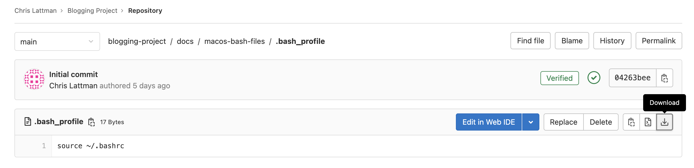

# Terminal Commands

## Table of Contents

- [Introduction](#introduction)
- [Before you start (macOS only)](#before-you-start-macos-only)
- [The 36 most important terminal commands (plus symbols and compression)](#the-36-most-important-terminal-commands-plus-symbols-and-compression)
- [Other important terminal info](#other-important-terminal-info)

## Introduction

Examples of [Unix-like](https://en.wikipedia.org/wiki/Unix-like) terminals include `Terminal.app` (Terminal) on macOS and Terminal on Ubuntu or any other Linux distribution.

- Linux uses the terms "folder" and "directory" interchangeably
- Windows is NOT a Unix-like operating system
- If you want to try all of these commands on Windows, create a [Docker container](../docker#getting-started) (recommended) or set up a [virtual machine](../virtualbox)
- Git Bash allows you to run most of these commands (except `man`, `wget`, `speedtest`, `openvpn`, `htop`, `zip`, or any package manager)

Knowing these commands by heart will make you a "power user" on any Unix-like OS.

## Before you start (macOS only)

Before using these commands on macOS, make sure you are using bash (not zsh) in Terminal by running the following command:

```
echo $0
```

- If it says `-bash` then you're good to go
- Otherwise, run
    ```
    chsh -s /bin/bash
    ```

    Then quit Terminal and restart it.

Apple will tell you to use zsh but just ignore it for now.

Download the 4 files inside of [`macos-dot-files`](../macos-dot-files). You can do this by clicking on a file and then downloading it to your computer by clicking the download button. For example:



Copy these files to your home directory. To make this easy, open up Terminal and run
```
open ~
```
This opens up your home directory in a Finder window. After you have copied these files, quit Terminal and restart it. Your Terminal bash settings are now preserved.

Notes:

- These files make the macOS Terminal behave more like a Linux Terminal
- When you start Terminal, it should place you in your home directory
- When you open a new Finder window from the macOS Dock, it should also open your home directory

### Profiles

You can customize Terminal. There are 10 profiles to choose from; I personally use the "Pro" profile.

To change your Terminal profile, open Terminal and go to Terminal -> Preferences... -> Profiles

- Click on which profile you want, then click "Default" to save your choice
- Check "Blink cursor" to keep your Terminal cursor blinking
- I recommend changing the font size from 10 to 12

To save your changes, quit Terminal and restart it.

## The 36 most important terminal commands (plus symbols and compression):

- [`ls` - lists items in a directory](#ls)
- [`du` - shows size of file or directory contents](#du)
- [`df` - shows free space on drive](#df)
- [`file` - shows details about a file](#file)
- [`mkdir` - creates a new directory](#mkdir)
- [`touch` - creates a new file](#touch)
- [`ln` - creates a shortcut to a file or directory](#ln)
- [`echo` - echoes input](#echo)
- [`pwd` - outputs the current directory path](#pwd)
- [`cd` - changes the current directory](#cd)
- [`cp` - copies a file or directory](#cp)
- [`rm` - removes a file or directory](#rm)
- [`mv` - moves or renames a file or directory](#mv)
- [`cat` - outputs the contents of a file](#cat)
- [`diff` - compares two files for differences](#diff)
- [`wc` - outputs number of words, characters, or lines in a file](#wc)
- [`grep` - searches a file (or files) for a given phrase](#grep)
- [`find` - searches the file system for files and directories](#find)
- [`which` - searches for the location of a command](#which)
- [`chmod` - changes the permissions of a file](#chmod)
- [`man` - manual pages for various commands](#man)
- [`history` - outputs your previous terminal commands](#history)
- [`wget` - downloads files from the Internet](#wget)
- [`shasum` - outputs the SHA-2 hash of a file](#shasum)
- [`speedtest` - calculates Internet speed](#speedtest)
- [`ping` - pings a URL for connectivity](#ping)
- [`ifconfig` - outputs network interface information](#ifconfig)
- [`openvpn` - connects to a VPN service](#openvpn)
- [`date` - outputs the current date and time](#date)
- [`clear` - clears the terminal screen](#clear)
- [`less` - displays a terminal window-sized chunk of scrollable output](#less)
- [`tee` - writes output to both the terminal and a file](#tee)
- [`passwd` - changes the password of a user](#passwd)
- [`ps` - outputs a list of running processes](#ps)
- [`kill` - terminates one or more running processes](#kill)
- [`htop` - displays system usage](#htop)
- [Symbols](#symbols)
- [Compression (`zip` and `tar`)](#compression-zip-and-tar)

There is also a presentation [here](https://courses.cs.vt.edu/cs2505/spring2019/notes/T02_BasicLinuxCommands.pdf), created by Virginia Tech CS department faculty, that discusses some of these commands.

### `ls`

Stands for "list." Use it to list files and directories.

- By default, `ls` lists the files/directories in your current directory
    - Add the name of a directory after `ls` to list the files/directories in that specific directory
    - e.g. `ls ~/Downloads` outputs the contents of your Downloads directory regardless of your current directory
- Use the `-l` flag to list details of the files/directories
    - The first 'd' in front of a result means it is a directory
- Use the `-a` flag to list all files/directories in your current directory (including hidden files/directories)
- Flags can be combined, e.g. `-al` or `-la` (order does not matter)
- For macOS:
    - `ls -lT` is like `ls -l` but shows the detailed timestamp for each file/directory
- For Linux and Git Bash:
    - `ls --full-time` is like `ls -l` but shows the detailed timestamp for each file/directory
- `ls -lt` sorts results by last modified
- `ls -lS` sorts file results by size (doesn't sort directories)
- `ls -lX` sorts results by type (not available on macOS)
- Use the `-r` flag to reverse the results
- `tree` is a similar command that displays directory and subdirectory contents in a tree
    - You might need to install `tree` with a [package manager](#second-honorable-mention-package-managers)
    - `tree -L <depth>` outputs the first `depth` levels of the directory tree

Examples:

```
[Chris@Chris-MBP-16 test-make]$ ls
FracTester.c FracTester.o Fraction.h   Makefile     driver.c
FracTester.h Fraction.c   Fraction.o   driver       driver.dSYM
[Chris@Chris-MBP-16 test-make]$ ls -l
total 208
-rw-r--r--  1 Chris  staff   5385 Dec 19  2021 FracTester.c
-rw-r--r--  1 Chris  staff    412 Dec 19  2021 FracTester.h
-rw-r--r--  1 Chris  staff  13040 Aug 29 16:49 FracTester.o
-rw-r--r--@ 1 Chris  staff   3036 Dec 18  2021 Fraction.c
-rw-r--r--  1 Chris  staff   2512 Dec 19  2021 Fraction.h
-rw-r--r--  1 Chris  staff   5280 Aug 29 16:49 Fraction.o
-rw-r--r--@ 1 Chris  staff    758 Aug 29 16:51 Makefile
-rwxr-xr-x  1 Chris  staff  52816 Aug 29 16:49 driver
-rw-r--r--  1 Chris  staff    985 Dec 18  2021 driver.c
drwxr-xr-x  3 Chris  staff     96 Aug 29 16:49 driver.dSYM
[Chris@Chris-MBP-16 test-make]$ ls -al
total 232
drwxr-xr-x  15 Chris  staff    480 Aug 29 16:49 .
drwx------@ 18 Chris  staff    576 Sep 18 23:06 ..
-rw-r--r--@  1 Chris  staff   6148 Sep  1 20:24 .DS_Store
drwxr-xr-x  16 Chris  staff    512 Aug 29 16:51 .git
-rw-r--r--   1 Chris  staff     23 Dec 19  2021 .gitignore
-rw-r--r--   1 Chris  staff   5385 Dec 19  2021 FracTester.c
-rw-r--r--   1 Chris  staff    412 Dec 19  2021 FracTester.h
-rw-r--r--   1 Chris  staff  13040 Aug 29 16:49 FracTester.o
-rw-r--r--@  1 Chris  staff   3036 Dec 18  2021 Fraction.c
-rw-r--r--   1 Chris  staff   2512 Dec 19  2021 Fraction.h
-rw-r--r--   1 Chris  staff   5280 Aug 29 16:49 Fraction.o
-rw-r--r--@  1 Chris  staff    758 Aug 29 16:51 Makefile
-rwxr-xr-x   1 Chris  staff  52816 Aug 29 16:49 driver
-rw-r--r--   1 Chris  staff    985 Dec 18  2021 driver.c
drwxr-xr-x   3 Chris  staff     96 Aug 29 16:49 driver.dSYM
[Chris@Chris-MBP-16 test-make]$ ls -l driver.dSYM
total 0
drwxr-xr-x  4 Chris  staff  128 Aug 29 16:49 Contents
[Chris@Chris-MBP-16 test-make]$ ls -lT
total 208
-rw-r--r--  1 Chris  staff   5385 Dec 19 00:19:07 2021 FracTester.c
-rw-r--r--  1 Chris  staff    412 Dec 19 00:18:15 2021 FracTester.h
-rw-r--r--  1 Chris  staff  13040 Aug 29 16:49:39 2022 FracTester.o
-rw-r--r--@ 1 Chris  staff   3036 Dec 18 22:49:42 2021 Fraction.c
-rw-r--r--  1 Chris  staff   2512 Dec 19 00:18:10 2021 Fraction.h
-rw-r--r--  1 Chris  staff   5280 Aug 29 16:49:39 2022 Fraction.o
-rw-r--r--@ 1 Chris  staff    758 Aug 29 16:51:23 2022 Makefile
-rwxr-xr-x  1 Chris  staff  52816 Aug 29 16:49:39 2022 driver
-rw-r--r--  1 Chris  staff    985 Dec 18 23:05:09 2021 driver.c
drwxr-xr-x  3 Chris  staff     96 Aug 29 16:49:40 2022 driver.dSYM
[Chris@Chris-MBP-16 test-make]$
```

```
[Chris@Chris-MBP-16 flask]$ tree
.
├── birthdays
│   ├── app.py
│   ├── birthdays.db
│   ├── static
│   │   └── styles.css
│   └── templates
│       ├── error.html
│       ├── index.html
│       ├── invalid-birthday.html
│       ├── invalid-name.html
│       └── layout.html
├── finance
│   ├── app.py
│   ├── finance.db
│   ├── helpers.py
│   ├── requirements.txt
│   ├── static
│   │   ├── favicon.ico
│   │   └── styles.css
│   └── templates
│       ├── add-money.html
│       ├── apology.html
│       ├── buy.html
│       ├── change-password.html
│       ├── delete-account.html
│       ├── history.html
│       ├── index.html
│       ├── layout.html
│       ├── login.html
│       ├── quote.html
│       ├── quoted.html
│       ├── register.html
│       └── sell.html
├── flask-http-echo-server
│   └── app.py
└── trivia
    ├── index.html
    └── styles.css

8 directories, 30 files
[Chris@Chris-MBP-16 flask]$ tree -L 1
.
├── birthdays
├── finance
├── flask-http-echo-server
└── trivia

4 directories, 0 files
[Chris@Chris-MBP-16 flask]$
```

### `du`

Stands for "disk usage." Use it to see the true size of a file or directory's contents.

- `du -s --si <file-or-directory>` shows the file or directory size on disk
- For macOS:
    - `du -sA --si <file-or-directory>` shows the "apparent" directory size
- For Linux and Git Bash:
    - `du -s --si --apparent-size <file-or-directory>` shows the "apparent" directory size

Example:

```
[Chris@Chris-MBP-16 Downloads]$ du -s --si test-make
315k	test-make
[Chris@Chris-MBP-16 Downloads]$ du -sA --si test-make
177k	test-make
[Chris@Chris-MBP-16 Downloads]$
```

### `df`

Stands for "disk free." Use it to see the original size of your drive and the amount of free space available.

- `df -H` shows the free space in human-readable format
    - In my case, the file system representing my files and apps is `/dev/disk1s2`
    - On macOS, this can also be checked by going to System Information -> Hardware -> Storage
    - On Linux, the file system representing files is usually mounted at `/`, the root directory

Example:

```
[Chris@Chris-MBP-16 ~]$ df -H
Filesystem       Size   Used  Avail Capacity iused      ifree %iused  Mounted on
/dev/disk1s1s1   1.0T   8.9G   430G     3%  348574 4195501840    0%   /
devfs            195k   195k     0B   100%     658          0  100%   /dev
/dev/disk1s3     1.0T   2.2G   430G     1%    2887 4195501840    0%   /System/Volumes/Preboot
/dev/disk1s5     1.0T    20k   430G     1%       0 4195501840    0%   /System/Volumes/VM
/dev/disk1s6     1.0T    10M   430G     1%      18 4195501840    0%   /System/Volumes/Update
/dev/disk1s2     1.0T   558G   430G    57% 3718885 4195501840    0%   /System/Volumes/Data
map auto_home      0B     0B     0B   100%       0          0  100%   /System/Volumes/Data/home
/dev/disk2s1     1.6G   1.2G   455M    72%    1086 4294966193    0%   /Volumes/UTM
[Chris@Chris-MBP-16 ~]$
```

### `file`

Shows details about a file's type.

- To see a file's size, use [`du`](#du)

Example:

```
[Chris@Chris-MBP-16 test-make]$ ls -l
total 208
-rw-r--r--  1 Chris  staff   5385 Dec 19  2021 FracTester.c
-rw-r--r--  1 Chris  staff    412 Dec 19  2021 FracTester.h
-rw-r--r--  1 Chris  staff  13040 Aug 29 16:49 FracTester.o
-rw-r--r--@ 1 Chris  staff   3036 Dec 18  2021 Fraction.c
-rw-r--r--  1 Chris  staff   2512 Dec 19  2021 Fraction.h
-rw-r--r--  1 Chris  staff   5280 Aug 29 16:49 Fraction.o
-rw-r--r--@ 1 Chris  staff    758 Aug 29 16:51 Makefile
-rwxr-xr-x  1 Chris  staff  52816 Aug 29 16:49 driver
-rw-r--r--  1 Chris  staff    985 Dec 18  2021 driver.c
drwxr-xr-x  3 Chris  staff     96 Aug 29 16:49 driver.dSYM
[Chris@Chris-MBP-16 test-make]$ file FracTester.c
FracTester.c: c program text, ASCII text
[Chris@Chris-MBP-16 test-make]$ file FracTester.h
FracTester.h: c program text, ASCII text
[Chris@Chris-MBP-16 test-make]$ file FracTester.o
FracTester.o: Mach-O 64-bit object x86_64
[Chris@Chris-MBP-16 test-make]$ file driver
driver: Mach-O 64-bit executable x86_64
[Chris@Chris-MBP-16 test-make]$
```

### `mkdir`

Stands for "make directory." Use it to create a new directory.

- You can create multiple directories at once
- `mkdir -p <name>` creates any necessary directories in the middle, e.g. `mkdir -p path/to/folder`

Examples:

```
[Chris@Chris-MBP-16 test-make]$ ls -l
total 160
-rw-r--r--  1 Chris  staff   5385 Dec 19 00:19 FracTester.c
-rw-r--r--  1 Chris  staff    412 Dec 19 00:18 FracTester.h
-rw-r--r--@ 1 Chris  staff   3036 Dec 18 22:49 Fraction.c
-rw-r--r--  1 Chris  staff   2512 Dec 19 00:18 Fraction.h
-rw-r--r--  1 Chris  staff    647 Dec 19 22:22 Makefile
-rwxr-xr-x  1 Chris  staff  52816 Dec 19 00:30 driver
-rw-r--r--  1 Chris  staff    985 Dec 18 23:05 driver.c
drwxr-xr-x  3 Chris  staff     96 Dec 19 00:30 driver.dSYM
[Chris@Chris-MBP-16 test-make]$ mkdir test-directory
[Chris@Chris-MBP-16 test-make]$ ls -l
total 160
-rw-r--r--  1 Chris  staff   5385 Dec 19 00:19 FracTester.c
-rw-r--r--  1 Chris  staff    412 Dec 19 00:18 FracTester.h
-rw-r--r--@ 1 Chris  staff   3036 Dec 18 22:49 Fraction.c
-rw-r--r--  1 Chris  staff   2512 Dec 19 00:18 Fraction.h
-rw-r--r--  1 Chris  staff    647 Dec 19 22:22 Makefile
-rwxr-xr-x  1 Chris  staff  52816 Dec 19 00:30 driver
-rw-r--r--  1 Chris  staff    985 Dec 18 23:05 driver.c
drwxr-xr-x  3 Chris  staff     96 Dec 19 00:30 driver.dSYM
drwxr-xr-x  2 Chris  staff     64 Jan 16 00:48 test-directory
[Chris@Chris-MBP-16 test-make]$ mkdir test-directory1 directory2 dir3
[Chris@Chris-MBP-16 test-make]$ ls -l
total 160
-rw-r--r--  1 Chris  staff   5385 Dec 19 00:19 FracTester.c
-rw-r--r--  1 Chris  staff    412 Dec 19 00:18 FracTester.h
-rw-r--r--@ 1 Chris  staff   3036 Dec 18 22:49 Fraction.c
-rw-r--r--  1 Chris  staff   2512 Dec 19 00:18 Fraction.h
-rw-r--r--  1 Chris  staff    647 Dec 19 22:22 Makefile
drwxr-xr-x  2 Chris  staff     64 Jan 16 00:48 dir3
drwxr-xr-x  2 Chris  staff     64 Jan 16 00:48 directory2
-rwxr-xr-x  1 Chris  staff  52816 Dec 19 00:30 driver
-rw-r--r--  1 Chris  staff    985 Dec 18 23:05 driver.c
drwxr-xr-x  3 Chris  staff     96 Dec 19 00:30 driver.dSYM
drwxr-xr-x  2 Chris  staff     64 Jan 16 00:48 test-directory
drwxr-xr-x  2 Chris  staff     64 Jan 16 00:48 test-directory1
[Chris@Chris-MBP-16 test-make]$
```

```
[Chris@Chris-MBP-16 Downloads]$ mkdir -p path/to/folder
[Chris@Chris-MBP-16 Downloads]$ pwd
/Users/Chris/Downloads
[Chris@Chris-MBP-16 Downloads]$ cd path/
[Chris@Chris-MBP-16 path]$ pwd
/Users/Chris/Downloads/path
[Chris@Chris-MBP-16 path]$ cd to/
[Chris@Chris-MBP-16 to]$ pwd
/Users/Chris/Downloads/path/to
[Chris@Chris-MBP-16 to]$ cd folder/
[Chris@Chris-MBP-16 folder]$ pwd
/Users/Chris/Downloads/path/to/folder
[Chris@Chris-MBP-16 folder]$
```

### `touch`

Creates a new file.

- You can create multiple files at once

Example:

```
[Chris@Chris-MBP-16 test-make]$ ls -l
total 160
-rw-r--r--  1 Chris  staff   5385 Dec 19 00:19 FracTester.c
-rw-r--r--  1 Chris  staff    412 Dec 19 00:18 FracTester.h
-rw-r--r--@ 1 Chris  staff   3036 Dec 18 22:49 Fraction.c
-rw-r--r--  1 Chris  staff   2512 Dec 19 00:18 Fraction.h
-rw-r--r--  1 Chris  staff    647 Dec 19 22:22 Makefile
-rwxr-xr-x  1 Chris  staff  52816 Dec 19 00:30 driver
-rw-r--r--  1 Chris  staff    985 Dec 18 23:05 driver.c
drwxr-xr-x  3 Chris  staff     96 Dec 19 00:30 driver.dSYM
[Chris@Chris-MBP-16 test-make]$ touch file.txt
[Chris@Chris-MBP-16 test-make]$ ls -l
total 160
-rw-r--r--  1 Chris  staff   5385 Dec 19 00:19 FracTester.c
-rw-r--r--  1 Chris  staff    412 Dec 19 00:18 FracTester.h
-rw-r--r--@ 1 Chris  staff   3036 Dec 18 22:49 Fraction.c
-rw-r--r--  1 Chris  staff   2512 Dec 19 00:18 Fraction.h
-rw-r--r--  1 Chris  staff    647 Dec 19 22:22 Makefile
-rwxr-xr-x  1 Chris  staff  52816 Dec 19 00:30 driver
-rw-r--r--  1 Chris  staff    985 Dec 18 23:05 driver.c
drwxr-xr-x  3 Chris  staff     96 Dec 19 00:30 driver.dSYM
-rw-r--r--  1 Chris  staff      0 Jan 16 00:45 file.txt
[Chris@Chris-MBP-16 test-make]$ touch file1.txt file2.py file3.java
[Chris@Chris-MBP-16 test-make]$ ls -l
total 160
-rw-r--r--  1 Chris  staff   5385 Dec 19 00:19 FracTester.c
-rw-r--r--  1 Chris  staff    412 Dec 19 00:18 FracTester.h
-rw-r--r--@ 1 Chris  staff   3036 Dec 18 22:49 Fraction.c
-rw-r--r--  1 Chris  staff   2512 Dec 19 00:18 Fraction.h
-rw-r--r--  1 Chris  staff    647 Dec 19 22:22 Makefile
-rwxr-xr-x  1 Chris  staff  52816 Dec 19 00:30 driver
-rw-r--r--  1 Chris  staff    985 Dec 18 23:05 driver.c
drwxr-xr-x  3 Chris  staff     96 Dec 19 00:30 driver.dSYM
-rw-r--r--  1 Chris  staff      0 Jan 16 00:45 file.txt
-rw-r--r--  1 Chris  staff      0 Jan 16 00:46 file1.txt
-rw-r--r--  1 Chris  staff      0 Jan 16 00:46 file2.py
-rw-r--r--  1 Chris  staff      0 Jan 16 00:46 file3.java
[Chris@Chris-MBP-16 test-make]$
```

### `ln`

Stands for "link." Use it to create symbolic links, also known as shortcuts, to files and directories.

- `ln -s $(realpath <source-file-or-directory>) <shortcut-name>`
    - This is what you want most of the time
    - The created shortcut can be moved around and it will still work
    - Of course, if the source file or directory is moved, the link will be broken and no longer work
- `ln -s <source-file-or-directory> <shortcut-name>`
    - In some cases, you want the shortcut to link to a file in the same directory tree, where both can be exported, e.g. to a USB drive
    - However, moving the shortcut into any other directory will break the shortcut

Example:

```
[Chris@Chris-MBP-16 Downloads]$ ls -l
total 24
drwxr-xr-x  8 Chris  staff   256 Oct 27 18:59 VM images
-rw-r--r--@ 1 Chris  staff  3258 Jul  9 00:37 crypto_test.py
-rw-r--r--  1 Chris  staff    46 Dec 27 22:13 file.txt
-rw-r--r--@ 1 Chris  staff   565 Sep 20 09:51 firsts.txt
drwxr-xr-x  8 Chris  staff   256 Dec 27 22:14 flask
drwxr-xr-x  6 Chris  staff   192 Sep 24  2021 taken from phone
[Chris@Chris-MBP-16 Downloads]$
[Chris@Chris-MBP-16 Downloads]$ cat file.txt
This is a file that will have a shortcut soon
[Chris@Chris-MBP-16 Downloads]$ ln -s $(realpath file.txt) shortcut1
[Chris@Chris-MBP-16 Downloads]$ ls -l
total 24
drwxr-xr-x  8 Chris  staff   256 Oct 27 18:59 VM images
-rw-r--r--@ 1 Chris  staff  3258 Jul  9 00:37 crypto_test.py
-rw-r--r--  1 Chris  staff    46 Dec 27 22:13 file.txt
-rw-r--r--@ 1 Chris  staff   565 Sep 20 09:51 firsts.txt
drwxr-xr-x  7 Chris  staff   224 Dec 26 22:06 flask
lrwxr-xr-x  1 Chris  staff    31 Dec 27 22:13 shortcut1 -> /Users/Chris/Downloads/file.txt
drwxr-xr-x  6 Chris  staff   192 Sep 24  2021 taken from phone
[Chris@Chris-MBP-16 Downloads]$ file shortcut1
shortcut1: ASCII text
[Chris@Chris-MBP-16 Downloads]$ cat shortcut1
This is a file that will have a shortcut soon
[Chris@Chris-MBP-16 Downloads]$ mv shortcut1 flask
[Chris@Chris-MBP-16 Downloads]$ cd flask
[Chris@Chris-MBP-16 flask]$ ls -l
total 0
drwxr-xr-x  7 Chris  staff  224 May  1  2022 birthdays
drwxr-xr-x  9 Chris  staff  288 May  2  2022 finance
drwxr-xr-x  4 Chris  staff  128 Apr 29  2022 flask-http-echo-server
lrwxr-xr-x  1 Chris  staff   31 Dec 27 22:13 shortcut1 -> /Users/Chris/Downloads/file.txt
drwxr-xr-x@ 4 Chris  staff  128 Apr 27  2022 trivia
[Chris@Chris-MBP-16 flask]$ file shortcut1
shortcut1: ASCII text
[Chris@Chris-MBP-16 flask]$ cat shortcut1
This is a file that will have a shortcut soon
[Chris@Chris-MBP-16 flask]$
```

### `echo`

Useful utility that echoes any input back out.

- It can be used to check which shell you are using: `echo $0`
- It is also used to quickly add text to a file: `echo [-e] "text" > <file>`
    - The `-e` flag allows you to write characters such as the newline character, `\n`
    - You can append to the end of a file (instead of overwriting its contents) by running `echo [-e] "text" >> <file>`
        - Appending to a file automatically adds a newline character before any text
- You can use `echo` to see the exit code of the last command executed: `echo $?`
    - 0 indicates success, while a non-zero value indicates failure

Example:

```
[Chris@Chris-MBP-16 test-make]$ echo $0
-bash
[Chris@Chris-MBP-16 test-make]$ echo -e "sample text\nmore text" > file.txt
[Chris@Chris-MBP-16 test-make]$ cat file.txt
sample text
more text
[Chris@Chris-MBP-16 test-make]$ echo "even more text" >> file.txt
[Chris@Chris-MBP-16 test-make]$ cat file.txt
sample text
more text
even more text
[Chris@Chris-MBP-16 test-make]$ echo $?
0
[Chris@Chris-MBP-16 test-make]$ cat ~/Downloads
cat: /Users/Chris/Downloads/: Is a directory
[Chris@Chris-MBP-16 test-make]$ echo $?
1
[Chris@Chris-MBP-16 test-make]$
```

### `pwd`

Stands for "present working directory." Use it to output your current directory.

Example:

```
[Chris@Chris-MBP-16 test-make]$ pwd
/Users/Chris/Downloads/test-make
[Chris@Chris-MBP-16 test-make]$
```

### `cd`

Stands for "change directory." Use it to change your current directory.

- Running `cd` by itself takes you to your home directory

Example:

```
[Chris@Chris-MBP-16 test-make]$ pwd
/Users/Chris/Downloads/test-make
[Chris@Chris-MBP-16 test-make]$ mkdir test-directory
[Chris@Chris-MBP-16 test-make]$ cd test-directory
[Chris@Chris-MBP-16 test-directory]$ pwd
/Users/Chris/Downloads/test-make/test-directory
[Chris@Chris-MBP-16 test-make]$
```

### `cp`

Stands for "copy." Use it to copy files or subdirectories from one directory to another directory.

- `cp <source1> [source2] ... [sourceN] <destination>`
- Use the `-r` flag to copy over a directory (the r stands for recursive)
    - `cp -r <source-directory> <destination-directory>`
- You can copy one or more files and/or directories to a destination directory
- Remember, this does not work like copy and paste on a GUI - there is no inherent "clipboard"
    - Therefore, you must specify a destination
- You can use `cp` to make a copy of a file in the same directory, e.g. `cp file.txt file-copy.txt`
- You can copy a file to another directory and rename the file in its new directory with one command
    - For example, `cp file.txt /tmp/results.txt` copies `file.txt` from the current directory and pastes it into the `/tmp` directory, but with the new name of `results.txt`

Examples:

```
[Chris@Chris-MBP-16 test-make]$ ls -l
total 160
-rw-r--r--  1 Chris  staff   5385 Dec 19 00:19 FracTester.c
-rw-r--r--  1 Chris  staff    412 Dec 19 00:18 FracTester.h
-rw-r--r--@ 1 Chris  staff   3036 Dec 18 22:49 Fraction.c
-rw-r--r--  1 Chris  staff   2512 Dec 19 00:18 Fraction.h
-rw-r--r--  1 Chris  staff    647 Dec 19 22:22 Makefile
-rwxr-xr-x  1 Chris  staff  52816 Dec 19 00:30 driver
-rw-r--r--  1 Chris  staff    985 Dec 18 23:05 driver.c
drwxr-xr-x  3 Chris  staff     96 Dec 19 00:30 driver.dSYM
[Chris@Chris-MBP-16 test-make]$ mkdir test-directory
[Chris@Chris-MBP-16 test-make]$ cp driver.c test-directory
[Chris@Chris-MBP-16 test-make]$ cd test-directory
[Chris@Chris-MBP-16 test-directory]$ ls -l
total 8
-rw-r--r--  1 Chris  staff  985 Jan 16 01:00 driver.c
[Chris@Chris-MBP-16 test-make]$
```

```
[Chris@Chris-MBP-16 test-make]$ ls -l
total 160
-rw-r--r--  1 Chris  staff   5385 Dec 19 00:19 FracTester.c
-rw-r--r--  1 Chris  staff    412 Dec 19 00:18 FracTester.h
-rw-r--r--@ 1 Chris  staff   3036 Dec 18 22:49 Fraction.c
-rw-r--r--  1 Chris  staff   2512 Dec 19 00:18 Fraction.h
-rw-r--r--  1 Chris  staff    647 Dec 19 22:22 Makefile
-rwxr-xr-x  1 Chris  staff  52816 Dec 19 00:30 driver
-rw-r--r--  1 Chris  staff    985 Dec 18 23:05 driver.c
drwxr-xr-x  3 Chris  staff     96 Dec 19 00:30 driver.dSYM
[Chris@Chris-MBP-16 test-make]$ mkdir test-directory
[Chris@Chris-MBP-16 test-make]$ cp driver.c test-directory
[Chris@Chris-MBP-16 test-make]$ mkdir other-directory
[Chris@Chris-MBP-16 test-make]$ cp -r test-directory other-directory
[Chris@Chris-MBP-16 test-make]$ cd other-directory
[Chris@Chris-MBP-16 other-directory]$ ls -l
total 0
drwxr-xr-x  3 Chris  staff  96 Jan 16 01:03 test-directory
[Chris@Chris-MBP-16 other-directory]$ cd test-directory
[Chris@Chris-MBP-16 test-directory]$ ls -l
total 8
-rw-r--r--  1 Chris  staff  985 Jan 16 01:03 driver.c
[Chris@Chris-MBP-16 test-make]$
```

### `rm`

Stands for "remove." Use it to remove files and/or directories.

- Use `-rf` to remove one or more directories (r stands for recursive, f stands for force)
- `rmdir` is another remove command you might see, but it can only be used to remove empty directories

Example:

```
[Chris@Chris-MBP-16 test-make]$ ls -l
total 160
-rw-r--r--  1 Chris  staff   5385 Dec 19 00:19 FracTester.c
-rw-r--r--  1 Chris  staff    412 Dec 19 00:18 FracTester.h
-rw-r--r--@ 1 Chris  staff   3036 Dec 18 22:49 Fraction.c
-rw-r--r--  1 Chris  staff   2512 Dec 19 00:18 Fraction.h
-rw-r--r--  1 Chris  staff    647 Dec 19 22:22 Makefile
-rwxr-xr-x  1 Chris  staff  52816 Dec 19 00:30 driver
-rw-r--r--  1 Chris  staff    985 Dec 18 23:05 driver.c
drwxr-xr-x  3 Chris  staff     96 Dec 19 00:30 driver.dSYM
[Chris@Chris-MBP-16 test-make]$ touch file.txt
[Chris@Chris-MBP-16 test-make]$ ls -l
total 160
-rw-r--r--  1 Chris  staff   5385 Dec 19 00:19 FracTester.c
-rw-r--r--  1 Chris  staff    412 Dec 19 00:18 FracTester.h
-rw-r--r--@ 1 Chris  staff   3036 Dec 18 22:49 Fraction.c
-rw-r--r--  1 Chris  staff   2512 Dec 19 00:18 Fraction.h
-rw-r--r--  1 Chris  staff    647 Dec 19 22:22 Makefile
-rwxr-xr-x  1 Chris  staff  52816 Dec 19 00:30 driver
-rw-r--r--  1 Chris  staff    985 Dec 18 23:05 driver.c
drwxr-xr-x  3 Chris  staff     96 Dec 19 00:30 driver.dSYM
-rw-r--r--  1 Chris  staff      0 Jan 24 23:51 file.txt
[Chris@Chris-MBP-16 test-make]$ rm file.txt
[Chris@Chris-MBP-16 test-make]$ ls -l
total 160
-rw-r--r--  1 Chris  staff   5385 Dec 19 00:19 FracTester.c
-rw-r--r--  1 Chris  staff    412 Dec 19 00:18 FracTester.h
-rw-r--r--@ 1 Chris  staff   3036 Dec 18 22:49 Fraction.c
-rw-r--r--  1 Chris  staff   2512 Dec 19 00:18 Fraction.h
-rw-r--r--  1 Chris  staff    647 Dec 19 22:22 Makefile
-rwxr-xr-x  1 Chris  staff  52816 Dec 19 00:30 driver
-rw-r--r--  1 Chris  staff    985 Dec 18 23:05 driver.c
drwxr-xr-x  3 Chris  staff     96 Dec 19 00:30 driver.dSYM
[Chris@Chris-MBP-16 test-make]$ touch file.txt
[Chris@Chris-MBP-16 test-make]$ mkdir file-directory
[Chris@Chris-MBP-16 test-make]$ cp file.txt file-directory
[Chris@Chris-MBP-16 test-make]$ ls -l
total 160
-rw-r--r--  1 Chris  staff   5385 Dec 19 00:19 FracTester.c
-rw-r--r--  1 Chris  staff    412 Dec 19 00:18 FracTester.h
-rw-r--r--@ 1 Chris  staff   3036 Dec 18 22:49 Fraction.c
-rw-r--r--  1 Chris  staff   2512 Dec 19 00:18 Fraction.h
-rw-r--r--  1 Chris  staff    647 Dec 19 22:22 Makefile
-rwxr-xr-x  1 Chris  staff  52816 Dec 19 00:30 driver
-rw-r--r--  1 Chris  staff    985 Dec 18 23:05 driver.c
drwxr-xr-x  3 Chris  staff     96 Dec 19 00:30 driver.dSYM
drwxr-xr-x  3 Chris  staff     96 Jan 24 23:52 file-directory
-rw-r--r--  1 Chris  staff      0 Jan 24 23:52 file.txt
[Chris@Chris-MBP-16 test-make]$ ls -l file-directory
total 0
-rw-r--r--  1 Chris  staff  0 Jan 24 23:52 file.txt
[Chris@Chris-MBP-16 test-make]$ rm -rf file.txt file-directory
[Chris@Chris-MBP-16 test-make]$ ls -l
total 160
-rw-r--r--  1 Chris  staff   5385 Dec 19 00:19 FracTester.c
-rw-r--r--  1 Chris  staff    412 Dec 19 00:18 FracTester.h
-rw-r--r--@ 1 Chris  staff   3036 Dec 18 22:49 Fraction.c
-rw-r--r--  1 Chris  staff   2512 Dec 19 00:18 Fraction.h
-rw-r--r--  1 Chris  staff    647 Dec 19 22:22 Makefile
-rwxr-xr-x  1 Chris  staff  52816 Dec 19 00:30 driver
-rw-r--r--  1 Chris  staff    985 Dec 18 23:05 driver.c
drwxr-xr-x  3 Chris  staff     96 Dec 19 00:30 driver.dSYM
[Chris@Chris-MBP-16 test-make]$ touch file1.txt file2.txt
[Chris@Chris-MBP-16 test-make]$ ls -l
total 160
-rw-r--r--  1 Chris  staff   5385 Dec 19 00:19 FracTester.c
-rw-r--r--  1 Chris  staff    412 Dec 19 00:18 FracTester.h
-rw-r--r--@ 1 Chris  staff   3036 Dec 18 22:49 Fraction.c
-rw-r--r--  1 Chris  staff   2512 Dec 19 00:18 Fraction.h
-rw-r--r--  1 Chris  staff    647 Dec 19 22:22 Makefile
-rwxr-xr-x  1 Chris  staff  52816 Dec 19 00:30 driver
-rw-r--r--  1 Chris  staff    985 Dec 18 23:05 driver.c
drwxr-xr-x  3 Chris  staff     96 Dec 19 00:30 driver.dSYM
-rw-r--r--  1 Chris  staff      0 Jan 24 23:52 file1.txt
-rw-r--r--  1 Chris  staff      0 Jan 24 23:52 file2.txt
[Chris@Chris-MBP-16 test-make]$ rm file1.txt file2.txt
[Chris@Chris-MBP-16 test-make]$ ls -l
total 160
-rw-r--r--  1 Chris  staff   5385 Dec 19 00:19 FracTester.c
-rw-r--r--  1 Chris  staff    412 Dec 19 00:18 FracTester.h
-rw-r--r--@ 1 Chris  staff   3036 Dec 18 22:49 Fraction.c
-rw-r--r--  1 Chris  staff   2512 Dec 19 00:18 Fraction.h
-rw-r--r--  1 Chris  staff    647 Dec 19 22:22 Makefile
-rwxr-xr-x  1 Chris  staff  52816 Dec 19 00:30 driver
-rw-r--r--  1 Chris  staff    985 Dec 18 23:05 driver.c
drwxr-xr-x  3 Chris  staff     96 Dec 19 00:30 driver.dSYM
[Chris@Chris-MBP-16 test-make]$ mkdir empty-directory
[Chris@Chris-MBP-16 test-make]$ ls -l
total 160
-rw-r--r--  1 Chris  staff   5385 Dec 19 00:19 FracTester.c
-rw-r--r--  1 Chris  staff    412 Dec 19 00:18 FracTester.h
-rw-r--r--@ 1 Chris  staff   3036 Dec 18 22:49 Fraction.c
-rw-r--r--  1 Chris  staff   2512 Dec 19 00:18 Fraction.h
-rw-r--r--  1 Chris  staff    647 Dec 19 22:22 Makefile
-rwxr-xr-x  1 Chris  staff  52816 Dec 19 00:30 driver
-rw-r--r--  1 Chris  staff    985 Dec 18 23:05 driver.c
drwxr-xr-x  3 Chris  staff     96 Dec 19 00:30 driver.dSYM
drwxr-xr-x  2 Chris  staff     64 Jan 24 23:53 empty-directory
[Chris@Chris-MBP-16 test-make]$ rmdir empty-directory
[Chris@Chris-MBP-16 test-make]$ ls -l
total 160
-rw-r--r--  1 Chris  staff   5385 Dec 19 00:19 FracTester.c
-rw-r--r--  1 Chris  staff    412 Dec 19 00:18 FracTester.h
-rw-r--r--@ 1 Chris  staff   3036 Dec 18 22:49 Fraction.c
-rw-r--r--  1 Chris  staff   2512 Dec 19 00:18 Fraction.h
-rw-r--r--  1 Chris  staff    647 Dec 19 22:22 Makefile
-rwxr-xr-x  1 Chris  staff  52816 Dec 19 00:30 driver
-rw-r--r--  1 Chris  staff    985 Dec 18 23:05 driver.c
drwxr-xr-x  3 Chris  staff     96 Dec 19 00:30 driver.dSYM
[Chris@Chris-MBP-16 test-make]$
```

### `mv`

Stands for "move." It can be used to move _or rename_ a file or directory.

- `mv <old-name> <new-name>` for renaming
- `mv <file-or-directory> <new-location>` for moving

Example:

```
[Chris@Chris-MBP-16 test-make]$ ls -l
total 160
-rw-r--r--  1 Chris  staff   5385 Dec 19 00:19 FracTester.c
-rw-r--r--  1 Chris  staff    412 Dec 19 00:18 FracTester.h
-rw-r--r--@ 1 Chris  staff   3036 Dec 18 22:49 Fraction.c
-rw-r--r--  1 Chris  staff   2512 Dec 19 00:18 Fraction.h
-rw-r--r--  1 Chris  staff    647 Dec 19 22:22 Makefile
-rwxr-xr-x  1 Chris  staff  52816 Dec 19 00:30 driver
-rw-r--r--  1 Chris  staff    985 Dec 18 23:05 driver.c
drwxr-xr-x  3 Chris  staff     96 Dec 19 00:30 driver.dSYM
[Chris@Chris-MBP-16 test-make]$ touch file.txt
[Chris@Chris-MBP-16 test-make]$ ls -l
total 160
-rw-r--r--  1 Chris  staff   5385 Dec 19 00:19 FracTester.c
-rw-r--r--  1 Chris  staff    412 Dec 19 00:18 FracTester.h
-rw-r--r--@ 1 Chris  staff   3036 Dec 18 22:49 Fraction.c
-rw-r--r--  1 Chris  staff   2512 Dec 19 00:18 Fraction.h
-rw-r--r--  1 Chris  staff    647 Dec 19 22:22 Makefile
-rwxr-xr-x  1 Chris  staff  52816 Dec 19 00:30 driver
-rw-r--r--  1 Chris  staff    985 Dec 18 23:05 driver.c
drwxr-xr-x  3 Chris  staff     96 Dec 19 00:30 driver.dSYM
-rw-r--r--  1 Chris  staff      0 Jan 18 16:21 file.txt
[Chris@Chris-MBP-16 test-make]$ mv file.txt new-name.txt
[Chris@Chris-MBP-16 test-make]$ ls -l
total 160
-rw-r--r--  1 Chris  staff   5385 Dec 19 00:19 FracTester.c
-rw-r--r--  1 Chris  staff    412 Dec 19 00:18 FracTester.h
-rw-r--r--@ 1 Chris  staff   3036 Dec 18 22:49 Fraction.c
-rw-r--r--  1 Chris  staff   2512 Dec 19 00:18 Fraction.h
-rw-r--r--  1 Chris  staff    647 Dec 19 22:22 Makefile
-rwxr-xr-x  1 Chris  staff  52816 Dec 19 00:30 driver
-rw-r--r--  1 Chris  staff    985 Dec 18 23:05 driver.c
drwxr-xr-x  3 Chris  staff     96 Dec 19 00:30 driver.dSYM
-rw-r--r--  1 Chris  staff      0 Jan 18 16:21 new-name.txt
[Chris@Chris-MBP-16 test-make]$ mkdir test-directory
[Chris@Chris-MBP-16 test-make]$ mv new-name.txt test-directory
[Chris@Chris-MBP-16 test-make]$ ls -l
total 160
-rw-r--r--  1 Chris  staff   5385 Dec 19 00:19 FracTester.c
-rw-r--r--  1 Chris  staff    412 Dec 19 00:18 FracTester.h
-rw-r--r--@ 1 Chris  staff   3036 Dec 18 22:49 Fraction.c
-rw-r--r--  1 Chris  staff   2512 Dec 19 00:18 Fraction.h
-rw-r--r--  1 Chris  staff    647 Dec 19 22:22 Makefile
-rwxr-xr-x  1 Chris  staff  52816 Dec 19 00:30 driver
-rw-r--r--  1 Chris  staff    985 Dec 18 23:05 driver.c
drwxr-xr-x  3 Chris  staff     96 Dec 19 00:30 driver.dSYM
drwxr-xr-x  3 Chris  staff     96 Jan 18 16:22 test-directory
[Chris@Chris-MBP-16 test-make]$ cd test-directory
[Chris@Chris-MBP-16 test-directory]$ ls -l
total 0
-rw-r--r--  1 Chris  staff  0 Jan 18 16:21 new-name.txt
[Chris@Chris-MBP-16 test-directory]$
```

### `cat`

Stands for "concatenate," but for most purposes, it is used to output the contents of a file.

- `cat -n <file>` outputs line numbers for a given file
- `cat <file1> [file2] ... [fileN]` concatenates the output of two or more files

Examples:

```
[Chris@Chris-MBP-16 test-make]$ ls -l
total 160
-rw-r--r--  1 Chris  staff   5385 Dec 19 00:19 FracTester.c
-rw-r--r--  1 Chris  staff    412 Dec 19 00:18 FracTester.h
-rw-r--r--@ 1 Chris  staff   3036 Dec 18 22:49 Fraction.c
-rw-r--r--  1 Chris  staff   2512 Dec 19 00:18 Fraction.h
-rw-r--r--  1 Chris  staff    647 Dec 19 22:22 Makefile
-rwxr-xr-x  1 Chris  staff  52816 Dec 19 00:30 driver
-rw-r--r--  1 Chris  staff    985 Dec 18 23:05 driver.c
drwxr-xr-x  3 Chris  staff     96 Dec 19 00:30 driver.dSYM
[Chris@Chris-MBP-16 test-make]$ cat driver.c
#include "Fraction.h"
#include "FracTester.h"

int main(void)
{
    /*
     * Quick test of Fraction implementation
     */
    Fraction* frac1 = fraction_init(14, 27);
    Fraction* frac2 = fraction_init(12, 13);
    int f1_num = frac1->numerator;
    int f1_denom = frac1->denominator;
    int f2_num = frac2->numerator;
    int f2_denom = frac2->denominator;
    fraction_multiply(frac1, frac2);
    int prod_num = frac1->numerator;
    int prod_denom = frac1->denominator;
    printf("%d/%d * %d/%d = %d/%d\n", f1_num, f1_denom, f2_num, f2_denom,
        prod_num, prod_denom);
    fraction_free(frac1);
    fraction_free(frac2);

    /**
     * Run the full test suite
     */
    test_fraction_init();
    test_fraction_free();
    test_fraction_add();
    test_fraction_subtract();
    test_fraction_multiply();
    test_fraction_divide();
    test_fraction_invert();
    test_fraction_negate();
    test_fraction_reduce();
    test_fraction_check_negatives();

    return 0;
}
[Chris@Chris-MBP-16 test-make]$ cat -n driver.c
     1	#include "Fraction.h"
     2	#include "FracTester.h"
     3
     4	int main(void)
     5	{
     6	    /*
     7	     * Quick test of Fraction implementation
     8	     */
     9	    Fraction* frac1 = fraction_init(14, 27);
    10	    Fraction* frac2 = fraction_init(12, 13);
    11	    int f1_num = frac1->numerator;
    12	    int f1_denom = frac1->denominator;
    13	    int f2_num = frac2->numerator;
    14	    int f2_denom = frac2->denominator;
    15	    fraction_multiply(frac1, frac2);
    16	    int prod_num = frac1->numerator;
    17	    int prod_denom = frac1->denominator;
    18	    printf("%d/%d * %d/%d = %d/%d\n", f1_num, f1_denom, f2_num, f2_denom,
    19	        prod_num, prod_denom);
    20	    fraction_free(frac1);
    21	    fraction_free(frac2);
    22
    23	    /**
    24	     * Run the full test suite
    25	     */
    26	    test_fraction_init();
    27	    test_fraction_free();
    28	    test_fraction_add();
    29	    test_fraction_subtract();
    30	    test_fraction_multiply();
    31	    test_fraction_divide();
    32	    test_fraction_invert();
    33	    test_fraction_negate();
    34	    test_fraction_reduce();
    35	    test_fraction_check_negatives();
    36
    37	    return 0;
    38	}
[Chris@Chris-MBP-16 test-make]$
```

```
[Chris@Chris-MBP-16 Downloads]$ cat file1.txt
This is file1.txt
[Chris@Chris-MBP-16 Downloads]$ cat file2.txt
This is file2.txt
[Chris@Chris-MBP-16 Downloads]$ cat file1.txt file2.txt
This is file1.txt
This is file2.txt
[Chris@Chris-MBP-16 Downloads]$
```

### `diff`

Stands for "difference." It compares two files for differences line by line.

Example:

```
[Chris@Chris-MBP-16 Downloads]$ cat file1.txt
Line of text
1ine of text
some more text
[Chris@Chris-MBP-16 Downloads]$ cat file2.txt
Line of text
line of text
some more text
[Chris@Chris-MBP-16 Downloads]$ diff file1.txt file2.txt
2c2
< 1ine of text
---
> line of text
[Chris@Chris-MBP-16 Downloads]$
```

### `wc`

Stands for "word count." Despite its name, it can also output the character count or line count of a file.

- `wc -w <file>` outputs the number of words in a file
- `wc -m <file>` outputs the number of characters in a file
- `wc -l <file>` outputs the numbers of lines of text in a file

Example:

```
[Chris@Chris-MBP-16 Downloads]$ cat file1.txt
Line of text
1ine of text
some more text
[Chris@Chris-MBP-16 Downloads]$ wc -w file1.txt
       9 file1.txt
[Chris@Chris-MBP-16 Downloads]$ wc -m file1.txt
      41 file1.txt
[Chris@Chris-MBP-16 Downloads]$ wc -l file1.txt
       3 file1.txt
[Chris@Chris-MBP-16 Downloads]$
```

### `grep`

It searches a file (or files) for a given phrase.

- `grep -In "phrase" <file>` outputs every line that has a match as well as the line number
    - You can specify more than one file: `grep -In "phrase" <file1> <file2> ... <fileN>`
    - `grep -In "phrase" test*` searches all files that start with "test" for phrase
- `grep -Inr "phrase" <directory>` recursively searches within a directory for lines containing the provided phrase
    - You can specify more than one directory: `grep -Inr "phrase" <directory1> <directory2> ... <directoryN>`
    - `grep -Inr "phrase" test*` recursively searches all files and directories that start with "test" for files that contain phrase
- You can also include and/or exclude certain file extensions and directories from your search
    - `grep -Inr --include=*.txt "phrase" <directory>` restricts the search to text files
    - `grep -Inr --include=*.{c,h} "phrase" <directory>` restricts the search to C source and header files
    - `grep -Inr --exclude=*.txt "phrase" <directory>` restricts the search to everything except text files
    - `grep -Inr --exclude=*{c,h} "phrase" <directory>` restricts the search to everything except C source and header files
    - `grep -Inr --exclude-dir=*lorem* "phrase" <directory>` restricts the search to everything except files in any subdirectory with "lorem" anywhere in its name
    - `grep -Inr --exclude-dir={*lorem*,ipsum} "phrase" <directory>` restricts the search to everything except files in any subdirectory with "lorem" anywhere in its name and any subdirectory precisely named "ipsum"
    - If using curly braces, make sure to include comma, even for 1 pattern: `{phrase,}`
    - These include/exclude options can be combined in a single command
- `grep -Inw "phrase" <directory>` matches whole words, e.g. `onephrase` or `phrases` will not be matched
- By default, `grep` is case-sensitive. To perform a case-insensitive search, add the lowercase `-i` flag.
- `grep -Irl "old_phrase" <directory> | xargs sed -i "s/old_phrase/new_phrase/g"` finds and replaces all instances of `old_phrase` with `new_phrase` for all files within a directory (and its subdirectories)
    - For a single file, run `sed -i "s/old_phrase/new_phrase/g" <file>`
    - Prefix any `/` in `old_phrase` or `new_phrase` of `sed -i "s/old_phrase/new_phrase/g"` with a `\`
    - `grep -Iirl "old_phrase" <directory> | xargs sed -i "s/old_phrase/new_phrase/gI"` performs a case-insensitive find and replace
        - macOS requires `gnu-sed` to do this, which can be installed with [`brew`](#second-honorable-mention-package-managers)
- Once you've found matching results, you can filter out results containing an undesired phrase
    - `grep -Inr "phrase_wanted" <directory> | grep -v "phrase_unwanted"` filters out the results that include `phrase_unwanted` from all results containing `phrase_wanted`

Examples:

```
[Chris@Chris-MBP-16 Downloads]$ cat file.txt
This is a random file.
Lorem ipsum dolor
Some more text
Even more text
Done
[Chris@Chris-MBP-16 Downloads]$ grep -In "text" file.txt
3:Some more text
4:Even more text
[Chris@Chris-MBP-16 Downloads]$
```

```
[Chris@Chris-MBP-16 flask]$ grep -Inr "True" .
./birthdays/app.py:10:app.config["TEMPLATES_AUTO_RELOAD"] = True
./finance/app.py:16:app.config["TEMPLATES_AUTO_RELOAD"] = True
./finance/app.py:269:                lower = True
./finance/app.py:271:                upper = True
./finance/app.py:273:                digit = True
./finance/app.py:494:                lower = True
./finance/app.py:496:                upper = True
./finance/app.py:498:                digit = True
[Chris@Chris-MBP-16 flask]$
```

### `find`

It searches the file system for files and directories that match the input phrase. You specify which directory to search within.

- `find <directory> -iname "phrase"`
- `find / -iname "file.txt"` searches anywhere in the entire drive for files with the name "file.txt"
- `find . -iname "test*"` only searches within the current directory (and any subdirectories) for files and directories whose names start with "test"
    - `find . -iname "test*" -maxdepth 1` does the same thing but does not search within subdirectories
- Use `-name` instead of `-iname` if you want to perform a case-sensitive search
- By default, `find` outputs matching files
    - This is formally represented by the `-print` flag
    - `find . -iname "file*.txt` does the same thing as `find . -iname "file*.txt" -print`
- `find` can also be used to copy, move, or rename files and directories (and more) with the `-exec` flag
    - `find . -iname "file*.txt" -exec cp {} {}_1 \;` makes a copy of each matching file with `_1` appended to the filename
    - `find . -iname "file*.txt" -exec mv {} {}_1 \;` appends `_1` to the filename of each matching file
- `find . -iname "file*.txt" | xargs rm` removes all matching files

Example:

```
[Chris@Chris-MBP-16 Downloads]$ touch file1.txt file2.txt file3.txt
[Chris@Chris-MBP-16 Downloads]$ find . -iname "file*.txt"
./file2.txt
./file3.txt
./file1.txt
[Chris@Chris-MBP-16 Downloads]$
```

### `which`

Outputs the file location of a command in the terminal's [path](#add-to-path).

- It can be used to determine if a command is available without having to run the command itself
- Commands like [`cd`](#cd), [`alias`](#aliasing), and [`history`](#history) might not have file locations because they are built-in bash commands

Example:

```
[Chris@Chris-MBP-16 Downloads]$ which mkdir
/bin/mkdir
[Chris@Chris-MBP-16 Downloads]$
```

### `chmod`

Stands for "change mode." It changes the permissions of a file.

- This is commonly used to allow shell scripts (`.sh` files) or executables to run in a terminal
- A common usage is `chmod 744 <file>`, which allows `<file>` to be executed by the user and read by members of the user's group and others
    - 1 allows execution, 2 allows write access, and 4 allows read access
    - You can use any combination of these privileges by adding the numbers of the desired privileges
- You may also see something like `chmod +x <file>`, which allows `<file>` to be executed by anyone
    - `chmod u+x <file>` specifically grants the user execute permissions for `<file>`

Example:

```
[Chris@Chris-MBP-16 test-directory]$ ls -l
total 8
-rw-r--r--  1 Chris  staff  21 Jan 16 01:30 script.sh
[Chris@Chris-MBP-16 test-directory]$ cat script.sh
echo "Hello, world!"
[Chris@Chris-MBP-16 test-directory]$ ./script.sh
-bash: ./script.sh: Permission denied
[Chris@Chris-MBP-16 test-directory]$ chmod 744 script.sh
[Chris@Chris-MBP-16 test-directory]$ ./script.sh
Hello, world!
[Chris@Chris-MBP-16 test-directory]$
```

### `man`

Stands for "manual." It can be helpful if you want to find out more about a common command.

- `man <command>`
- Press `q` to exit any manual page
- Many commands output a condensed help guide with the `--help` flag, e.g. `grep --help`

### `history`

Outputs your terminal history. Just run `history` to view.

- You can use `history` with [`grep`](#grep) to quickly find a command you previously ran (see example below)

Example (finds previous `wget` commands):

```
[Chris@Chris-MBP-16 Downloads]$ history | grep "wget"
  1547  wget https://releases.ubuntu.com/20.04.3/ubuntu-20.04.3-desktop-amd64.iso
  1548  history | grep "wget"
[Chris@Chris-MBP-16 Downloads]$
```

### `wget`

Stands for "[world wide] web get." It downloads files from the Internet.

- You might need to install `wget` with a [package manager](#second-honorable-mention-package-managers)

Example:

```
[Chris@Chris-MBP-16 Downloads]$ mkdir downloaded-files
[Chris@Chris-MBP-16 Downloads]$ cd downloaded-files
[Chris@Chris-MBP-16 downloaded-files]$ wget https://releases.ubuntu.com/20.04.3/ubuntu-20.04.3-desktop-amd64.iso
--2022-01-18 14:55:48--  https://releases.ubuntu.com/20.04.3/ubuntu-20.04.3-desktop-amd64.iso
Resolving releases.ubuntu.com (releases.ubuntu.com)... 2001:67c:1562::28, 2001:67c:1360:8001::33, 2001:67c:1562::25, ...
Connecting to releases.ubuntu.com (releases.ubuntu.com)|2001:67c:1562::28|:443... connected.
HTTP request sent, awaiting response... 200 OK
Length: 3071934464 (2.9G) [application/x-iso9660-image]
Saving to: ‘ubuntu-20.04.3-desktop-amd64.iso’

ubuntu-20.04.3-desktop-amd64.iso                                100%[======================================================================================================================================================>]   2.86G  56.2MB/s    in 50s

2022-01-18 14:56:39 (58.3 MB/s) - ‘ubuntu-20.04.3-desktop-amd64.iso’ saved [3071934464/3071934464]

[Chris@Chris-MBP-16 downloaded-files]$ ls -l
total 6030984
-rw-r--r--  1 Chris  staff  3071934464 Aug 19 07:06 ubuntu-20.04.3-desktop-amd64.iso
[Chris@Chris-MBP-16 downloaded-files]$
```

- You could also run `curl -LO https://releases.ubuntu.com/20.04.3/ubuntu-20.04.3-desktop-amd64.iso` to do the same thing
    - `curl` stands for "client URL"
    - `-LO` has an uppercase letter O, not a zero
    - However, `curl` only works for individual files (`wget` is more [robust](https://daniel.haxx.se/docs/curl-vs-wget.html))
    - You might also need to install `curl` with a package manager (it's better to use `wget` anyways)
- `curl https://ipv4.ipleak.net/json/` outputs your IP address and rough geographic location
- `curl -I <url>` outputs the HTTP header of a website
- `curl wttr.in` outputs a 3-day weather forecast for your current IP address location
    - `curl wttr.in/<city>` outputs a 3-day weather forecast for the given city
    - You can also specify a state to narrow down the right city, e.g. `curl wttr.in/manhattan,ks`

### `shasum`

Used to show the [SHA-2](https://en.wikipedia.org/wiki/SHA-2) cryptographic hash of a file.

- A cryptographic hash is a unique value associated with a file (or any series of bytes)
- In general, it is easy to get the cryptographic hash of a file, but hard/impossible to get the file from a cryptographic hash
- Cryptographic hashes are often used to verify that a file has not been tampered with, e.g. Internet downloads
- `shasum -a 256 <file>` outputs the [SHA-256](https://en.wikipedia.org/wiki/SHA-2) hash of a file

Example (go to this website to verify: https://releases.ubuntu.com/22.04.1/SHA256SUMS):

```
[Chris@Chris-MBP-16 VM images]$ shasum -a 256 ubuntu-22.04.1-live-server-amd64.iso
10f19c5b2b8d6db711582e0e27f5116296c34fe4b313ba45f9b201a5007056cb  ubuntu-22.04.1-live-server-amd64.iso
[Chris@Chris-MBP-16 VM images]$
```

### `speedtest`

A command line interface offered by [speedtest.net](https://www.speedtest.net/) to calculate Internet upload speed, download speed, and ping.

- You might need to install `speedtest-cli` with a [package manager](#second-honorable-mention-package-managers)
- `speedtest` runs a speed test with default settings and provides verbose output
- `speedtest --simple` removes verbose output and just outputs ping, download speed, and upload speed (with default settings)
- `speedtest --list` outputs a list of nearby servers available
    - The first column of output is the server ID
- `speedtest --server <server-id>` runs a speed test with your chosen server from the list
- By default, multiple connections are used
    - Use `--single` to force a single connection (as in a file transfer)

Example:

```
[Chris@Chris-MBP-16 Downloads]$ speedtest
Retrieving speedtest.net configuration...
Testing from Cox Communications (*.*.*.*)...
Retrieving speedtest.net server list...
Selecting best server based on ping...
Hosted by Cox - Nova (Fairfax, VA) [13.91 km]: 16.457 ms
Testing download speed................................................................................
Download: 363.33 Mbit/s
Testing upload speed......................................................................................................
Upload: 8.47 Mbit/s
[Chris@Chris-MBP-16 Downloads]$ speedtest --simple
Ping: 15.469 ms
Download: 421.14 Mbit/s
Upload: 8.39 Mbit/s
[Chris@Chris-MBP-16 Downloads]$
```

### `ping`

Sends packets to a URL and listens for any responses.

- You might need to install `ping` with a [package manager](#second-honorable-mention-package-managers)
- `ping -s 32 -c 4 <url>` sends 4 packets, each of size 32 bytes, to the provided URL (this is the default Windows ping)
- The flags are different in Git Bash
    - `ping -l 32 -n 4 <url>` does the default Windows ping in Git Bash
- `host` can be used to just query DNS instead of pinging the website server
    - It outputs the IP address(es) associated with a domain name

Examples:

```
[Chris@Chris-MBP-16 ~]$ ping -s 32 -c 4 google.com
PING google.com (142.251.163.113): 32 data bytes
40 bytes from 142.251.163.113: icmp_seq=0 ttl=106 time=19.226 ms
40 bytes from 142.251.163.113: icmp_seq=1 ttl=106 time=19.166 ms
40 bytes from 142.251.163.113: icmp_seq=2 ttl=106 time=19.814 ms
40 bytes from 142.251.163.113: icmp_seq=3 ttl=106 time=19.647 ms

--- google.com ping statistics ---
4 packets transmitted, 4 packets received, 0.0% packet loss
round-trip min/avg/max/stddev = 19.166/19.463/19.814/0.275 ms
[Chris@Chris-MBP-16 ~]$ ping -s 32 -c 4 www.google.com
PING www.google.com (142.251.163.99): 32 data bytes
40 bytes from 142.251.163.99: icmp_seq=0 ttl=59 time=14.221 ms
40 bytes from 142.251.163.99: icmp_seq=1 ttl=59 time=20.811 ms
40 bytes from 142.251.163.99: icmp_seq=2 ttl=59 time=20.555 ms
40 bytes from 142.251.163.99: icmp_seq=3 ttl=59 time=20.516 ms

--- www.google.com ping statistics ---
4 packets transmitted, 4 packets received, 0.0% packet loss
round-trip min/avg/max/stddev = 14.221/19.026/20.811/2.776 ms
[Chris@Chris-MBP-16 ~]$
```

```
[Chris@Chris-MBP-16 ~]$ host google.com
google.com has address 172.217.2.110
google.com has IPv6 address 2607:f8b0:4004:c1b::8b
google.com has IPv6 address 2607:f8b0:4004:c1b::65
google.com has IPv6 address 2607:f8b0:4004:c1b::64
google.com has IPv6 address 2607:f8b0:4004:c1b::71
google.com mail is handled by 10 smtp.google.com.
[Chris@Chris-MBP-16 ~]$ host www.google.com
www.google.com has address 142.251.163.103
www.google.com has address 142.251.163.104
www.google.com has address 142.251.163.106
www.google.com has address 142.251.163.105
www.google.com has address 142.251.163.99
www.google.com has address 142.251.163.147
www.google.com has IPv6 address 2607:f8b0:4004:c08::63
www.google.com has IPv6 address 2607:f8b0:4004:c08::6a
www.google.com has IPv6 address 2607:f8b0:4004:c08::69
www.google.com has IPv6 address 2607:f8b0:4004:c08::68
[Chris@Chris-MBP-16 ~]$
```

### `ifconfig`

Outputs information about your network interfaces, e.g. Wi-Fi and Ethernet.

- `ifconfig` shows your local IP address and MAC address
    - You will see multiple network devices when you run `ifconfig`
    - The one corresponding to your active device (either a Wi-Fi antenna or an Ethernet port) will have an inet address that is not 127.0.0.1 and multiple inet6 address that are not ::1
    - The MAC address of a device is denoted by "ether" (even for a Wi-Fi antenna)

Example:

```
[Chris@Chris-MBP-16 ~]$ ifconfig
lo0: flags=8049<UP,LOOPBACK,RUNNING,MULTICAST> mtu 16384
	options=1203<RXCSUM,TXCSUM,TXSTATUS,SW_TIMESTAMP>
	inet 127.0.0.1 netmask 0xff000000
	inet6 ::1 prefixlen 128
	inet6 fe80::1%lo0 prefixlen 64 scopeid 0x1
	nd6 options=201<PERFORMNUD,DAD>
en0: flags=8863<UP,BROADCAST,SMART,RUNNING,SIMPLEX,MULTICAST> mtu 1500
	options=6463<RXCSUM,TXCSUM,TSO4,TSO6,CHANNEL_IO,PARTIAL_CSUM,ZEROINVERT_CSUM>
	ether 01:23:45:67:89:0a
	inet6 fe80::451:fde8:31fc:cb02%en0 prefixlen 64 secured scopeid 0x6
	inet6 2600:8806:2907:8a00:14c8:a203:4bc2:9d99 prefixlen 64 autoconf secured
	inet6 2600:8806:2907:8a00:f86a:2677:f8bd:58a2 prefixlen 64 autoconf temporary
	inet6 2600:8806:2907:8a00::16c prefixlen 64 dynamic
	inet 192.168.1.56 netmask 0xffffff00 broadcast 192.168.1.255
	nd6 options=201<PERFORMNUD,DAD>
	media: autoselect
	status: active
bridge0: flags=8863<UP,BROADCAST,SMART,RUNNING,SIMPLEX,MULTICAST> mtu 1500
	options=63<RXCSUM,TXCSUM,TSO4,TSO6>
	ether 82:30:ea:68:4c:01
	Configuration:
		id 0:0:0:0:0:0 priority 0 hellotime 0 fwddelay 0
		maxage 0 holdcnt 0 proto stp maxaddr 100 timeout 1200
		root id 0:0:0:0:0:0 priority 0 ifcost 0 port 0
		ipfilter disabled flags 0x0
	member: en1 flags=3<LEARNING,DISCOVER>
	        ifmaxaddr 0 port 10 priority 0 path cost 0
	member: en2 flags=3<LEARNING,DISCOVER>
	        ifmaxaddr 0 port 11 priority 0 path cost 0
	member: en3 flags=3<LEARNING,DISCOVER>
	        ifmaxaddr 0 port 12 priority 0 path cost 0
	member: en4 flags=3<LEARNING,DISCOVER>
	        ifmaxaddr 0 port 13 priority 0 path cost 0
	nd6 options=201<PERFORMNUD,DAD>
	media: <unknown type>
	status: inactive
```

- In this example, `en0` is the Wi-Fi device for my Mac, and its MAC address is 01:23:45:67:89:0a

### `openvpn`

Endpoint that connects to a VPN service. This command only works for Linux.

- You might need to install `openvpn` with a [package manager](#second-honorable-mention-package-managers)
- It is NOT a VPN service, it is used to _connect_ to VPN services like NordVPN, ExpressVPN, ProtonVPN, etc.
- You need to already have an account with a VPN service (and you will probably need to pay for it)
- Refer to your VPN service for specific instructions on using OpenVPN
    - There may be some steps that have to be done prior to running `openvpn`
    - You will need a `.ovpn` configuration file from your VPN service that indicates which server to route your Internet traffic through
        - Make sure to specify Linux (if applicable) and use UDP (it is faster than TCP)
        - However, use TCP if there are connection issues with UDP (unlikely)
    - You may also be prompted for an OpenVPN username/password pair that is provided by your VPN service

Usage: `sudo openvpn some-file.ovpn`

- Keep the terminal window open to stay connected
- To disconnect, enter `Ctrl + C`

### `date`

Outputs the current date and time.

- On some terminals, GMT/UTC is used instead of your local time zone
- On some terminals, AM/PM time is used instead of 24-hour time

Example:

```
[Chris@Chris-MBP-16 Downloads]$ date
Sat Dec  3 19:24:55 EST 2022
[Chris@Chris-MBP-16 Downloads]$
```

### `clear`

This one is pretty straightforward. It just clears your terminal screen.

- Just type `clear` into your terminal and press enter/return

A note on `clear`: it should work as expected in a VirtualBox virtual machine. However,

- For macOS:
    - `clear` merely hides the previous Terminal output, but still allows you to see it again by scrolling up
    - To actually clear (i.e. remove) all previous Terminal output, you will need to enter `Cmd + K`
        - This applies to Terminal and the Visual Studio Code terminal, but not the Eclipse terminal
- For Windows:
    - `clear` behaves as expected in Git Bash (and Windows PowerShell and the Eclipse terminal)
    - If you are using Visual Studio Code:
        - Go to File -> Preferences -> Keyboard Shortcuts and search for `workbench.action.terminal.clear`
        - Hover over the Terminal: Clear command and click on the pencil icon
        - Type `Ctrl + K` and press enter
        - Now Ctrl + K will actually clear your Visual Studio Code terminal (instead of just hiding previous output)

### `less`

Used to display a scrollable windows of output.

- You might need to install `less` with a [package manager](#second-honorable-mention-package-managers)
- `ls -l ~ | less` outputs the contents of your home directory into a pane, in which the up and down arrow keys are used to navigate
- Type `q` and press enter/return to exit `less`

### `tee`

Duplicates output of a command to the terminal and a file.

- It is named after the [T-splitter pipe fitting](https://en.wikipedia.org/wiki/Tee_(command))
- It is used with the [`|`](#pipes-and-redirection) (pipe) symbol
- Replace `|` with `2>&1 |` to include additional error output in both the terminal output and the output file
- `tee -a <file>` appends to the end of the file instead of overwriting its contents

Example:

```
[Chris@Chris-MBP-16 Downloads]$ ls -l | tee output.txt
total 16
drwxr-xr-x  8 Chris  staff   256 Oct 27 18:59 VM images
-rw-r--r--@ 1 Chris  staff  3258 Jul  9 00:37 crypto_test.py
-rw-r--r--@ 1 Chris  staff   565 Sep 20 09:51 firsts.txt
drwxr-xr-x  7 Chris  staff   224 May  2  2022 flask
drwxr-xr-x  4 Chris  staff   128 Dec  3 18:02 fromusb
drwxr-xr-x  6 Chris  staff   192 Sep 24  2021 taken from phone
[Chris@Chris-MBP-16 Downloads]$ cat output.txt
total 16
drwxr-xr-x  8 Chris  staff   256 Oct 27 18:59 VM images
-rw-r--r--@ 1 Chris  staff  3258 Jul  9 00:37 crypto_test.py
-rw-r--r--@ 1 Chris  staff   565 Sep 20 09:51 firsts.txt
drwxr-xr-x  7 Chris  staff   224 May  2  2022 flask
drwxr-xr-x  4 Chris  staff   128 Dec  3 18:02 fromusb
drwxr-xr-x  6 Chris  staff   192 Sep 24  2021 taken from phone
[Chris@Chris-MBP-16 Downloads]$
```

### `passwd`

Stands for "password." Changes the login password of a user.

- `passwd` changes your password
- `passwd <username>` changes the password of a specified user
    - `whoami` outputs your username
- You may need to restart your computer to reflect the password change

### `ps`

Stands for "process status." It displays a list of processes.

- All processes have a unique PID (process ID)
- `ps ax` outputs all processes

Example:

```
[Chris@Chris-MBP-16 Downloads]$ ps
  PID TTY           TIME CMD
 7550 ttys000    0:00.11 -bash
[Chris@Chris-MBP-16 Downloads]$
```

### `kill`

Ends one or more processes.

- `kill -9 <pid>` ends a process immediately
- You can end multiple processes at once, e.g. `kill -9 <pid1> [pid2] ... [pidN]`

Example (I am downloading a 3 GB file in the [background](#run-in-background)):

```
[Chris@Chris-MBP-16 Downloads]$ wget https://releases.ubuntu.com/20.04.3/ubuntu-20.04.3-desktop-amd64.iso &
[1] 8155
[Chris@Chris-MBP-16 Downloads]$
Redirecting output to ‘wget-log’.

[Chris@Chris-MBP-16 Downloads]$ ps
  PID TTY           TIME CMD
 8119 ttys000    0:00.03 -bash
 8155 ttys000    0:01.32 wget https://releases.ubuntu.com/20.04.3/ubuntu-20.04.
[Chris@Chris-MBP-16 Downloads]$ kill -9 8155
[Chris@Chris-MBP-16 Downloads]$ ps
  PID TTY           TIME CMD
 8119 ttys000    0:00.03 -bash
[1]+  Killed: 9               wget https://releases.ubuntu.com/20.04.3/ubuntu-20.04.3-desktop-amd64.iso
[Chris@Chris-MBP-16 Downloads]$ ls -l
total 623232
drwxr-xr-x  8 Chris  staff        256 Oct 27 18:59 VM images
-rw-r--r--@ 1 Chris  staff       3258 Jul  9 00:37 crypto_test.py
-rw-r--r--@ 1 Chris  staff        565 Sep 20 09:51 firsts.txt
drwxr-xr-x  7 Chris  staff        224 May  2  2022 flask
drwxr-xr-x  6 Chris  staff        192 Sep 24  2021 taken from phone
-rw-r--r--  1 Chris  staff  303480832 Dec 11 03:09 ubuntu-20.04.3-desktop-amd64.iso
-rw-r--r--  1 Chris  staff       5599 Dec 11 03:09 wget-log
[Chris@Chris-MBP-16 Downloads]$
```

- Even though the `wget` process got killed, the two leftover files from the download are still there (they can be removed with [rm](#rm))

### `htop`

Improved version of `top` (table of processes). It lists process activity including CPU usage and memory usage.

- You might need to install `htop` with a [package manager](#second-honorable-mention-package-managers)
- It is similar to Task Manager on Windows or Activity Monitor on macOS
- Type `q` and press enter/return to exit `htop`
- `uptime` outputs the amount of time the computer has been on for the current session, but `htop` includes this and much more

## Symbols

There are 3 symbols used to abbreviate certain directories:

- `.` refers to the current directory
    - This is often used to run an executable (`<some-file>.exe` on Windows) in your current directory, e.g. `./<some-file>`
    - Unlike Windows, Unix-like operating systems do not have a designated file extension for executables
- `..` refers to the parent directory of the current directory
- `~` refers to your home directory (this doesn't change)

Example:

```
[Chris@Chris-MBP-16 Downloads]$ cd ~
[Chris@Chris-MBP-16 ~]$ pwd
/Users/Chris
[Chris@Chris-MBP-16 ~]$ cd ..
[Chris@Chris-MBP-16 Users]$ pwd
/Users
[Chris@Chris-MBP-16 Users]$ cd .
[Chris@Chris-MBP-16 Users]$ pwd
/Users
[Chris@Chris-MBP-16 Users]$
```

## Compression (`zip` and `tar`)

On macOS and Windows, you are most likely familiar with the [ZIP](https://en.wikipedia.org/wiki/ZIP_(file_format)) compression format. It is the default utility used by both major OSes to create a compressed archive.

Linux distributions also support ZIP with the `zip` and `unzip` commands, but you'll see a lot more `.tar.gz` files. Why? It is because the [`tar`](https://en.wikipedia.org/wiki/Tar_(computing)) and [`gzip`](https://en.wikipedia.org/wiki/Gzip) commands used to create such files are native to Linux (whereas `zip` and `unzip` are _not_).

- You might need to install `zip` (and possibly `unzip`) with a [package manager](#second-honorable-mention-package-managers) if using Linux
- Note: `.tar` stands for "tape archive", and `.gz` means that it is _compressed_ with Gzip
- However, you can archive and compress files at once (like `zip`) using just the `tar` command
- `tar` can also be used to decompress and unarchive (a.k.a. extract) files at once (whereas `unzip` is needed for `.zip` files)

You might see other compression algorithms used besides `.gz`, such as `.bz2`, the newer `.xz`, or even the old `.Z` format.

- Due to its novelty, you might need to install `bzip2` and/or `xz` with a [package manager](#second-honorable-mention-package-managers) to compress or extract `.tar.bz2` and/or `.tar.xz` files

Usage:

```bash
# To view the contents of a .zip file:
zip -sf archive.zip

# To compress files into a .zip:
zip archive.zip [files] [directory/*]

# To extract a .zip file:
unzip archive.zip

# To view the contents of a .tar[.gz|.bz2|.xz] file:
tar -tf archive.tar[.gz|.bz2|.xz]

# To archive (but not compress) files into a .tar file:
tar -cf archive.tar [files] [directory/*]

# To unarchive a .tar file:
tar -xf archive.tar

# To compress files into a .tar.gz file:
tar -czf archive.tar.gz [files] [directory/*]

# To extract a .tar.gz file:
tar -xzf archive.tar.gz

# To compress files into a .tar.bz2 file:
tar -cjf archive.tar.bz2 [files] [directory/*]

# To extract a .tar.bz2 file:
tar -xjf archive.tar.bz2

# To compress files into a .tar.xz file:
tar -cJf archive.tar.xz [files] [directory/*]

# To extract a .tar.xz file:
tar -xJf archive.tar.xz

# To extract a .tar.Z file:
uncompress archive.tar.Z
tar -xf archive.tar

# When extracting any archive, you can output its contents to a separate directory:
mkdir output-directory
tar -x[z|j|J]f archive.tar[.gz|.bz2|.xz] -C output-directory
```

- `[files]` refers to the files that you want to compress
- `[directory/*]` refers to a directory that you want to compress
    - You can compress multiple directories
    - It is important to include the `/*` to include all of the files within a given directory
- **Make sure to specify file extensions** when compressing files to ensure [portability](https://en.wikipedia.org/wiki/Software_portability)

## Other important terminal info

- Use the up/down arrow keys to navigate through commands you previously ran
- Pressing enter/return without any command moves the prompt down the terminal window
- Pressing the tab key completes your terminal input with a known command, file, or directory

You do not have to run every single terminal command one at a time. You can aggregate your commands with [bash scripting](https://courses.cs.vt.edu/cs2505/spring2019/notes/T27_ShellScripting.pdf) (generally called "shell scripting").

### Honorable mention: `Ctrl + C`

`Ctrl + C` (for both macOS and Windows keyboards) cancels a running command in a terminal.

Example (here I am using the [`wget`](#wget) command to attempt to download a 3 GB file):

```
[Chris@Chris-MBP-16 test-directory]$ wget https://releases.ubuntu.com/20.04.3/ubuntu-20.04.3-desktop-amd64.iso
--2022-01-16 01:40:08--  https://releases.ubuntu.com/20.04.3/ubuntu-20.04.3-desktop-amd64.iso
Resolving releases.ubuntu.com (releases.ubuntu.com)... 2001:67c:1360:8001::33, 2001:67c:1562::28, 2001:67c:1562::25, ...
Connecting to releases.ubuntu.com (releases.ubuntu.com)|2001:67c:1360:8001::33|:443... connected.
HTTP request sent, awaiting response... 200 OK
Length: 3071934464 (2.9G) [application/x-iso9660-image]
Saving to: ‘ubuntu-20.04.3-desktop-amd64.iso’

ubuntu-20.04.3-desk   1%[                    ]  33.01M  14.2MB/s               ^C
[Chris@Chris-MBP-16 test-directory]$
```

- The `^C` signifies that I entered Ctrl + C to the terminal, terminating the remainder of the download

### Second honorable mention: package managers

Package managers are meant to make software installation easier, by providing a single source of up-to-date software. Every Linux distribution comes with its own built-in package manager.

- There are [two major families](https://en.wikipedia.org/wiki/List_of_Linux_distributions) of Linux distributions: `deb` and `rpm`
- Ubuntu, part of the Debian (`.deb`) family of distributions, uses the `apt` package manager
- Distributions in the Red Hat (`.rpm`) family, such as CentOS, use the `dnf` package manager

However, both of the major package managers use the same syntax:

- `sudo apt update` fetches updates for packages on a Debian-based OS
- `sudo apt upgrade` installs updates for packages on a Debian-based OS
- `sudo apt install <package>` installs a package on a Debian-based OS
    - Example: `sudo apt install wget`
    - Works with `.deb` files too, e.g. `sudo apt install package.deb`
- `sudo apt remove <package>` uninstalls a package on a Debian-based OS
- `sudo apt clean` clears the cache
    - This wipes metadata that speeds up fetching updates
- `sudo apt autoremove` removes all unneeded packages
- `apt list --installed` shows all installed packages
- `sudo dnf update` fetches updates for packages on a Red Hat-based OS
- `sudo dnf upgrade` installs updates for packages on a Red Hat-based OS
- `sudo dnf install <package>` installs a package on a Red Hat-based OS
    - Example: `sudo dnf install wget`
    - Works with `.rpm` files too, e.g. `sudo dnf install package.rpm`
- `sudo dnf remove <package>` uninstalls a package on a Red Hat-based OS
- `sudo dnf clean all` clears the cache
    - This wipes metadata that speeds up fetching updates
- `sudo dnf autoremove` removes all unneeded packages
- `dnf list installed` shows all installed packages
- **If you are running these commands in a Docker container (Ubuntu preferably):**
    - Remove `sudo` since you are already the [root](https://en.wikipedia.org/wiki/Superuser) user
    - Run either `apt update` (Ubuntu uses this) or `dnf update` before installing first package

The are package managers available for other operating systems too:

- [Homebrew](https://brew.sh/) is a package manager available for macOS, and uses roughly the same syntax as `apt` and `dnf`, but without the `sudo` keyword:
    - `brew update`
    - `brew upgrade`
    - `brew install <package>`
        - Example: `brew install wget`
    - `brew remove <package>`
    - `brew cleanup`
    - `brew autoremove`
    - `brew list`
- [MacPorts](https://www.macports.org/) is an older but less popular package manager for macOS

### More commands!

I lied. There are actually a few more useful terminal commands, but they are more complex. They have their own pages linked below:

- [`ssh`](../ssh)
- [`git`](../git)
- [`docker`](../docker)
- [`transmission`](../transmission)
- [`tshark`](../wireshark)
- [`qemu`](../qemu)

### `vim`

It is one of the oldest (and most despised) editors in existence. However, it is useful when you need to make a quick change to a file from within a terminal.

- You might need to install `vim` with a [package manager](#second-honorable-mention-package-managers)
- Make sure to place [this file](../macos-dot-files/.exrc) in your home directory
- `vim <file>` opens an existing file or creates a new file, then opens up the editor
- Vim opens up in Command Mode, which accepts values such as `:w` to save a file, `:q` to exit a blank file, and more
- From Command Mode, press the `i` key to enter Insert Mode and start editing
    - Use the arrow keys to move the cursor around
    - Hold the shift key while pressing the left or right arrow keys to move the cursor faster
- When you're done, press the escape key to go back to Command Mode, then type `:wq` and press enter/return to save your changes and exit
    - If you did not mean to make any changes, press the escape key then type `:q!` and press enter/return to exit Vim
- From Command Mode, press the `v` key to enter Visual Mode, which allows you to cut/copy and paste text
- Steps to cut/copy and paste text (from Command Mode):
    1. Move your cursor to where you want to start the cut/copy
    1. Press `v`
    1. Move your cursor to select the text, and end the blinking cursor at the last character you want to cut/copy
    1. Press `d` to cut the selected text or press `y` to copy the selected text
    1. Press the escape key
    1. Press `i`
    1. Insert enough spaces to where you want to paste, plus 1 space
    1. Press the escape key
    1. Press `v`
    1. Press `p`

### Aliasing

Command aliasing is a common practice used to provide a shortcut alias to a longer command that is typed often.

There are two ways to create an alias:

1. Use [`vim`](#vim) to edit `~/.bashrc` and manually type in an alias (see [here](../macos-dot-files/.bashrc) for examples)
1. Append an alias to `~/.bashrc` in a command
    - Example: `echo "alias shortcut='ls -l /home/user/me'" >> ~/.bashrc`
    - This appends the alias `shortcut` to the end of the `.bashrc` file in your home directory

In either case, run `source ~/.bashrc` to save your changes.

### Pipes and redirection

Pipes can be used to send the output of one command to the input of another command.

Example:

```
[Chris@Chris-MBP-16 Downloads]$ cat firsts.txt | wc -l
      12
```

This sends the output of firsts.txt to the [`wc`](#wc) command, which uses it as input to determine how many lines of text are in the file (in this case, 12 lines).

Redirectors can be used to redirect terminal output to a file.
- `ls -l > file.txt` copies the output of `ls -l` to file.txt
- `ls -l >> file.txt` copies the output of `ls -l` and appends it to the end of file.txt (rather than overwrite file.txt's contents)
- `ls -l &> file.txt` copies the output and any additional error output from running `ls -l` to file.txt

### Run in background

If some command takes a very long time to execute, and you want to use the same terminal for another command, you can use the `&` operator.

Example:

```
[Chris@Chris-MBP-16 Downloads]$ cat script.py
counter = 0
for i in range(100000000):
	counter += 1
print(counter)
[Chris@Chris-MBP-16 Downloads]$ python3 script.py > logfile.txt &
[1] 96345
[Chris@Chris-MBP-16 Downloads]$ cat logfile.txt
100000000
[Chris@Chris-MBP-16 Downloads]$
```

The Python script increments a counter 100 million times, and then prints out its value (should be 100000000, of course). `python3 script.py > logfile.txt` runs the script and [redirects](#pipes-and-redirection) the output to a file named logfile.txt. The `&` runs the script as a background process, and prints out its process ID. Now you are able to use your terminal without waiting for the script to finish. As you can see, the script did eventually finish, since the correct output was saved in logfile.txt.

- To kill a process that is taking too long, run [`ps`](#ps) and find its PID (process ID), then kill it by running [`kill -9 <PID>`](#kill)

A more advanced tool is `tmux` (stands for terminal multiplexer), which has built-in support in [iTerm2](../../docs#optional-for-macos).

### Run sequential commmands

You can run commands one after the other with one terminal line using the `&&` symbol.

- `sudo apt update && sudo apt upgrade -y` updates and upgrades packages on a Debian-based OS in a single expression
- `sudo dnf update && sudo dnf upgrade -y` does the same thing on a Red Hat-based OS
- `brew update && brew upgrade` does the same thing on macOS

### Split command over several lines

You can use `\` to split a single command over several lines.

Example:

```
[Chris@Chris-MBP-16 Downloads]$ cat \
> file1.txt \
> file2.txt
This is a text file.
This is another text file.
[Chris@Chris-MBP-16 Downloads]$
```

### Add to path

The `$PATH` environment variable contains the directories that bash searches through for commands.

- To see its value, run `echo $PATH`

You can add directories to this `$PATH` variable by modifying your `~/.bashrc` file:

- Example: `echo "export PATH=/path/to/directory:$PATH" >> ~/.bashrc`
- Run `source ~/.bashrc` to save your changes.
- Now, any executable in `/path/to/directory` will be visible in the terminal without having to specify its location

### Mounting devices

Most modern operating systems abstract away the process of mounting a removable storage device, such as a USB flash drive or SD card, to a computer. For Linux on some platforms, you may have to manually mount a device from the terminal.

Here's how to do so (e.g. for a USB flash drive):

1. Plug the flash drive into a USB port on your computer
1. Run the `lsblk` command
    - It is named something like `sda1`, `sdb1`, etc. Use this name for step 5
    - Take note of the type. Look for the device of type `part` (partition), not `disk`!
    - If there is confusion, run `sudo fdisk -l | grep -Iin -B 1 "company"` and replace `company` with the manufacturer of your flash drive
        - This tells you if the name's prefix is `sda` or `sdb` or something else
1. Run `sudo ls -l /mnt`
    - If no such directory exists, or if the `/mnt` directory is empty, go on to the next step
    - If `/mnt` contains a directory, such as `/usb`, you should make sure that no other USB device is plugged in
        - If there is no other USB device plugged in, run `sudo umount /mnt/usb` to unmount the `/mnt/usb` directory
        - If you're plugging in a 2nd USB device, REPLACE `/mnt/usb` WITH `/mnt/usb2` FOR THE REST OF THESE INSTRUCTIONS
1. Run `sudo mkdir -p /mnt/usb`
1. Replace `sdXX` in `sudo mount /dev/sdXX /mnt/usb` with the name from step 2, then run the command

Now you can copy files between your computer and your flash drive by using the following (read more on `cp` [here](#cp)):
- `sudo cp ~/your/directory/<files> /mnt/usb`
- `sudo cp /mnt/usb/<files> ~/your/directory`

Trivia: on macOS, devices are automatically mounted in the `/Volumes` directory

You may want to format a removable storage device from a Linux terminal. To do so:

1. Follow steps 1-2 from above
1. Optional: have only one partition
    - Run `sudo fdisk /dev/sdX` (e.g. `sda` not `sda1`)
    - In the prompt, enter `d` repeatedly until there are no more partitions left
    - Enter `n`, then accept the defaults by pressing enter until a new partition has been created
    - Enter `w` to save your changes and exit
1. Run `sudo umount /dev/sdX1`, using the name from step 2 above
    - This removes OS access to the files and folders on the device, but still allows your computer hardware to communicate with the device itself
1. Run `sudo dd if=/dev/zero of=/dev/sdXX bs=4M status=progress && sync`
    - This overwrites the entire partition with zeros
    - This can take a really long time to complete
    - It's okay if you see `No space left on device`
1. Run `sudo mkfs.exfat /dev/sdXX`
    - This sometimes takes a while to complete
    - You may have to install `exfatprogs` with a [package manager](#second-honorable-mention-package-managers)
    - What follows `mkfs.` depends on which type of [file system](https://en.wikipedia.org/wiki/File_system) you want on your device
    - Each OS has a native file system:
        - Windows uses [NTFS](https://en.wikipedia.org/wiki/NTFS) which corresponds to `mkfs.ntfs`
        - macOS uses [APFS](https://en.wikipedia.org/wiki/Apple_File_System) which is currently unsupported for `mkfs`
        - Linux uses [ext4](https://en.wikipedia.org/wiki/Ext4) which corresponds to `mkfs.ext4`
        - [exFAT](https://en.wikipedia.org/wiki/ExFAT) is often used by USB flash drives and SD cards (and corresponds to `mkfs.exfat` as shown above)
    - However, modern operating systems support accessing devices with differing file systems by means of an abstraction layer, called a [virtual file system](https://en.wikipedia.org/wiki/Virtual_file_system)
1. Run `sudo fsck /dev/sdXX` to verify that the device has been formatted
    - It should say that there are 0 files on the device (1 directory is ok)

Alternatively, you may want to create a startup disk. To do so:

1. Plug the flash drive into a USB port on your computer
1. Run the `lsblk` command
    - It is named something like `sda1`, `sdb1`, etc. Use this name for step 5
    - Take note of the type. Look for the device of type `part` (partition), not `disk`!
    - If there is confusion, run `sudo fdisk -l | grep -Iin -B 1 "company"` and replace `company` with the manufacturer of your flash drive
        - This tells you if the name's prefix is `sda` or `sdb` or something else
1. Optional: have only one partition
    - Run `sudo fdisk /dev/sdX` (e.g. `sda` not `sda1`)
    - In the prompt, enter `d` repeatedly until there are no more partitions left
    - Enter `n`, then accept the defaults by pressing enter until a new partition has been created
    - Enter `w` to save your changes and exit
1. Run `sudo umount /dev/sdX1`, using the name from step 2
1. Run `sudo dd if=/path/to/startup-disk.iso of=/dev/sdX bs=4M status=progress && sync`
    - `/path/to/startup-disk.iso` is the location of the startup disk you want to install on the flash drive
    - `sdX` is the name from step 2 but without the number (i.e. the whole disk, not just a partition)
    - This can take a really long time to complete
    - It's okay if you see `No space left on device`

To unmount the device:

1. Run `sudo eject /dev/sdX` (the whole disk, not just partition `sdXX`)
1. Run `sudo rm -rf /mnt/usb` if you ran `sudo mount` earlier
1. Unplug the device from your computer

### `xclip`

Linux command that copies output from a command and stores it in the clipboard.

- This command isn't really necessary, since it's only useful on Linux desktop environments, where you presumably have a mouse/touchpad available to right-click and copy or paste text

Usage: `command | xclip -sel clip`

To paste what's in the clipboard to the terminal: `xclip -sel clip -o`

- You might need to use `$(xclip -sel clip -o)` to evaluate the clipboard's contents for the command
- Example: `git clone $(xclip -sel clip -o)` to [clone](../git#initializing-a-git-repository) a repository whose link you copied

For macOS, `command | pbcopy` stores output in the clipboard and `pbpaste` pastes the clipboard

- Evaluate `pbpaste` the same way as for Linux, i.e. `git clone $(pbpaste)`

For Git Bash, run these commands:

```
echo "alias pbcopy='cat > /dev/clipboard'" >> ~/.bashrc
echo "alias pbpaste='cat /dev/clipboard'" >> ~/.bashrc
source ~/.bashrc
```

Now you can use `pbcopy` and `pbpaste` in Git Bash like you would on macOS.
