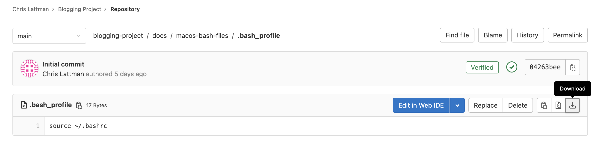

# Unix Commands

## Table of Contents

- [Introduction](#introduction)
- [Before you start (macOS only)](#before-you-start-macos-only)
- [The 16 most important Unix commands (plus symbols and compression)](#the-16-most-important-unix-commands-plus-symbols-and-compression)
- [Other important terminal info](#other-important-terminal-info)

## Introduction

A Unix terminal (or command line) includes `Terminal.app` (Terminal) on macOS and Terminal on Ubuntu or any other Linux distribution.

- Windows is NOT a Unix-like operating system
- If you want to try all of these commands on Windows, create a [Docker container](../docker#getting-started) (recommended) or set up a [VM](../virtualbox)

Knowing these commands by heart will make you a "power user" on any [Unix-like](https://en.wikipedia.org/wiki/Unix-like) OS.

## Before you start (macOS only)

Before using these commands on macOS, make sure you are using bash (not zsh) in Terminal by running the following command:

```
echo $0
```

- If it says `-bash` then you're good to go
- Otherwise, run
    ```
    chsh -s /bin/bash
    ```

    Then quit Terminal and restart it.

Apple will tell you to use zsh but just ignore it for now.

Download the 4 files inside of [`macos-bash-files`](../macos-bash-files). You can do this by clicking on a file and then downloading it to your computer by clicking the download button. For example:



Copy these files to your home directory. To make this easy, open up Terminal and run
```
open ~
```
This opens up your home directory in a Finder window. After you have copied these files, quit Terminal and restart it. Your Terminal bash settings will now be preserved.

Notes:

- These files will make the macOS Terminal behave more like a Linux Terminal
- When you start Terminal, it should place you in your home directory
- When you open a new Finder window from the macOS Dock, it should also open your home directory

### Profiles

You can customize Terminal. There are 10 profiles to choose from; I personally use the "Pro" profile.

To change your Terminal profile, open Terminal and go to Terminal -> Preferences... -> Profiles

- Click on which profile you want, then click "Default" to save your choice
- Check "Blink cursor" to keep your Terminal cursor blinking
- I recommend changing the font size from 10 to 12

To save your changes, quit Terminal and restart it.

## The 16 most important Unix commands (plus symbols and compression):

- [`ls` - lists items in a directory](#ls)
- [`mkdir` - creates a new directory](#mkdir)
- [`touch` - creates a new file](#touch)
- [`pwd` - outputs the current directory path](#pwd)
- [`cd` - changes the current directory](#cd)
- [`cp` - copies a file or directory](#cp)
- [`rm` - removes a file or directory](#rm)
- [`mv` - moves or renames a file or directory](#mv)
- [`cat` - outputs the contents of a file](#cat)
- [`grep` - searches a file for a given phrase](#grep)
- [`find` - searches the filesystem for files and directories](#find)
- [`chmod` - changes the execute permissions of a file](#chmod)
- [`clear` - clears the terminal screen](#clear)
- [`man` - manual pages for various commands](#man)
- [`wget` - downloads files from the Internet](#wget)
- [`ping` - pings a URL for connectivity](#ping)
- [Symbols](#symbols)
- [Compression (`zip` and `tar`)](#compression-zip-and-tar)

There is also a presentation [here](https://courses.cs.vt.edu/cs2505/spring2019/notes/T02_BasicLinuxCommands.pdf), created by Virginia Tech CS department faculty, that discusses some of these commands (and others).

### `ls`

Stands for "list." Use it to list files and directories.

- By default, `ls` lists the files/directories in your current directory
    - Add the name of a directory after `ls` to list the files/directories in that specific directory
    - e.g. `ls ~/Downloads` will print the contents of your Downloads folder regardless of your current directory
- Use the `-l` flag to list details of the files/directories
    - The first 'd' in front of a result means it is a directory
- Use the `-a` flag to list all files/directories in your current directory (including hidden files/directories)
- Flags can be combined, e.g. `-al` or `-la` (order does not matter)

Example:

```
[Chris@Chris-MBP-16 test-make]$ ls
FracTester.c FracTester.h Fraction.c   Fraction.h   Makefile     driver       driver.c     driver.dSYM
[Chris@Chris-MBP-16 test-make]$ ls -l
total 160
-rw-r--r--  1 Chris  staff   5385 Dec 19 00:19 FracTester.c
-rw-r--r--  1 Chris  staff    412 Dec 19 00:18 FracTester.h
-rw-r--r--@ 1 Chris  staff   3036 Dec 18 22:49 Fraction.c
-rw-r--r--  1 Chris  staff   2512 Dec 19 00:18 Fraction.h
-rw-r--r--  1 Chris  staff    647 Dec 19 22:22 Makefile
-rwxr-xr-x  1 Chris  staff  52816 Dec 19 00:30 driver
-rw-r--r--  1 Chris  staff    985 Dec 18 23:05 driver.c
drwxr-xr-x  3 Chris  staff     96 Dec 19 00:30 driver.dSYM
[Chris@Chris-MBP-16 test-make]$ ls -al
total 184
drwxr-xr-x  13 Chris  staff    416 Jan 16 01:09 .
drwx------@ 13 Chris  staff    416 Jan 15 20:35 ..
-rw-r--r--@  1 Chris  staff   6148 Dec 20 15:01 .DS_Store
drwxr-xr-x  13 Chris  staff    416 Dec 19 22:22 .git
-rw-r--r--   1 Chris  staff     23 Dec 19 00:21 .gitignore
-rw-r--r--   1 Chris  staff   5385 Dec 19 00:19 FracTester.c
-rw-r--r--   1 Chris  staff    412 Dec 19 00:18 FracTester.h
-rw-r--r--@  1 Chris  staff   3036 Dec 18 22:49 Fraction.c
-rw-r--r--   1 Chris  staff   2512 Dec 19 00:18 Fraction.h
-rw-r--r--   1 Chris  staff    647 Dec 19 22:22 Makefile
-rwxr-xr-x   1 Chris  staff  52816 Dec 19 00:30 driver
-rw-r--r--   1 Chris  staff    985 Dec 18 23:05 driver.c
drwxr-xr-x   3 Chris  staff     96 Dec 19 00:30 driver.dSYM
[Chris@Chris-MBP-16 test-make]$ ls -l driver.dSYM
total 0
drwxr-xr-x  4 Chris  staff  128 Dec 19 00:30 Contents
[Chris@Chris-MBP-16 test-make]$
```

### `mkdir`

Stands for "make directory." Use it to create a new directory.

- You can create multiple directories at once

Example:

```
[Chris@Chris-MBP-16 test-make]$ ls -l
total 160
-rw-r--r--  1 Chris  staff   5385 Dec 19 00:19 FracTester.c
-rw-r--r--  1 Chris  staff    412 Dec 19 00:18 FracTester.h
-rw-r--r--@ 1 Chris  staff   3036 Dec 18 22:49 Fraction.c
-rw-r--r--  1 Chris  staff   2512 Dec 19 00:18 Fraction.h
-rw-r--r--  1 Chris  staff    647 Dec 19 22:22 Makefile
-rwxr-xr-x  1 Chris  staff  52816 Dec 19 00:30 driver
-rw-r--r--  1 Chris  staff    985 Dec 18 23:05 driver.c
drwxr-xr-x  3 Chris  staff     96 Dec 19 00:30 driver.dSYM
[Chris@Chris-MBP-16 test-make]$ mkdir test-directory
[Chris@Chris-MBP-16 test-make]$ ls -l
total 160
-rw-r--r--  1 Chris  staff   5385 Dec 19 00:19 FracTester.c
-rw-r--r--  1 Chris  staff    412 Dec 19 00:18 FracTester.h
-rw-r--r--@ 1 Chris  staff   3036 Dec 18 22:49 Fraction.c
-rw-r--r--  1 Chris  staff   2512 Dec 19 00:18 Fraction.h
-rw-r--r--  1 Chris  staff    647 Dec 19 22:22 Makefile
-rwxr-xr-x  1 Chris  staff  52816 Dec 19 00:30 driver
-rw-r--r--  1 Chris  staff    985 Dec 18 23:05 driver.c
drwxr-xr-x  3 Chris  staff     96 Dec 19 00:30 driver.dSYM
drwxr-xr-x  2 Chris  staff     64 Jan 16 00:48 test-directory
[Chris@Chris-MBP-16 test-make]$ mkdir test-directory1 directory2 dir3
[Chris@Chris-MBP-16 test-make]$ ls -l
total 160
-rw-r--r--  1 Chris  staff   5385 Dec 19 00:19 FracTester.c
-rw-r--r--  1 Chris  staff    412 Dec 19 00:18 FracTester.h
-rw-r--r--@ 1 Chris  staff   3036 Dec 18 22:49 Fraction.c
-rw-r--r--  1 Chris  staff   2512 Dec 19 00:18 Fraction.h
-rw-r--r--  1 Chris  staff    647 Dec 19 22:22 Makefile
drwxr-xr-x  2 Chris  staff     64 Jan 16 00:48 dir3
drwxr-xr-x  2 Chris  staff     64 Jan 16 00:48 directory2
-rwxr-xr-x  1 Chris  staff  52816 Dec 19 00:30 driver
-rw-r--r--  1 Chris  staff    985 Dec 18 23:05 driver.c
drwxr-xr-x  3 Chris  staff     96 Dec 19 00:30 driver.dSYM
drwxr-xr-x  2 Chris  staff     64 Jan 16 00:48 test-directory
drwxr-xr-x  2 Chris  staff     64 Jan 16 00:48 test-directory1
[Chris@Chris-MBP-16 test-make]$
```

### `touch`

Creates a new file.

- You can create multiple files at once

Example:

```
[Chris@Chris-MBP-16 test-make]$ ls -l
total 160
-rw-r--r--  1 Chris  staff   5385 Dec 19 00:19 FracTester.c
-rw-r--r--  1 Chris  staff    412 Dec 19 00:18 FracTester.h
-rw-r--r--@ 1 Chris  staff   3036 Dec 18 22:49 Fraction.c
-rw-r--r--  1 Chris  staff   2512 Dec 19 00:18 Fraction.h
-rw-r--r--  1 Chris  staff    647 Dec 19 22:22 Makefile
-rwxr-xr-x  1 Chris  staff  52816 Dec 19 00:30 driver
-rw-r--r--  1 Chris  staff    985 Dec 18 23:05 driver.c
drwxr-xr-x  3 Chris  staff     96 Dec 19 00:30 driver.dSYM
[Chris@Chris-MBP-16 test-make]$ touch file.txt
[Chris@Chris-MBP-16 test-make]$ ls -l
total 160
-rw-r--r--  1 Chris  staff   5385 Dec 19 00:19 FracTester.c
-rw-r--r--  1 Chris  staff    412 Dec 19 00:18 FracTester.h
-rw-r--r--@ 1 Chris  staff   3036 Dec 18 22:49 Fraction.c
-rw-r--r--  1 Chris  staff   2512 Dec 19 00:18 Fraction.h
-rw-r--r--  1 Chris  staff    647 Dec 19 22:22 Makefile
-rwxr-xr-x  1 Chris  staff  52816 Dec 19 00:30 driver
-rw-r--r--  1 Chris  staff    985 Dec 18 23:05 driver.c
drwxr-xr-x  3 Chris  staff     96 Dec 19 00:30 driver.dSYM
-rw-r--r--  1 Chris  staff      0 Jan 16 00:45 file.txt
[Chris@Chris-MBP-16 test-make]$ touch file1.txt file2.py file3.java
[Chris@Chris-MBP-16 test-make]$ ls -l
total 160
-rw-r--r--  1 Chris  staff   5385 Dec 19 00:19 FracTester.c
-rw-r--r--  1 Chris  staff    412 Dec 19 00:18 FracTester.h
-rw-r--r--@ 1 Chris  staff   3036 Dec 18 22:49 Fraction.c
-rw-r--r--  1 Chris  staff   2512 Dec 19 00:18 Fraction.h
-rw-r--r--  1 Chris  staff    647 Dec 19 22:22 Makefile
-rwxr-xr-x  1 Chris  staff  52816 Dec 19 00:30 driver
-rw-r--r--  1 Chris  staff    985 Dec 18 23:05 driver.c
drwxr-xr-x  3 Chris  staff     96 Dec 19 00:30 driver.dSYM
-rw-r--r--  1 Chris  staff      0 Jan 16 00:45 file.txt
-rw-r--r--  1 Chris  staff      0 Jan 16 00:46 file1.txt
-rw-r--r--  1 Chris  staff      0 Jan 16 00:46 file2.py
-rw-r--r--  1 Chris  staff      0 Jan 16 00:46 file3.java
[Chris@Chris-MBP-16 test-make]$
```

### `pwd`

Stands for "present working directory." Use it to output your current directory.

Example:

```
[Chris@Chris-MBP-16 test-make]$ pwd
/Users/Chris/Downloads/test-make
[Chris@Chris-MBP-16 test-make]$
```

### `cd`

Stands for "change directory." Use it to change your current directory.

Example:

```
[Chris@Chris-MBP-16 test-make]$ pwd
/Users/Chris/Downloads/test-make
[Chris@Chris-MBP-16 test-make]$ mkdir test-directory
[Chris@Chris-MBP-16 test-make]$ cd test-directory
[Chris@Chris-MBP-16 test-directory]$ pwd
/Users/Chris/Downloads/test-make/test-directory
[Chris@Chris-MBP-16 test-make]$
```

### `cp`

Stands for "copy." Use it to copy a file or a subdirectory from one directory to another directory.

- `cp <source> <destination>`
- Use the `-r` flag to copy over a directory (the r stands for recursive)
- Remember, this does not work like copy and paste on a GUI - there is no inherent "clipboard"
    - Therefore, you must specify a destination
- You can use `cp` to make a copy of a file in the same directory, e.g. `cp file.txt file-copy.txt`
- You can copy a file to another directory and rename the file in its new directory with one command
    - For example, `cp file.txt /tmp/results.txt` copies `file.txt` from the current directory and pastes it into the `/tmp` directory, but with the new name of `results.txt`

Examples:

```
[Chris@Chris-MBP-16 test-make]$ ls -l
total 160
-rw-r--r--  1 Chris  staff   5385 Dec 19 00:19 FracTester.c
-rw-r--r--  1 Chris  staff    412 Dec 19 00:18 FracTester.h
-rw-r--r--@ 1 Chris  staff   3036 Dec 18 22:49 Fraction.c
-rw-r--r--  1 Chris  staff   2512 Dec 19 00:18 Fraction.h
-rw-r--r--  1 Chris  staff    647 Dec 19 22:22 Makefile
-rwxr-xr-x  1 Chris  staff  52816 Dec 19 00:30 driver
-rw-r--r--  1 Chris  staff    985 Dec 18 23:05 driver.c
drwxr-xr-x  3 Chris  staff     96 Dec 19 00:30 driver.dSYM
[Chris@Chris-MBP-16 test-make]$ mkdir test-directory
[Chris@Chris-MBP-16 test-make]$ cp driver.c test-directory
[Chris@Chris-MBP-16 test-make]$ cd test-directory
[Chris@Chris-MBP-16 test-directory]$ ls -l
total 8
-rw-r--r--  1 Chris  staff  985 Jan 16 01:00 driver.c
[Chris@Chris-MBP-16 test-make]$
```

```
[Chris@Chris-MBP-16 test-make]$ ls -l
total 160
-rw-r--r--  1 Chris  staff   5385 Dec 19 00:19 FracTester.c
-rw-r--r--  1 Chris  staff    412 Dec 19 00:18 FracTester.h
-rw-r--r--@ 1 Chris  staff   3036 Dec 18 22:49 Fraction.c
-rw-r--r--  1 Chris  staff   2512 Dec 19 00:18 Fraction.h
-rw-r--r--  1 Chris  staff    647 Dec 19 22:22 Makefile
-rwxr-xr-x  1 Chris  staff  52816 Dec 19 00:30 driver
-rw-r--r--  1 Chris  staff    985 Dec 18 23:05 driver.c
drwxr-xr-x  3 Chris  staff     96 Dec 19 00:30 driver.dSYM
[Chris@Chris-MBP-16 test-make]$ mkdir test-directory
[Chris@Chris-MBP-16 test-make]$ cp driver.c test-directory
[Chris@Chris-MBP-16 test-make]$ mkdir other-directory
[Chris@Chris-MBP-16 test-make]$ cp -r test-directory other-directory
[Chris@Chris-MBP-16 test-make]$ cd other-directory
[Chris@Chris-MBP-16 other-directory]$ ls -l
total 0
drwxr-xr-x  3 Chris  staff  96 Jan 16 01:03 test-directory
[Chris@Chris-MBP-16 other-directory]$ cd test-directory
[Chris@Chris-MBP-16 test-directory]$ ls -l
total 8
-rw-r--r--  1 Chris  staff  985 Jan 16 01:03 driver.c
[Chris@Chris-MBP-16 test-make]$
```

### `rm`

Stands for "remove." Use it to remove files and/or directories.

- Use `-rf` or `-fr` to remove one or more directories (r stands for recursive, f stands for force)
- `rmdir` is another remove command you might see, but it can only be used to remove empty directories

Example:

```
[Chris@Chris-MBP-16 test-make]$ ls -l
total 160
-rw-r--r--  1 Chris  staff   5385 Dec 19 00:19 FracTester.c
-rw-r--r--  1 Chris  staff    412 Dec 19 00:18 FracTester.h
-rw-r--r--@ 1 Chris  staff   3036 Dec 18 22:49 Fraction.c
-rw-r--r--  1 Chris  staff   2512 Dec 19 00:18 Fraction.h
-rw-r--r--  1 Chris  staff    647 Dec 19 22:22 Makefile
-rwxr-xr-x  1 Chris  staff  52816 Dec 19 00:30 driver
-rw-r--r--  1 Chris  staff    985 Dec 18 23:05 driver.c
drwxr-xr-x  3 Chris  staff     96 Dec 19 00:30 driver.dSYM
[Chris@Chris-MBP-16 test-make]$ touch file.txt
[Chris@Chris-MBP-16 test-make]$ ls -l
total 160
-rw-r--r--  1 Chris  staff   5385 Dec 19 00:19 FracTester.c
-rw-r--r--  1 Chris  staff    412 Dec 19 00:18 FracTester.h
-rw-r--r--@ 1 Chris  staff   3036 Dec 18 22:49 Fraction.c
-rw-r--r--  1 Chris  staff   2512 Dec 19 00:18 Fraction.h
-rw-r--r--  1 Chris  staff    647 Dec 19 22:22 Makefile
-rwxr-xr-x  1 Chris  staff  52816 Dec 19 00:30 driver
-rw-r--r--  1 Chris  staff    985 Dec 18 23:05 driver.c
drwxr-xr-x  3 Chris  staff     96 Dec 19 00:30 driver.dSYM
-rw-r--r--  1 Chris  staff      0 Jan 24 23:51 file.txt
[Chris@Chris-MBP-16 test-make]$ rm file.txt
[Chris@Chris-MBP-16 test-make]$ ls -l
total 160
-rw-r--r--  1 Chris  staff   5385 Dec 19 00:19 FracTester.c
-rw-r--r--  1 Chris  staff    412 Dec 19 00:18 FracTester.h
-rw-r--r--@ 1 Chris  staff   3036 Dec 18 22:49 Fraction.c
-rw-r--r--  1 Chris  staff   2512 Dec 19 00:18 Fraction.h
-rw-r--r--  1 Chris  staff    647 Dec 19 22:22 Makefile
-rwxr-xr-x  1 Chris  staff  52816 Dec 19 00:30 driver
-rw-r--r--  1 Chris  staff    985 Dec 18 23:05 driver.c
drwxr-xr-x  3 Chris  staff     96 Dec 19 00:30 driver.dSYM
[Chris@Chris-MBP-16 test-make]$ touch file.txt
[Chris@Chris-MBP-16 test-make]$ mkdir file-directory
[Chris@Chris-MBP-16 test-make]$ cp file.txt file-directory
[Chris@Chris-MBP-16 test-make]$ ls -l
total 160
-rw-r--r--  1 Chris  staff   5385 Dec 19 00:19 FracTester.c
-rw-r--r--  1 Chris  staff    412 Dec 19 00:18 FracTester.h
-rw-r--r--@ 1 Chris  staff   3036 Dec 18 22:49 Fraction.c
-rw-r--r--  1 Chris  staff   2512 Dec 19 00:18 Fraction.h
-rw-r--r--  1 Chris  staff    647 Dec 19 22:22 Makefile
-rwxr-xr-x  1 Chris  staff  52816 Dec 19 00:30 driver
-rw-r--r--  1 Chris  staff    985 Dec 18 23:05 driver.c
drwxr-xr-x  3 Chris  staff     96 Dec 19 00:30 driver.dSYM
drwxr-xr-x  3 Chris  staff     96 Jan 24 23:52 file-directory
-rw-r--r--  1 Chris  staff      0 Jan 24 23:52 file.txt
[Chris@Chris-MBP-16 test-make]$ ls -l file-directory
total 0
-rw-r--r--  1 Chris  staff  0 Jan 24 23:52 file.txt
[Chris@Chris-MBP-16 test-make]$ rm -rf file.txt file-directory
[Chris@Chris-MBP-16 test-make]$ ls -l
total 160
-rw-r--r--  1 Chris  staff   5385 Dec 19 00:19 FracTester.c
-rw-r--r--  1 Chris  staff    412 Dec 19 00:18 FracTester.h
-rw-r--r--@ 1 Chris  staff   3036 Dec 18 22:49 Fraction.c
-rw-r--r--  1 Chris  staff   2512 Dec 19 00:18 Fraction.h
-rw-r--r--  1 Chris  staff    647 Dec 19 22:22 Makefile
-rwxr-xr-x  1 Chris  staff  52816 Dec 19 00:30 driver
-rw-r--r--  1 Chris  staff    985 Dec 18 23:05 driver.c
drwxr-xr-x  3 Chris  staff     96 Dec 19 00:30 driver.dSYM
[Chris@Chris-MBP-16 test-make]$ touch file1.txt file2.txt
[Chris@Chris-MBP-16 test-make]$ ls -l
total 160
-rw-r--r--  1 Chris  staff   5385 Dec 19 00:19 FracTester.c
-rw-r--r--  1 Chris  staff    412 Dec 19 00:18 FracTester.h
-rw-r--r--@ 1 Chris  staff   3036 Dec 18 22:49 Fraction.c
-rw-r--r--  1 Chris  staff   2512 Dec 19 00:18 Fraction.h
-rw-r--r--  1 Chris  staff    647 Dec 19 22:22 Makefile
-rwxr-xr-x  1 Chris  staff  52816 Dec 19 00:30 driver
-rw-r--r--  1 Chris  staff    985 Dec 18 23:05 driver.c
drwxr-xr-x  3 Chris  staff     96 Dec 19 00:30 driver.dSYM
-rw-r--r--  1 Chris  staff      0 Jan 24 23:52 file1.txt
-rw-r--r--  1 Chris  staff      0 Jan 24 23:52 file2.txt
[Chris@Chris-MBP-16 test-make]$ rm file1.txt file2.txt
[Chris@Chris-MBP-16 test-make]$ ls -l
total 160
-rw-r--r--  1 Chris  staff   5385 Dec 19 00:19 FracTester.c
-rw-r--r--  1 Chris  staff    412 Dec 19 00:18 FracTester.h
-rw-r--r--@ 1 Chris  staff   3036 Dec 18 22:49 Fraction.c
-rw-r--r--  1 Chris  staff   2512 Dec 19 00:18 Fraction.h
-rw-r--r--  1 Chris  staff    647 Dec 19 22:22 Makefile
-rwxr-xr-x  1 Chris  staff  52816 Dec 19 00:30 driver
-rw-r--r--  1 Chris  staff    985 Dec 18 23:05 driver.c
drwxr-xr-x  3 Chris  staff     96 Dec 19 00:30 driver.dSYM
[Chris@Chris-MBP-16 test-make]$ mkdir empty-directory
[Chris@Chris-MBP-16 test-make]$ ls -l
total 160
-rw-r--r--  1 Chris  staff   5385 Dec 19 00:19 FracTester.c
-rw-r--r--  1 Chris  staff    412 Dec 19 00:18 FracTester.h
-rw-r--r--@ 1 Chris  staff   3036 Dec 18 22:49 Fraction.c
-rw-r--r--  1 Chris  staff   2512 Dec 19 00:18 Fraction.h
-rw-r--r--  1 Chris  staff    647 Dec 19 22:22 Makefile
-rwxr-xr-x  1 Chris  staff  52816 Dec 19 00:30 driver
-rw-r--r--  1 Chris  staff    985 Dec 18 23:05 driver.c
drwxr-xr-x  3 Chris  staff     96 Dec 19 00:30 driver.dSYM
drwxr-xr-x  2 Chris  staff     64 Jan 24 23:53 empty-directory
[Chris@Chris-MBP-16 test-make]$ rmdir empty-directory
[Chris@Chris-MBP-16 test-make]$ ls -l
total 160
-rw-r--r--  1 Chris  staff   5385 Dec 19 00:19 FracTester.c
-rw-r--r--  1 Chris  staff    412 Dec 19 00:18 FracTester.h
-rw-r--r--@ 1 Chris  staff   3036 Dec 18 22:49 Fraction.c
-rw-r--r--  1 Chris  staff   2512 Dec 19 00:18 Fraction.h
-rw-r--r--  1 Chris  staff    647 Dec 19 22:22 Makefile
-rwxr-xr-x  1 Chris  staff  52816 Dec 19 00:30 driver
-rw-r--r--  1 Chris  staff    985 Dec 18 23:05 driver.c
drwxr-xr-x  3 Chris  staff     96 Dec 19 00:30 driver.dSYM
[Chris@Chris-MBP-16 test-make]$
```

### `mv`

Stands for "move." It can be used to move _or rename_ a file or directory.

- `mv <old-name> <new-name>` for renaming
- `mv <file> <new-location>` for moving

Example:

```
[Chris@Chris-MBP-16 test-make]$ ls -l
total 160
-rw-r--r--  1 Chris  staff   5385 Dec 19 00:19 FracTester.c
-rw-r--r--  1 Chris  staff    412 Dec 19 00:18 FracTester.h
-rw-r--r--@ 1 Chris  staff   3036 Dec 18 22:49 Fraction.c
-rw-r--r--  1 Chris  staff   2512 Dec 19 00:18 Fraction.h
-rw-r--r--  1 Chris  staff    647 Dec 19 22:22 Makefile
-rwxr-xr-x  1 Chris  staff  52816 Dec 19 00:30 driver
-rw-r--r--  1 Chris  staff    985 Dec 18 23:05 driver.c
drwxr-xr-x  3 Chris  staff     96 Dec 19 00:30 driver.dSYM
[Chris@Chris-MBP-16 test-make]$ touch file.txt
[Chris@Chris-MBP-16 test-make]$ ls -l
total 160
-rw-r--r--  1 Chris  staff   5385 Dec 19 00:19 FracTester.c
-rw-r--r--  1 Chris  staff    412 Dec 19 00:18 FracTester.h
-rw-r--r--@ 1 Chris  staff   3036 Dec 18 22:49 Fraction.c
-rw-r--r--  1 Chris  staff   2512 Dec 19 00:18 Fraction.h
-rw-r--r--  1 Chris  staff    647 Dec 19 22:22 Makefile
-rwxr-xr-x  1 Chris  staff  52816 Dec 19 00:30 driver
-rw-r--r--  1 Chris  staff    985 Dec 18 23:05 driver.c
drwxr-xr-x  3 Chris  staff     96 Dec 19 00:30 driver.dSYM
-rw-r--r--  1 Chris  staff      0 Jan 18 16:21 file.txt
[Chris@Chris-MBP-16 test-make]$ mv file.txt new-name.txt
[Chris@Chris-MBP-16 test-make]$ ls -l
total 160
-rw-r--r--  1 Chris  staff   5385 Dec 19 00:19 FracTester.c
-rw-r--r--  1 Chris  staff    412 Dec 19 00:18 FracTester.h
-rw-r--r--@ 1 Chris  staff   3036 Dec 18 22:49 Fraction.c
-rw-r--r--  1 Chris  staff   2512 Dec 19 00:18 Fraction.h
-rw-r--r--  1 Chris  staff    647 Dec 19 22:22 Makefile
-rwxr-xr-x  1 Chris  staff  52816 Dec 19 00:30 driver
-rw-r--r--  1 Chris  staff    985 Dec 18 23:05 driver.c
drwxr-xr-x  3 Chris  staff     96 Dec 19 00:30 driver.dSYM
-rw-r--r--  1 Chris  staff      0 Jan 18 16:21 new-name.txt
[Chris@Chris-MBP-16 test-make]$ mkdir test-directory
[Chris@Chris-MBP-16 test-make]$ mv new-name.txt test-directory
[Chris@Chris-MBP-16 test-make]$ ls -l
total 160
-rw-r--r--  1 Chris  staff   5385 Dec 19 00:19 FracTester.c
-rw-r--r--  1 Chris  staff    412 Dec 19 00:18 FracTester.h
-rw-r--r--@ 1 Chris  staff   3036 Dec 18 22:49 Fraction.c
-rw-r--r--  1 Chris  staff   2512 Dec 19 00:18 Fraction.h
-rw-r--r--  1 Chris  staff    647 Dec 19 22:22 Makefile
-rwxr-xr-x  1 Chris  staff  52816 Dec 19 00:30 driver
-rw-r--r--  1 Chris  staff    985 Dec 18 23:05 driver.c
drwxr-xr-x  3 Chris  staff     96 Dec 19 00:30 driver.dSYM
drwxr-xr-x  3 Chris  staff     96 Jan 18 16:22 test-directory
[Chris@Chris-MBP-16 test-make]$ cd test-directory
[Chris@Chris-MBP-16 test-directory]$ ls -l
total 0
-rw-r--r--  1 Chris  staff  0 Jan 18 16:21 new-name.txt
[Chris@Chris-MBP-16 test-directory]$
```

### `cat`

Stands for "concatenate," but for most purposes, it is used to output the contents of a file.

Example:

```
[Chris@Chris-MBP-16 test-make]$ ls -l
total 160
-rw-r--r--  1 Chris  staff   5385 Dec 19 00:19 FracTester.c
-rw-r--r--  1 Chris  staff    412 Dec 19 00:18 FracTester.h
-rw-r--r--@ 1 Chris  staff   3036 Dec 18 22:49 Fraction.c
-rw-r--r--  1 Chris  staff   2512 Dec 19 00:18 Fraction.h
-rw-r--r--  1 Chris  staff    647 Dec 19 22:22 Makefile
-rwxr-xr-x  1 Chris  staff  52816 Dec 19 00:30 driver
-rw-r--r--  1 Chris  staff    985 Dec 18 23:05 driver.c
drwxr-xr-x  3 Chris  staff     96 Dec 19 00:30 driver.dSYM
[Chris@Chris-MBP-16 test-make]$ cat driver.c
#include "Fraction.h"
#include "FracTester.h"

int main(void)
{
    /*
     * Quick test of Fraction implementation
     */
    Fraction* frac1 = fraction_init(14, 27);
    Fraction* frac2 = fraction_init(12, 13);
    int f1_num = frac1->numerator;
    int f1_denom = frac1->denominator;
    int f2_num = frac2->numerator;
    int f2_denom = frac2->denominator;
    fraction_multiply(frac1, frac2);
    int prod_num = frac1->numerator;
    int prod_denom = frac1->denominator;
    printf("%d/%d * %d/%d = %d/%d\n", f1_num, f1_denom, f2_num, f2_denom,
        prod_num, prod_denom);
    fraction_free(frac1);
    fraction_free(frac2);

    /**
     * Run the full test suite
     */
    test_fraction_init();
    test_fraction_free();
    test_fraction_add();
    test_fraction_subtract();
    test_fraction_multiply();
    test_fraction_divide();
    test_fraction_invert();
    test_fraction_negate();
    test_fraction_reduce();
    test_fraction_check_negatives();

    return 0;
}
[Chris@Chris-MBP-16 test-make]$
```

### `grep`

It searches a file for a given phrase.

- `grep -n "phrase" <file>`
- It prints out every line that has a match as well as the line number

Example:

```
[Chris@Chris-MBP-16 Downloads]$ cat file.txt 
This is a random file.
Lorem ipsum dolor
Some more text
Even more text
Done
[Chris@Chris-MBP-16 Downloads]$ grep -n "text" file.txt 
3:Some more text
4:Even more text
[Chris@Chris-MBP-16 Downloads]$
```

### `find`

It searches the filesystem for files and directories that match the input phrase. You specify which directory to search within.

- `find <directory> -name "phrase"`
- `find / -name "file.txt"` will search anywhere in the entire hard drive for files with the name "file.txt"
- `find . -name "test*"` will only search within the current directory (and any subdirectories) for files and directories whose names start with "test"

Example:

```
[Chris@Chris-MBP-16 Downloads]$ touch file1.txt file2.txt file3.txt
[Chris@Chris-MBP-16 Downloads]$ find . -name "file*.txt"
./file2.txt
./file3.txt
./file1.txt
[Chris@Chris-MBP-16 Downloads]$
```

### `chmod`

Stands for "change mode." It changes the permissions of a file.

- This is commonly used to allow shell scripts (`.sh` files) or executables to run in a terminal
- A common usage is `chmod 744 <file>`, which allows `<file>` to be executed by the user

Example:

```
[Chris@Chris-MBP-16 test-directory]$ ls -l
total 8
-rw-r--r--  1 Chris  staff  21 Jan 16 01:30 script.sh
[Chris@Chris-MBP-16 test-directory]$ cat script.sh
echo "Hello, world!"
[Chris@Chris-MBP-16 test-directory]$ ./script.sh
-bash: ./script.sh: Permission denied
[Chris@Chris-MBP-16 test-directory]$ chmod 744 script.sh
[Chris@Chris-MBP-16 test-directory]$ ./script.sh
Hello, world!
[Chris@Chris-MBP-16 test-directory]$
```

### `clear`

This one is pretty straightforward. It just clears your terminal screen.

- Just type `clear` into your terminal and press enter/return

A note on `clear`: it should work as expected in a VirtualBox VM. However,

- For macOS:
    - `clear` merely hides the previous Terminal output, but will still allow you to see it again by scrolling up
    - To actually clear (i.e. remove) all previous Terminal output, you will need to enter `Cmd + K`
        - This applies to Terminal and the Visual Studio Code terminal, but not the Eclipse terminal
- For Windows:
    - `clear` behaves as expected in Git Bash (and Windows PowerShell and the Eclipse terminal)
    - If you are using Visual Studio Code:
        - Go to File -> Preferences -> Keyboard Shortcuts and search for `workbench.action.terminal.clear`
        - Hover over the Terminal: Clear command and click on the pencil icon
        - Type `Ctrl + K` and hit enter
        - Now Ctrl + K will actually clear your Visual Studio Code terminal (instead of just hiding previous output)

### `man`

Stands for "manual." It can be helpful if you want to find out more about a common command.

- `man <command>`
- Press `q` to exit any manual page
- Many commands will output a condensed help guide with the `--help` flag, e.g. `grep --help`

### `wget`

Stands for "[world wide] web get." It downloads files from the Internet.

- You might need to install `wget` with a [package manager](#second-honorable-mention-package-managers)

Example:

```
[Chris@Chris-MBP-16 Downloads]$ mkdir downloaded-files
[Chris@Chris-MBP-16 Downloads]$ cd downloaded-files
[Chris@Chris-MBP-16 downloaded-files]$ wget https://releases.ubuntu.com/20.04.3/ubuntu-20.04.3-desktop-amd64.iso
--2022-01-18 14:55:48--  https://releases.ubuntu.com/20.04.3/ubuntu-20.04.3-desktop-amd64.iso
Resolving releases.ubuntu.com (releases.ubuntu.com)... 2001:67c:1562::28, 2001:67c:1360:8001::33, 2001:67c:1562::25, ...
Connecting to releases.ubuntu.com (releases.ubuntu.com)|2001:67c:1562::28|:443... connected.
HTTP request sent, awaiting response... 200 OK
Length: 3071934464 (2.9G) [application/x-iso9660-image]
Saving to: ‘ubuntu-20.04.3-desktop-amd64.iso’

ubuntu-20.04.3-desktop-amd64.iso                                100%[======================================================================================================================================================>]   2.86G  56.2MB/s    in 50s     

2022-01-18 14:56:39 (58.3 MB/s) - ‘ubuntu-20.04.3-desktop-amd64.iso’ saved [3071934464/3071934464]

[Chris@Chris-MBP-16 downloaded-files]$ ls -l
total 6030984
-rw-r--r--  1 Chris  staff  3071934464 Aug 19 07:06 ubuntu-20.04.3-desktop-amd64.iso
[Chris@Chris-MBP-16 downloaded-files]$
```

- You could also run `curl -LO https://releases.ubuntu.com/20.04.3/ubuntu-20.04.3-desktop-amd64.iso` to do the same thing
    - `curl` stands for "client URL"
    - `-LO` has an uppercase letter O, not a zero
    - However, `curl` only works for individual files (`wget` is more [robust](https://daniel.haxx.se/docs/curl-vs-wget.html))
    - You might also need to install `curl` with a package manager (it's better to use `wget` anyways)

### `ping`

Sends packets to a URL and listens for any responses.

- You might need to install `ping` with a [package manager](#second-honorable-mention-package-managers)
- `ping -s 32 -c 4 <URL>` sends 4 packets, each of size 32 bytes, to the provided URL (this is the default Windows ping)

Example:

```
[Chris@Chris-MBP-16 Downloads]$ ping -s 32 -c 4 google.com
PING google.com (172.217.15.78): 32 data bytes
40 bytes from 172.217.15.78: icmp_seq=0 ttl=118 time=13.163 ms
40 bytes from 172.217.15.78: icmp_seq=1 ttl=118 time=18.488 ms
40 bytes from 172.217.15.78: icmp_seq=2 ttl=118 time=16.327 ms
40 bytes from 172.217.15.78: icmp_seq=3 ttl=118 time=12.359 ms

--- google.com ping statistics ---
4 packets transmitted, 4 packets received, 0.0% packet loss
round-trip min/avg/max/stddev = 12.359/15.084/18.488/2.462 ms
[Chris@Chris-MBP-16 Downloads]$ ping -s 32 -c 4 www.google.com
PING www.google.com (142.250.65.68): 32 data bytes
40 bytes from 142.250.65.68: icmp_seq=0 ttl=59 time=13.271 ms
40 bytes from 142.250.65.68: icmp_seq=1 ttl=59 time=19.823 ms
40 bytes from 142.250.65.68: icmp_seq=2 ttl=59 time=18.290 ms
40 bytes from 142.250.65.68: icmp_seq=3 ttl=59 time=17.855 ms

--- www.google.com ping statistics ---
4 packets transmitted, 4 packets received, 0.0% packet loss
round-trip min/avg/max/stddev = 13.271/17.310/19.823/2.444 ms
[Chris@Chris-MBP-16 Downloads]$
```

## Symbols

There are 3 symbols used to abbreviate certain directories:

- `.` refers to the current directory
    - This is often used to run an executable (`<some-file>.exe` on Windows) in your current directory, e.g. `./<some-file>`
    - Unlike Windows, Unix-like operating systems do not have a designated file extension for executables
- `..` refers to the parent directory of the current directory
- `~` refers to your home directory (this doesn't change)

Example:

```
[Chris@Chris-MBP-16 Downloads]$ cd ~
[Chris@Chris-MBP-16 ~]$ pwd
/Users/Chris
[Chris@Chris-MBP-16 ~]$ cd ..
[Chris@Chris-MBP-16 Users]$ pwd
/Users
[Chris@Chris-MBP-16 Users]$ cd .
[Chris@Chris-MBP-16 Users]$ pwd
/Users
[Chris@Chris-MBP-16 Users]$
```

## Compression (`zip` and `tar`)

On macOS and Windows, you are most likely familiar with the [ZIP](https://en.wikipedia.org/wiki/ZIP_(file_format)) compression format. It is the default utility used by both major OSes to create a compressed archive.

Linux distributions also support ZIP with the `zip` and `unzip` commands, but you'll see a lot more `.tar.gz` files. Why? It is because the [`tar`](https://en.wikipedia.org/wiki/Tar_(computing)) and [`gzip`](https://en.wikipedia.org/wiki/Gzip) commands used to create such files are native to Linux (whereas `zip` and `unzip` are _not_).

- You might need to install `zip` (and possibly `unzip`) with a [package manager](#second-honorable-mention-package-managers) if using Linux
- Note: `.tar` means _(tape) archive_, and `.gz` means that it is _compressed_ with Gzip
- However, you can archive and compress files at once (like `zip`) using just the `tar` command
- `tar` can also be used to decompress and unarchive (a.k.a. extract) files at once (whereas `unzip` is needed for `.zip` files)

You might see other compression algorithms used besides `.gz`, such as `.bz2`, the newer `.xz`, or even the old `.Z` format.

- Due to its novelty, you might need to install `xz` with a [package manager](#second-honorable-mention-package-managers) to compress or extract `.tar.xz` files

Usage:

```bash
# To view the contents of a .zip file:
zip -sf archive.zip

# To compress files into a .zip:
zip archive.zip [files] [directory/*]

# To extract a .zip file:
unzip archive.zip

# To view the contents of a .tar[.gz|.bz2|.xz] file:
tar -tf archive.tar[.gz|.bz2|.xz]

# To archive (but not compress) files into a .tar file:
tar -cf archive.tar [files] [directory/*]

# To unarchive a .tar file:
tar -xf archive.tar

# To compress files into a .tar.gz file:
tar -czf archive.tar.gz [files] [directory/*]

# To extract a .tar.gz file:
tar -xzf archive.tar.gz

# To compress files into a .tar.bz2 file:
tar -cjf archive.tar.bz2 [files] [directory/*]

# To extract a .tar.bz2 file:
tar -xjf archive.tar.bz2

# To compress files into a .tar.xz file:
tar -cJf archive.tar.xz [files] [directory/*]

# To extract a .tar.xz file:
tar -xJf archive.tar.xz

# To extract a .tar.Z file:
uncompress archive.tar.Z
tar -xf archive.tar

# When extracting any archive, you can output its contents to a separate directory:
mkdir output-directory
tar -x[z|j|J]f archive.tar[.gz|.bz2|.xz] -C output-directory
```

- `[files]` refers to the files that you want to compress
- `[directory/*]` refers to a directory that you want to compress
    - You can compress multiple directories
    - It is important to include the `/*` to include all of the files within a given directory
- **Make sure to specify file extensions** when compressing files to ensure [portability](https://en.wikipedia.org/wiki/Software_portability)

## Other important terminal info

- Use the up/down arrow keys to navigate through commands you previously ran
- Pressing enter/return without any command will move the prompt down the terminal window
- Pressing the tab key will complete your terminal input with a known command, file, or directory

You do not have to run every single Unix command one at a time. You can aggregate your commands with [bash scripting](https://courses.cs.vt.edu/cs2505/spring2019/notes/T27_ShellScripting.pdf) (generally called "shell scripting").

### Honorable mention: `Ctrl + C`

`Ctrl + C` (for both macOS and Windows keyboards) cancels a running command in a terminal.

Example (here I am using the [`wget`](#wget) command to attempt to download a 3 GB file):

```
[Chris@Chris-MBP-16 test-directory]$ wget https://releases.ubuntu.com/20.04.3/ubuntu-20.04.3-desktop-amd64.iso
--2022-01-16 01:40:08--  https://releases.ubuntu.com/20.04.3/ubuntu-20.04.3-desktop-amd64.iso
Resolving releases.ubuntu.com (releases.ubuntu.com)... 2001:67c:1360:8001::33, 2001:67c:1562::28, 2001:67c:1562::25, ...
Connecting to releases.ubuntu.com (releases.ubuntu.com)|2001:67c:1360:8001::33|:443... connected.
HTTP request sent, awaiting response... 200 OK
Length: 3071934464 (2.9G) [application/x-iso9660-image]
Saving to: ‘ubuntu-20.04.3-desktop-amd64.iso’

ubuntu-20.04.3-desk   1%[                    ]  33.01M  14.2MB/s               ^C
[Chris@Chris-MBP-16 test-directory]$
```

- The `^C` signifies that I entered Ctrl + C to the terminal, terminating the remainder of the download

### Second honorable mention: package managers

Package managers are meant to make software installation easier, by providing a single source of up-to-date software. Every Linux distribution comes with its own built-in package manager.

- There are [two major families](https://en.wikipedia.org/wiki/List_of_Linux_distributions) of Linux distributions: `deb` and `rpm`
- Ubuntu, part of the Debian (`.deb`) family of distributions, uses the `apt` package manager
- Distributions in the Red Hat (`.rpm`) family, such as CentOS, use the `dnf` package manager

However, both of the major package managers use the same syntax:

- `sudo apt update` fetches updates for packages on a Debian-based OS
- `sudo apt upgrade` installs updates for packages on a Debian-based OS
- `sudo apt install <package>` installs a package on a Debian-based OS
    - Example: `sudo apt install wget`
    - Works with `.deb` files too, e.g. `sudo apt install package.deb`
- `sudo dnf update` fetches updates for packages on a Red Hat-based OS
- `sudo dnf upgrade` installs updates for packages on a Red Hat-based OS
- `sudo dnf install <package>` installs a package on a Red Hat-based OS
    - Example: `sudo dnf install wget`
    - Works with `.rpm` files too, e.g. `sudo dnf install package.rpm`
- **If you are running these commands in a Docker container:** remove `sudo` since you are already the [root](https://en.wikipedia.org/wiki/Superuser) user

The are package managers available for other operating systems too:

- [Homebrew](https://brew.sh/) is a package manager available for macOS, and uses the same syntax as `apt` and `dnf`, but without the `sudo` keyword:
    - `brew update`
    - `brew upgrade`
    - `brew install <package>`
        - Example: `brew install wget`
- [MacPorts](https://www.macports.org/) is an older but less popular package manager for macOS

### More commands!

I lied. There are actually a few more useful terminal commands, but they are more complex and not specific to Unix. They have their own pages linked below:

- [`ssh`](../ssh)
- [`git`](../git)
- [`docker`](../docker)

### Vim

It is one of the oldest (and most despised) editors in existence. However, it is useful when you need to make a quick change to a file from within a terminal.

- You might need to install `vim` with a [package manager](#second-honorable-mention-package-managers)
- `vim <file>` opens an existing file or creates a new file, then opens up the editor
- From here, press the `i` key to start typing and use the arrow keys and the enter/return key to move the cursor around
- When you're done, press the escape key, then type `:wq` and press enter/return to save your changes and exit
    - If you did not mean to make any changes, press the escape key then type `:q!` and press enter/return to exit Vim
