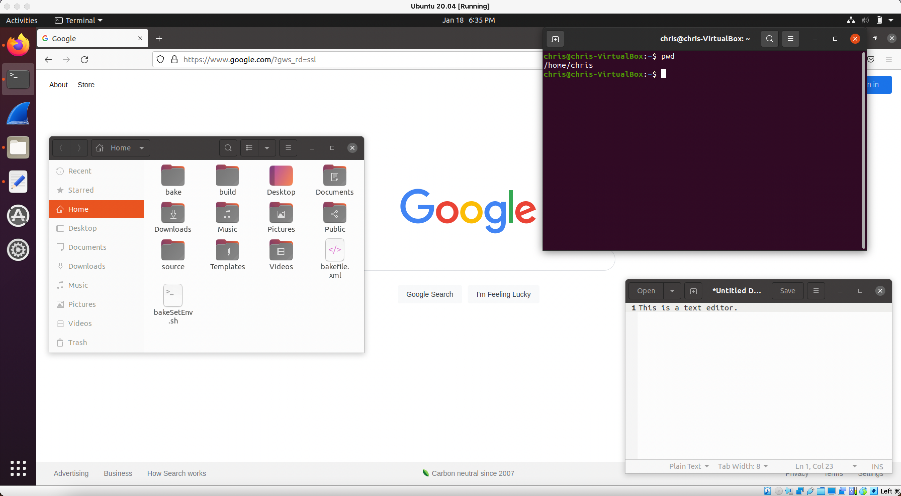
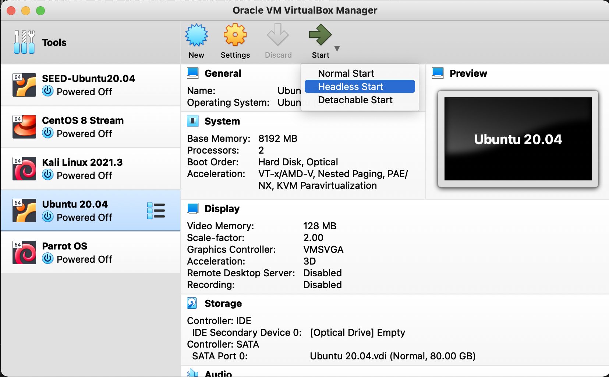

# VirtualBox

VirtualBox is a [hypervisor](https://en.wikipedia.org/wiki/Hypervisor), or a program used to simulate operating systems on computers. It allows you to run multiple guest OSes (known as virtual machines) on a single host computer.

This is different from [dual-booting](https://www.howtogeek.com/187789/dual-booting-explained-how-you-can-have-multiple-operating-systems-on-your-computer/), which allows you to choose between two host OSes at boot time.

It also differs from Docker in that a virtual machine (or VM for short) is completed isolated from the host OS, whereas Docker containers share the same underlying "OS" (container engine).

- This makes Docker containers much more lightweight (they take up less storage) than VMs, which is why Docker is used a lot more in practice
- VMs also tend to run slower if you have a high-resolution screen (i.e. modern Macs)

Note: on Linux desktops, a better alternative to VirtualBox is [Virtual Machine Manager](https://virt-manager.org/), also known as virt-manager. It runs on top of [QEMU](../qemu).

On VirtualBox, the concept of snapshots can be confusing. Navigate to the Snapshots view (click bulleted list on selected VM), click "Take" to take a snapshot, then start your VM if you want to test changes that could corrupt your VM.

When you are finished:

- Click "Restore" if you want to discard the changes from your snapshot
- Click "Delete" if you want to save the changes from your snapshot

Advanced: VirtualBox offers a command line interface through the `VBoxManage` command

- More information can be found [here](https://www.oracle.com/technical-resources/articles/it-infrastructure/admin-manage-vbox-cli.html)

## Installing Ubuntu

Since VirtualBox isn't something we'll be using a lot in this project, I won't go into much detail. However, knowing how to install an OS on VirtualBox (or an alternative like VMware) is valuable knowledge to have. There are several tutorials online on how to install Ubuntu on VirtualBox. Here are a few:

- https://www.geeksforgeeks.org/how-to-install-ubuntu-on-virtualbox/
- https://brb.nci.nih.gov/seqtools/installUbuntu.html (older info)
- https://ubuntu.com/tutorials/how-to-run-ubuntu-desktop-on-a-virtual-machine-using-virtualbox#1-overview (the official guide from Ubuntu)

There are also several videos on YouTube describing this installation process.

## Using Ubuntu

Once you've installed the virtual machine, you can use it like a regular operating system:

VirtualBox allows you to start up a VM in "Headless Start" mode:

This runs your VM in the background without a GUI. It treats your VM much like a detached Docker container, although by no means can Docker access it.

Regardless of whether you start your VM in "Normal Start" mode or "Headless Start" mode, you can SSH into your VM using the steps from [this](../ssh#ssh-configurations) section.

You can shut down your VM from the command line with this command: `sudo poweroff`

# VirtualBox Networking

Once you create a VM, you have the choice to configure its network settings (click on your virtual machine -> Settings -> Network). You have a few choices for networking modes. The most notable are:

- NAT: the default option, which is a basic [Network Address Translation](https://en.wikipedia.org/wiki/Network_address_translation) configuration that allows your VM to connect to the Internet
    - By default, your host OS cannot access the VM unless a local port forwarding rule is set up (click on the Advanced button -> Port Forwarding)
    - However, your VM can access the host OS's `localhost` from the hostname `10.0.2.2`
- Internal Network: this is similar to an internal Docker network, where VirtualBox VMs can connect to it and address one another but nothing outside can connect to it, and it doesn't allow VMs to access the Internet
- Host-Only Network: this extends upon an Internal Network by allowing the host OS to access VMs on it
- NAT Network: this sets up a virtual router that VMs can connect to, much like devices connecting to a home Wi-Fi router
    - Like routers, NAT Networks include a DHCP server and support DNAT port forwarding, which allows computers from the outside world (in this case the host OS) to connect to a particular device (in this case a VM)
        - Unlike local port forwarding, DNAT port forwarding can be configured even after the VM is turned on (just like a router)
        - If a DNAT port forwarding rule's host IP address is the same as the IP address for your Wi-Fi or Ethernet interface (see [`ifconfig`](../terminal-commands#ifconfig)), then you will be able to access your VM from another device on your LAN!
